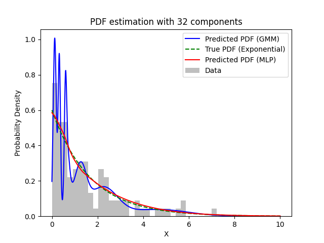
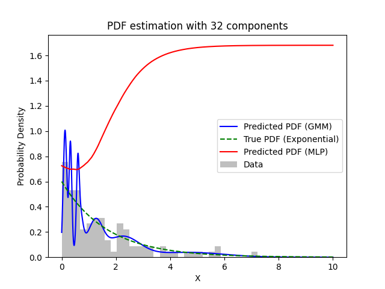

# Gaussian Mixture Neural Network

A model that combines Gaussian mixture models with Neural Networks

## Summary of the Project:

<details>
  <summary>The project consists in studying a new algorithm not covered in class which, along the lines of Parzen Neural Networks, brings together the statistical approach and machine learning approaches.</summary>
  
  The new algorithm consists in using the Gaussian Mixture Model (GMM) instead of the Parzen Window to generate the targets for the Neural Network.
Then the goal is to estimate the PDF of a certain unlabeled dataset.

The project must follow these points:

- [x] find a model for the NN (MLP: hard coding or finding a simulator)
- [x] find a model for GMM (hard coding or finding a simulator)
- [x] generate the dataset: composed of 100 examples/points taken randomly from an exponential distribution

- [x] carry out the experiments, producing as a result a graph that compares the true PDF of the exponential distribution and the one approximated by the GMM and the GMM+NN.
      Each experiment differs according to the number of components per GNN:

  - 4 components for GMM: estimate the PDF only with the GMM and with the new machine (GMM + NN)
  - 8 components for GMM: estimate the PDF only with the GMM and with the new machine (GMM + NN)
  - 16 components for GMM: estimate the PDF only with the GMM and with the new machine (GMM + NN)
  - 32 components for GMM: estimate the PDF only with the GMM and with the new machine (GMM + NN)

- [x] do one last experiment: choose the best model of the GMM+NN and check the differences between the unbiased and biased models. Do the same considerations of the Parzen Neural Network apply in this case too?

- [ ] finally, a report on the activity carried out is expected in order to produce a scientific paper type text.
      The report must be structured in the following chapters:
  - title
  - abstracts
  - introduction
  - explanation of the algorithm
  - the experiments and the results through the plots
  - personal conclusions

</details>

### remarks:

1. remark: the MLP must be chosen so as to maximize the result for each experiment, it is therefore expected to do different experiments to choose the best hyperparameters (the comparison can also be done only graphically)

2. pytorch is quite recommended

3. To draw the graph of GNN+NN, do we give it the same 100 examples as input?

   > No. AS we did for the demonstrations during the course, create a set of
   > equally-spaced datapoints at regular intervals, e.g. 0.01, 0.02, 0.03, ...
   > and plot the corresponding outputs from the pdf-estimator at hand as a
   > "continuous" line.

4. Does the output of the MLP need to be normalized to make it a PDF?

   > No. A sigmoid with adaptive amplitude lambda would be best, but that
   > feature will hardly be made available to you by any simulator you decide
   > to use. Effective. I recommend you either go for a standard ReLU (whose
   > output range [0, +INFINITY) matches the range of any pdf), or even a plain
   > linear activation function but in the latter case you need to force to 0.0
   > any possible negative outputs at test-tne

5. Should the input to GNN + MLP be normalized around 0 to get better results?

   > You can do that but that is not needed, experiece witt the exponential pdf
   > shows the neywork can cope withthe expected range of thenon-normalized
   > inputs.

6. Do we compare the various experiments only graphically?
   > Yes. A quantitative comparison would involve computing the Integrated
   > Squared error (ISE) or other simiar measure of distance between he
   > estimated pdf and the true pdf (you can do that you feel like it, of
   > course!)

## To do:

- [ ] do the 4 experiments, changing the number of parameters and the parameters of the gridsarch
- [x] check out the differences between the GMM biased and unbiased
- [x] Implement the saving plots for the experiments
- [ ] check the correctness of the ISE score function
- [x] maybe implement some options to pass with the command line
- [ ] maybe implement a gridsearch also for the GMM algorithm

## File Structure:

- ### `data` folder:

  Contains the save files of the training and test data.
  This files are automatically generated and saved when run the algorithm.

- ### `script` folder:

  It contains all the code for running the project.

  - #### `model/nn_model.py`: the model for the Neural Network part of the project. Implements the
  - #### `model/gm_model.py`:

  - #### `data_manager.py`: the data manager for the

  - #### `utils.py`: the utilities for the

  - #### `main.py`: the main function for the project

- ### `other` folder: some random code created at the beginning of the project

## Installation

In order to run all the script you need to run the following:

1. Clone the project:

   ```bash
   git clone https://github.com/Duccioo/Gaussian-Mixture-Neural-Network.git
   ```

2. install the dependencies:

   ```bash
   pip install -r requirements.txt
   ```

3. Optional if you have not install Pytorch on your machine: https://pytorch.org/get-started/locally/

## Run Locally

On the repo folder:

```bash
python script/main.py 
```

### Command Options:

- `--components <int n>` : for setting the number of components for the GMM (default 4)
- `--jobs <int n>` : for setting the number of jobs/threads for paralelize the gridsearch (default -1, use all the cores of your machine)
- `--rate <float n>` : for setting the rate that the true exponential pdf should be computed (default 0.6)
- `--samples <int n>` : number of samples for the training set taken from the exponential distribution (default 100)
- `--show` : if selected show the img at the end of the process (default false)
- `--gpu` : if specified try to use dedicated GPU (require pytorch and cuda installed, default false)
- `--bias` : if specified train the model with a bias version of GMM for generating the target for the MLP

### Grid Search Parameters:

you can specify the parameters to test the GMM+MLP model with the grid search in the `scripts/main.py` file.
By default:

```python
{
        "criterion": [nn.MSELoss],
        "max_epochs": [50, 80],
        "batch_size": [4, 8, 16],
        "lr": [0.005, 0.01],
        "module__n_layer": [2, 3],
        "module__last_activation": ["lambda", nn.ReLU()],
        "module__num_units": [80, 50, 10],
        "module__activation": [nn.ReLU()],
        "module__type_layer": ["increase", "decrease"],
        "optimizer": [optim.Adam],
        "module__dropout": [0.3, 0.5, 0.0],
    }
```

- `module__last_activation` : set the last activation function to be applied to the model, if `lambda` is specified than it will be applied a sigmoid function with adaptive amplitude parameter 'lambda'.

- `module__num_units` : set the number of neurons for the first layer of the model.
- `module__activation` : set the activation function for all the layers.
- `module__type_layer` : set how the layers should behave. With "increase" at each layer the number of neurons increases by a factor of 2. With "decrease" at each layer the number of neurons decrease by a factor of 2.


## Results:

- From all the experiments it's clear that GMM+MLP performe better than regular GMM.
- The best results that we obtained were using 32 and 4 components of the GMM+MLP.
- Using a bias version for generete the target for the MLP gives us worse results, particularly using kmeans initialization for the GMM init parameters.

### BEST RESULT:

- With the gridsearch we obtained a perfect fit for the true PDF with a 32 components GMM+MLP:



### Bias version of the BEST RESULT:

- with the best model for the GMM+MLP than we switch to a bias version:



## Authors

- [@AparnaPindali](https://github.com/AparnaPindali)
- [@duccioo](https://github.com/Duccioo)

## License

[MIT](https://choosealicense.com/licenses/mit/)
