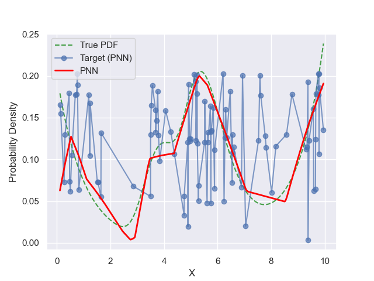

## Title Slide

- Titolo: Gaussian-mixture Neural Networks: A Novel Approach to PDF Estimation
- Sottotitolo: Combining Statistical Robustness with Neural Network Capabilities

- **Authors:** Duccio Meconcelli, Edmondo Trentin
- **Affiliation:** DIISM, Università di Siena, Italy

### Risorse da aggiungere

- [x] Logo Unisi

---

## Introduction and a short summary

- The goal is to estimate a probability density function (PDF) from unlabeled data.
- The challenge is to learn a non-parametric model robustly from the sample.

The ability to handle unlabeled data and extract useful statistical representations is fundamental to unsupervised learning. The GNN’s method is an innovative approach to this blending GMMs with ANNs for better accuracy. Great way to merge classic statistics and modern AI.

---

## Estimating Probability Density Functions

- Density estimation is central to machine learning, used in pattern recognition, clustering, and anomaly detection.
- Traditional statistical methods (parametric, non-parametric) have limitations in generalization, memory requirements, and robustness.
- ANN-based methods for PDF estimation show potential but face challenges in multidimensional spaces.
- Importance in statistics, machine learning, and data analysis

<!-- Probability Density Functions (PDFs) are fundamental in statistics and machine learning, describing the likelihood of a continuous random variable taking on different values. -->

Although the problem of density estimation has been known for a long time, finding scalable and robust solutions is still a complex open research area, particularly for complex, multidimensional data distributions. The task remains difficult, with significant potential for broad applications. While traditional statistical methods are limited, AI and machine learning techniques are still largely underexplored in this domain.

### Risorse da aggiungere

- [x] Aggiungere visualizzazioni di PDF comuni (ad esempio, normali, esponenziali) -> **SCRIPT** "miscellaneous/pdf_example.py"

### Modifiche da fare

- [x] finisci con una frase incisiva sul fatto che il task e' ancora aperto e difficile, di potenziale ampio utilizzo, che i metodi statistici sono limitati e i metpodi di AI/Machine Learning finora poco sfrutti

---

## Introduction to Neural Networks

<!-- - Key components:
  - Neurons (nodes)
  - Connections (weights)
  - Activation functions
- Training process: Backpropagation and gradient descent -->

Neural networks learn to perform tasks by processing examples and adjusting their internal parameters.
They've revolutionized many fields, including computer vision, natural language processing, and, in this case also probability density estimation.

### Risorse da aggiungere

- [x] Aggiungere un semplice diagramma di un'architettura di rete neurale (https://playground.tensorflow.org/) (Forse includere un'animazione che mostri forward e backward durante l'allenamento)

### Modifiche da fare

- [x] eviterei, dato il contesto, di introdurre le ANN: al posto della parte superiore della slide metti una figura di una ANN, e lascia solo l'idea di usarle per stimare pfg

---

## Current Approaches to PDF Estimation

PDF estimation has traditionally been approached in two main ways: parametric and non-parametric methods.

- Parametric methods:
  - Assume a specific distribution form (e.g., Gaussian)
  - Estimate parameters from data
- Non-parametric methods:
  - make fewer assumptions but can be computationally expensive
  - Kernel Density Estimation (KDE)
  - k-Nearest Neighbors (k-NN)
- Neural network-based approaches:
  <!-- - Mixture Density Networks -->
  - Recently, neural network-based approaches have gained popularity, offering flexible and powerful models for density estimation.

---

## Introducing Gaussian-mixture Neural Networks (GNNs)

A novel approach combining:

- Gaussian Mixture Models (GMMs)
- Artificial Neural Networks (ANNs)

Key idea: Use GMM as a "teacher" for ANN "student"

- Advantages:

  - Statistical robustness of GMMs
  - Modeling capabilities of ANNs
  - GMMs provide a powerful parametric tool but struggle with complex data structures.
  - ANNs can learn nonlinear relationships but lack the statistical robustness of GMMs.
  - GNN aims to combine the best of both approaches.

<!-- This combination leverages the statistical robustness of GMMs with the flexible modeling capabilities of ANNs, potentially overcoming limitations of each individual method. -->

### Risorse da aggiungere

- [ ] Formula per la GMM che coinvolge più componenti gaussiane
- [x] il corrispondente grafico di esempio -> **SCRIPT** "miscellaneous/gmm_example.py"

---

## GNN Architecture

The GNN algorithm is unsupervised, training an ANN to estimate PDFs.
The architecture of a GNN is flexible and can be adapted to different problems.

- Input: Feature vector x
- Output: Estimated PDF value p(x)
- Hidden layers: Flexible architecture
  - The hidden layers can vary in number and size, allowing the network to capture complex relationships.
- Activation functions:

  - Hidden layers: (ReLU, sigmoid, tanh)
  - Output layer: Non-negative function to ensure the estimated PDF is valid (e.g., ReLU, softmax, adaptive sigmoid)
  - The adaptive sigmoid activation function is particularly useful as it can automatically adjust its range to match the true PDF.

### Risorse da aggiungere

- [ ] (Forse includere equazioni per diverse funzioni di attivazione, in particolare la adaptive sigmoid)

---

## GNN Training Algorithm

The training process for GNNs is a multi-step procedure that combines GMM parameter estimation with ANN training.
Each step of the algorithm builds progressively on the previous, ensuring that both ANN and GMM components contribute to accurate density estimation.

1. Initialize GMM parameters using k-Means clustering or random.
2. Iterate Expectation-Maximization (EM) algorithm for GMM
3. Generate synthetic targets using final GMM
4. Train ANN using backpropagation on synthetic dataset
5. Output trained ANN as PDF estimator

The result is an ANN that can estimate PDFs with high accuracy.

### Risorse da aggiungere

- [x] Includere lo pseudocodice nei passaggi principali dell'algoritmo

---

## Experimental Setup

To evaluate the performance of GNNs, we conducted experiments on both unimodal and multimodal distributions.

- Datasets:
  - Unimodal: Exponential distribution
  - Multimodal: Mixture of exponential and generalized extreme-value distributions
    - The use of multiple evaluation metrics ensures that performance is measured across different perspectives.
- Sample sizes: N = 10, 50, 100, 200
- Competing methods:
  - Gaussian Mixture Model (GMM)
  - Parzen Window (PW)
  - k-Nearest Neighbors (k-NN)
  - Parzen Neural Network (PNN)
- Evaluation metrics: R², MSE, KL Divergence, Integrated Squared Error (ISE), Maximum Error.

### Risorse da aggiungere

- [x] Aggiungere visualizzazioni delle distribuzioni di test (exp e multivariate) -> **SCRIPT** "miscellaneous/sample_dataset.py"

---

## Results - Unimodal Distribution (Exponential)

<!-- The results for the unimodal exponential distribution were quite impressive. -->

This is where GNN shines – handling datasets of all sizes effectively, something conventional methods struggle with.

- GNN outperformed all other methods across most metrics
- Significant improvement over GMM (teacher)
- Robust performance even with small sample sizes (N = 10)
- Best R² scores:

  - N = 10: 0.9722 (GNN)
  - N = 100: 0.9953 (GNN)
  - N = 200: 0.9978 (GNN)

The GNN consistently outperformed all other methods across most metrics, including the GMM it was trained on. This demonstrates the power of combining the statistical approach with neural network capabilities. Notably, the GNN showed robust performance even with very small sample sizes, achieving an R² score of 0.9722 with just 10 samples. As the sample size increased, the performance improved further, reaching an R² of 0.9978 with 200 samples.

### Risorse da aggiungere

- [ ] Forse una tabella?
- [ ] Aggiungere un grafico a barre che confronta i punteggi R² insieme al variare della dimensione del campione.
  <!-- - [ ] Aggiungere un grafico lineare che mostra i punteggi R² per diversi metodi all'aumentare della dimensione del campione -->
  <!-- - [ ] Includere un grafico che mostra la pdf di GNN vs GMM per il caso exp -> dal paper -->
  <!-- - [ ] (Includere un grafico che mostra la pdf di PNN vs Parzen Window per il caso exp) -> dal paper -->
- [x] (Includere un confronto GNN e GMM) -> dal paper

---

## Results - Multimodal Distribution

- Complex multimodal distributions tested (mixture of exponentials and extreme value distributions).
- GNN performed best for larger sample sizes (N = 100, 200)
- PNN slightly better for smaller samples (N = 10, 50)
- All non-parametric methods outperformed GMM
- Best R² scores:

  - N = 100: 0.9498 (GNN)
  - N = 200: 0.9235 (GNN)

Estimating multimodal distributions is challenging but essential for real-world applications, the GNN still showed strong performance, particularly for larger sample sizes.
It achieved the best results for N = 100 and N = 200, with R² scores of 0.9498 and 0.9235 respectively. The PNN performed slightly better for smaller sample sizes, which is consistent with its known strengths. Importantly, all non-parametric methods, including the GNN, significantly outperformed the parametric GMM approach, highlighting the advantages of flexible, data-driven techniques for complex distributions.

### Risorse da aggiungere

- [ ] Forse una tabella?
- [ ] Aggiungere un grafico a barre che confronta i punteggi R² per diversi metodi a N che varia
- [x] Includere un grafico che mostra la pdf di GNN vs GMM per il caso multimodale -> dal paper
- [x] (Includere un grafico che mostra la pdf di PNN vs Parzen Window per il caso multimodale) -> dal paper

---

## Analysis of GNN Performance

- ANN-based models (PNN, GNN) consistently outperformed statistical methods.
- GNN performed best in most evaluation metrics.
- It excelled particularly on small datasets, demonstrating robustness where other models failed.
- Impact of number of GMM components (K)
  - Optimal K increases with sample size
  - We found out that the optimal number of GMM components (K) tends to increase with sample size, allowing for more complex models as more data becomes available.
- Effect of neural network architecture
  - Deeper networks preferred for larger samples
  - with deeper networks generally preferred for larger samples.
    This suggests that the GNN can effectively leverage additional data to capture more intricate patterns.
- Adaptive sigmoid often chosen for output activation
  - The adaptive sigmoid activation function was often selected for the output layer, demonstrating its effectiveness in PDF estimation tasks.

### Risorse da aggiungere

- [x] Aggiungere il grafico che cambia il numero di componenti nell exp -> dal paper
- [x] Aggiungere il grafico che cambia il numero di neuroni della exp -> dal paper

---

## Advantages of GNN Approach

GNNs offer a flexible solution where purely parametric or non-parametric models fail.
The GNN approach offers several key advantages:

- ANN’s adaptability to complex data distributions combining statistical robustness with neural network flexibility.
- Overcoming GMM’s limitations on small datasets:
  - crucial in many real-world applications where data may be limited
- Outperforms both GMM teacher and other established methods

- Flexible architecture allows adaptation to different problems
  - Hybrid model capable of estimating both unimodal and multimodal PDFs.
- Non-parametric learning without strict assumptions on data distribution.
  - Effective for both unimodal and multimodal distributions

By combining the statistical robustness of GMMs with the flexibility of neural networks, it achieves superior performance compared to both its GMM teacher and other established methods.

---

## Limitations

- GNN requires careful extensive hyperparameter tuning (e.g., number of Gaussian components).
- Prone to overfitting with complex architectures on small datasets.
- Current study limited to 1D distributions
- Only trained on synthetic dataset
- Potential overfitting with small samples and complex architectures

While the GNN shows promising results, it's important to acknowledge its current limitations. The study focused on one-dimensional distributions, and extending it to multidimensional cases is a crucial next step.
Furthermore, all the tests we carried out only concern manually created datasets and do not represent possible real problems, therefore more experiments should be conducted on real-world datasets to demonstrate its practical utility.

### Risorse da aggiungere

- [ ] plot di un allenamento non perfetto (un esempio è la GNN con id = dfc9a0fe)
- [x] aggiungere un plot di una pdf multidimensionale -> **SCRIPT** "miscellaneous/test_3d_2.py"

---

## Conclusion

- GNN represents a significant step forward in unsupervised density estimation.
- Combines strengths of traditional and modern AI methods.
- Open avenues for further exploration, particularly in multi-dimensional PDFs.
- GNN: A novel, effective approach to PDF estimation
- Combines strengths of GMMs and ANNs
- Outperforms existing methods in many scenarios
- Promising direction for future research in density estimation
- Potential impact on various fields requiring accurate PDF modeling

<!-- By combining the strengths of Gaussian Mixture Models and Artificial Neural Networks, it achieves superior performance compared to existing methods in many scenarios. While there's still work to be done, particularly in extending the method to higher dimensions and more complex real-world problems, the GNN approach opens up exciting new possibilities in the field of density estimation. -->

### Risorse da aggiungere

- [x] Includere un codice QR che collega al documento o al repository del progetto per ulteriori informazioni

---

## Future Research Directions

There’s room to further enhance GNN, especially in real-world scenarios where high-dimensional data is common.
GNN has broad applicability in domains where probability estimation from unlabeled data is crucial.

- Extension to multidimensional distributions
- Theoretical analysis of modeling and convergence properties
- Investigate deeper architectures and optimization techniques.
- Application to real-world datasets:

  - [Earthquake magnitude prediction](https://www.researchgate.net/figure/a-Histograms-in-probability-density-function-pdf-of-earthquake-magnitude-b_fig2_370827731)
  - [Precipitation prediction: PDFs can model the likelihood of different rainfall amount](https://www.semanticscholar.org/paper/on-Numerical-Weather-Prediction-Predictability-%2C-Zhu-Ma/dde6ee8ac00f1b0971a42e28582bb0c71ff1d11a)
  - [Predicting stock price movements: PDFs can model the distribution of potential future stock prices](https://www.semanticscholar.org/reader/35b7d196f76d22be047862e49aa209b456629ba5)
  - [Disease prediction: PDFs can model the potential spread of infectious diseases](https://www.frontiersin.org/journals/public-health/articles/10.3389/fpubh.2021.645405/full)
  - Renewable energy production forecasting: PDFs can model the expected output of wind turbines or solar panels based on weather conditions.

---

### Risorse da aggiungere

- [x] Esempi di applicazioni

## Q&A and Discussion
