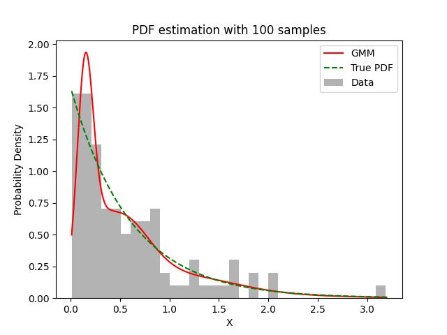

# Experiment Details Experiment S100
> from experiment with GMM
> on 2024-04-23 10-38
## Metrics:
                                                                   
| type  | r2     | mse    | max_error | ise      | kl    | evs    |
|-------|--------|--------|-----------|----------|-------|--------|
| Model | 0.8318 | 0.0269 | 1.1332    | 346.7013 | 0.702 | 0.8319 |
                                                                   
## Plot Prediction

## Dataset

PDF set as default <b>EXPONENTIAL_06</b>

#### Dimension 1
                               
| type        | rate | weight |
|-------------|------|--------|
| exponential | 0.6  | 1      |
                               

                              
| KEY                | VALUE |
|--------------------|-------|
| dimension          | 1     |
| seed               | 49    |
| n_samples_training | 100   |
| n_samples_test     | 319   |
| n_samples_val      | 0     |
| notes              |       |
                              
## Model
> using model GMM
#### Model Params:

All Params used in the model 

                         
| KEY          | VALUE  |
|--------------|--------|
| n_components | 31     |
| n_init       | 30     |
| max_iter     | 10     |
| init_params  | random |
| random_state | 49     |
                         

Model Architecture 

GaussianMixture(init_params='random', max_iter=10, n_components=31, n_init=30,
                random_state=49)

