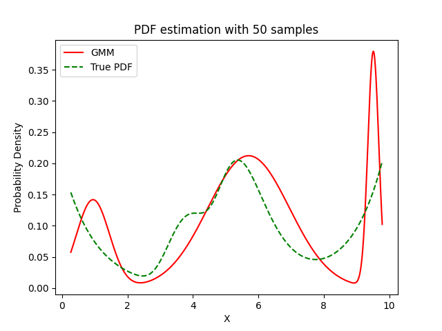

# Experiment Details Experiment S50
> from experiment with GMM
> on 2024-05-09 13-31
## Metrics:
                                                                    
| type  | r2      | mse    | max_error | ise     | kl     | evs    |
|-------|---------|--------|-----------|---------|--------|--------|
| Model | -0.0004 | 0.0028 | 0.2248    | 82.7112 | 0.1576 | 0.0188 |
                                                                    
## Plot Prediction

## Dataset

PDF set as default <b>MULTIVARIATE_1254</b>

#### Dimension 1
                                      
| type        | rate | weight |      |
|-------------|------|--------|------|
| exponential | 1    | 0.2    |      |
| logistic    | 4    | 0.8    | 0.25 |
| logistic    | 5.5  | 0.7    | 0.3  |
| exponential | -1   | 0.25   | -10  |
                                      

                              
| KEY                | VALUE |
|--------------------|-------|
| dimension          | 1     |
| seed               | 8     |
| n_samples_training | 50    |
| n_samples_test     | 953   |
| n_samples_val      | 0     |
| notes              |       |
                              
## Model
> using model GMM
#### Model Params:

All Params used in the model 

                                   
| KEY          | VALUE            |
|--------------|------------------|
| n_components | 3                |
| n_init       | 10               |
| max_iter     | 100              |
| init_params  | random_from_data |
| random_state | 78               |
                                   

Model Architecture 

GaussianMixture(init_params='random_from_data', n_components=3, n_init=10,
                random_state=78)

