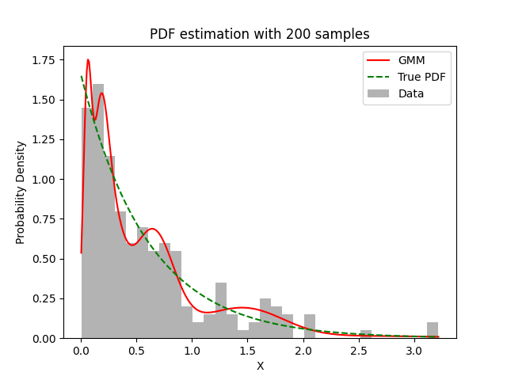

# Experiment Details Experiment S200
> from experiment with GMM
> on 2024-04-23 11-23
## Metrics:
                                                                  
| type  | r2    | mse    | max_error | ise      | kl     | evs   |
|-------|-------|--------|-----------|----------|--------|-------|
| Model | 0.907 | 0.0151 | 1.1122    | 344.0918 | 0.7101 | 0.907 |
                                                                  
## Plot Prediction

## Dataset

PDF set as default <b>EXPONENTIAL_06</b>

#### Dimension 1
                               
| type        | rate | weight |
|-------------|------|--------|
| exponential | 0.6  | 1      |
                               

                              
| KEY                | VALUE |
|--------------------|-------|
| dimension          | 1     |
| seed               | 0     |
| n_samples_training | 200   |
| n_samples_test     | 322   |
| n_samples_val      | 0     |
| notes              |       |
                              
## Model
> using model GMM
#### Model Params:

All Params used in the model 

                         
| KEY          | VALUE  |
|--------------|--------|
| n_components | 30     |
| n_init       | 100    |
| max_iter     | 30     |
| init_params  | random |
| random_state | 93     |
                         

Model Architecture 

GaussianMixture(init_params='random', max_iter=30, n_components=30, n_init=100,
                random_state=93)

