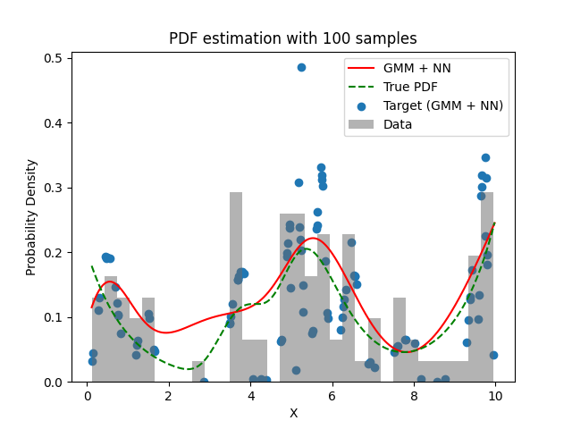

# Experiment Details Experiment  C10 S150
> from experiment with GMM + NN
> on 2024-04-03 17-44
## Metrics:
                                                                                                      
| type   | r2            | mse          | max_error    | ise          | kl           | evs           |
|--------|---------------|--------------|--------------|--------------|--------------|---------------|
| Target | -1.0793589597 | 0.0059723144 | 0.2829634476 | 0.0059723144 | 0.2619843707 | -1.0572539783 |
| Model  | 0.6449        | 0.0011       | 0.0679       | 0.0109       | 0.0394       | 0.8441        |
                                                                                                      
## Plot Prediction

## Loss Plot

## Dataset

PDF set as default <b>MULTIVARIATE_1254</b>

#### Dimension 1
                                      
| type        | rate | weight |      |
|-------------|------|--------|------|
| exponential | 1    | 0.2    |      |
| logistic    | 4    | 0.8    | 0.25 |
| logistic    | 5.5  | 0.7    | 0.3  |
| exponential | -1   | 0.25   | -10  |
                                      

                              
| KEY                | VALUE |
|--------------------|-------|
| dimension          | 1     |
| seed               | 42    |
| n_samples_training | 100   |
| n_samples_test     | 988   |
| n_samples_val      | 50    |
| notes              |       |
                              
## Target
- Using GMM + NN Target

All Params used in the model for generate the target for the MLP 

                            
| KEY          | VALUE     |
|--------------|-----------|
| n_components | 10        |
| n_init       | 100       |
| max_iter     | 80        |
| init_params  | k-means++ |
| random_state | 42        |
                            

## Model
> using model GMM + NN
#### Model Params:

All Params used in the model 

                                                                
| KEY             | VALUE                                      |
|-----------------|--------------------------------------------|
| dropout         | 0.0                                        |
| hidden_layer    | [(64, Tanh()), (56, Tanh()), (38, Tanh())] |
| last_activation | None                                       |
                                                                

Model Architecture 

LitModularNN(
  (neural_netowrk_modular): NeuralNetworkModular(
    (dropout): Dropout(p=0.0, inplace=False)
    (output_layer): Linear(in_features=38, out_features=1, bias=True)
    (layers): ModuleList(
      (0): Linear(in_features=1, out_features=64, bias=True)
      (1): Linear(in_features=64, out_features=56, bias=True)
      (2): Linear(in_features=56, out_features=38, bias=True)
    )
    (activation): ModuleList(
      (0-2): 3 x Tanh()
    )
  )
)

## Training

All Params used for the training 

                               
| KEY           | VALUE       |
|---------------|-------------|
| epochs        | 540         |
| batch_size    | 26          |
| loss_type     | mse_loss    |
| optimizer     | Adam        |
| learning_rate | 0.000874345 |
                               

