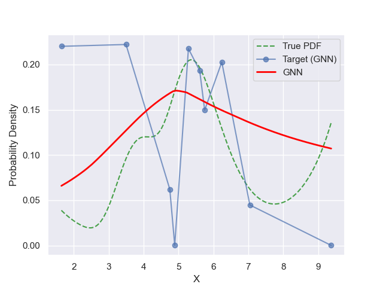
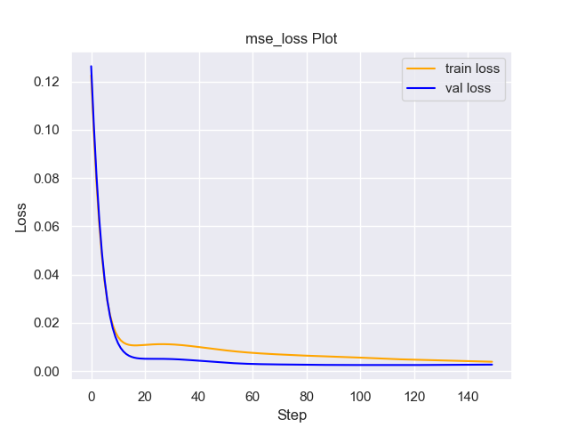
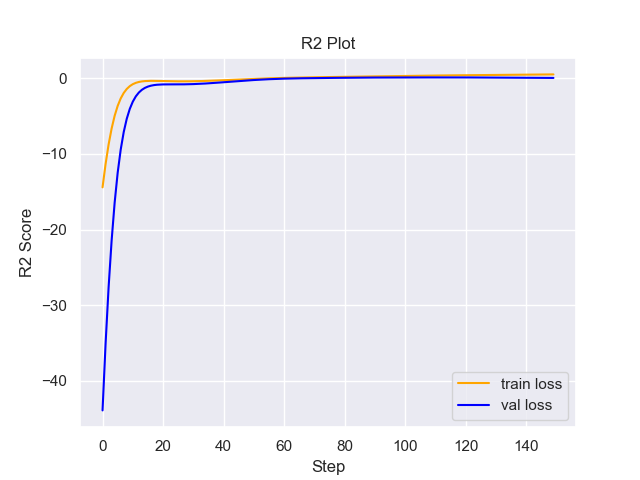

# Experiment Details Experiment  C2 S60
> from experiment with GNN
> on 2024-05-23 16-08
## Metrics:
                                                                                                      
| type   | r2            | mse          | max_error    | ise          | kl           | evs           |
|--------|---------------|--------------|--------------|--------------|--------------|---------------|
| Target | -0.0585361694 | 0.0030365066 | 0.1357844627 | 0.0003036507 | 0.7449445841 | -0.0464445366 |
| Model  | 0.1621        | 0.0025       | 0.081        | 0.1905       | 0.0875       | 0.5973        |
                                                                                                      
## Plot Prediction

## Loss Plot

## Training Metric Plot

## Dataset

PDF set as default <b>MULTIVARIATE_1254</b>

#### Dimension 1
                                      
| type        | rate | weight |      |
|-------------|------|--------|------|
| exponential | 1    | 0.2    |      |
| logistic    | 4    | 0.8    | 0.25 |
| logistic    | 5.5  | 0.7    | 0.3  |
| exponential | -1   | 0.25   | -10  |
                                      

                              
| KEY                | VALUE |
|--------------------|-------|
| dimension          | 1     |
| seed               | 42    |
| n_samples_training | 10    |
| n_samples_test     | 7735  |
| n_samples_val      | 50    |
| notes              |       |
                              
## Target
- Using GNN Target

All Params used in the model for generate the target for the MLP 

                            
| KEY          | VALUE     |
|--------------|-----------|
| n_components | 2         |
| n_init       | 70        |
| max_iter     | 10        |
| init_params  | k-means++ |
| random_state | 37        |
                            

## Model
> using model GNN
#### Model Params:

All Params used in the model 

                                                  
| KEY             | VALUE                        |
|-----------------|------------------------------|
| dropout         | 0.0                          |
| hidden_layer    | [(54, ReLU()), (30, Tanh())] |
| last_activation | lambda                       |
                                                  

Model Architecture 

NeuralNetworkModular(
  (dropout): Dropout(p=0.0, inplace=False)
  (output_layer): Linear(in_features=30, out_features=1, bias=True)
  (last_activation): AdaptiveSigmoid(
    (sigmoid): Sigmoid()
  )
  (layers): ModuleList(
    (0): Linear(in_features=1, out_features=54, bias=True)
    (1): Linear(in_features=54, out_features=30, bias=True)
    (2): AdaptiveSigmoid(
      (sigmoid): Sigmoid()
    )
  )
  (activation): ModuleList(
    (0): ReLU()
    (1): Tanh()
  )
)

## Training

All Params used for the training 

                            
| KEY           | VALUE    |
|---------------|----------|
| epochs        | 150      |
| batch_size    | 52       |
| loss_type     | mse_loss |
| optimizer     | Adam     |
| learning_rate | 0.00172  |
                            

