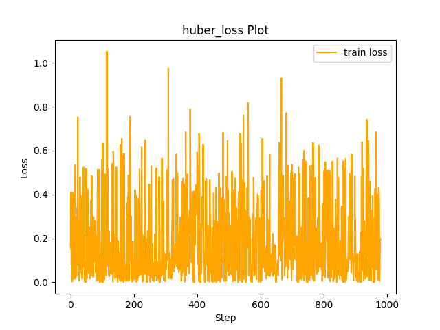

# Experiment Details Experiment  C10 S50
> from experiment with GNN
> on 2024-04-05 17-02
## Metrics:
                                                                                               
| type   | r2            | mse         | max_error    | ise          | kl     | evs           |
|--------|---------------|-------------|--------------|--------------|--------|---------------|
| Target | -0.7995051259 | 0.425884309 | 1.4045257595 | 0.2129421545 | 100000 | -0.7663059528 |
| Model  | 0.896         | 0.0134      | 0.5399       | 0.067        | 0.3395 | 0.8972        |
                                                                                               
## Plot Prediction

## Loss Plot

## Dataset

PDF attribute

#### Dimension 1
                               
| type        | rate | weight |
|-------------|------|--------|
| exponential | 0.6  | 1      |
                               

                              
| KEY                | VALUE |
|--------------------|-------|
| dimension          | 1     |
| seed               | 60    |
| n_samples_training | 50    |
| n_samples_test     | 501   |
| n_samples_val      | 0     |
| notes              |       |
                              
## Target
- Using GNN Target

All Params used in the model for generate the target for the MLP 

                            
| KEY          | VALUE     |
|--------------|-----------|
| n_components | 10        |
| n_init       | 100       |
| max_iter     | 80        |
| init_params  | k-means++ |
| random_state | 60        |
                            

## Model
> using model GNN
#### Model Params:

All Params used in the model 

                                                                
| KEY             | VALUE                                      |
|-----------------|--------------------------------------------|
| dropout         | 0.0                                        |
| hidden_layer    | [(22, Tanh()), (24, ReLU()), (60, ReLU())] |
| last_activation | lambda                                     |
                                                                

Model Architecture 

LitModularNN(
  (neural_netowrk_modular): NeuralNetworkModular(
    (dropout): Dropout(p=0.0, inplace=False)
    (output_layer): Linear(in_features=60, out_features=1, bias=True)
    (last_activation): AdaptiveSigmoid(
      (sigmoid): Sigmoid()
    )
    (layers): ModuleList(
      (0): Linear(in_features=1, out_features=22, bias=True)
      (1): Linear(in_features=22, out_features=24, bias=True)
      (2): Linear(in_features=24, out_features=60, bias=True)
      (3): AdaptiveSigmoid(
        (sigmoid): Sigmoid()
      )
    )
    (activation): ModuleList(
      (0): Tanh()
      (1-2): 2 x ReLU()
    )
  )
)

## Training

All Params used for the training 

                                 
| KEY           | VALUE         |
|---------------|---------------|
| epochs        | 980           |
| batch_size    | 2             |
| loss_type     | huber_loss    |
| optimizer     | RMSprop       |
| learning_rate | 0.00660307851 |
                                 

