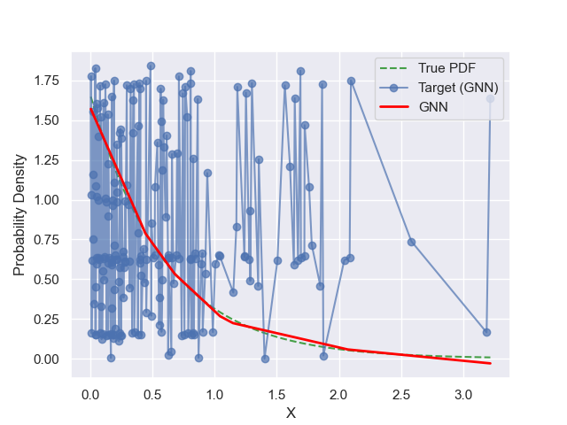
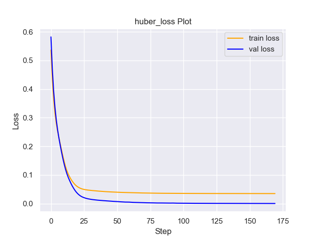
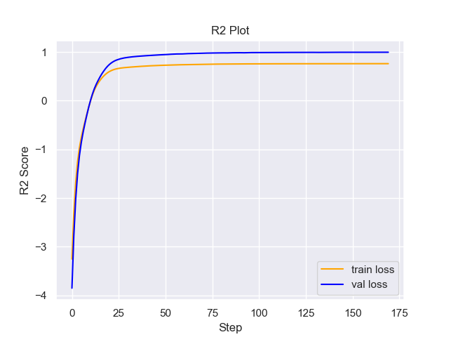

# Experiment Details Experiment  C25 S250
> from experiment with GNN
> on 2024-05-23 16-28
## Metrics:
                                                                                                     
| type   | r2           | mse          | max_error    | ise          | kl            | evs          |
|--------|--------------|--------------|--------------|--------------|---------------|--------------|
| Target | 0.6689535849 | 0.0762224021 | 1.2035861518 | 0.1524448042 | 0.0462480869  | 0.6689539511 |
| Model  | 0.9978       | 0.0004       | 0.0766       | 0.0116       | 10000000000.0 | 0.9978       |
                                                                                                     
## Plot Prediction

## Loss Plot

## Training Metric Plot

## Dataset

PDF set as default <b>EXPONENTIAL_06</b>

#### Dimension 1
                               
| type        | rate | weight |
|-------------|------|--------|
| exponential | 0.6  | 1      |
                               

                              
| KEY                | VALUE |
|--------------------|-------|
| dimension          | 1     |
| seed               | 18    |
| n_samples_training | 200   |
| n_samples_test     | 3210  |
| n_samples_val      | 50    |
| notes              |       |
                              
## Target
- Using GNN Target

All Params used in the model for generate the target for the MLP 

                         
| KEY          | VALUE  |
|--------------|--------|
| n_init       | 90     |
| max_iter     | 40     |
| n_components | 25     |
| random_state | 64     |
| init_params  | random |
                         

## Model
> using model GNN
#### Model Params:

All Params used in the model 

                                    
| KEY             | VALUE          |
|-----------------|----------------|
| dropout         | 0.0            |
| hidden_layer    | [(32, ReLU())] |
| last_activation | None           |
                                    

Model Architecture 

NeuralNetworkModular(
  (dropout): Dropout(p=0.0, inplace=False)
  (output_layer): Linear(in_features=32, out_features=1, bias=True)
  (layers): ModuleList(
    (0): Linear(in_features=1, out_features=32, bias=True)
  )
  (activation): ModuleList(
    (0): ReLU()
  )
)

## Training

All Params used for the training 

                              
| KEY           | VALUE      |
|---------------|------------|
| learning_rate | 0.00519    |
| epochs        | 170        |
| loss_type     | huber_loss |
| optimizer     | Adam       |
| batch_size    | 78         |
                              

