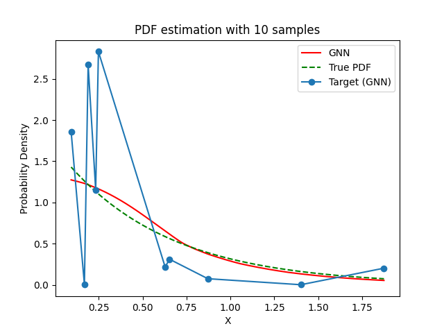
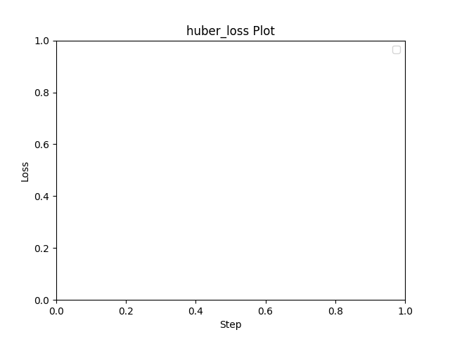

# Experiment Details Experiment  C2 S10
> from experiment with GNN
> on 2024-05-23 15-37
## Metrics:
                                                                                                      
| type   | r2            | mse          | max_error    | ise          | kl           | evs           |
|--------|---------------|--------------|--------------|--------------|--------------|---------------|
| Target | -2.3167214543 | 0.7260905639 | 1.6143189058 | 0.0726090564 | 0.6557528452 | -2.2259442192 |
| Model  | 0.9722        | 0.0037       | 0.1557       | 0.0668       | 0.007        | 0.9727        |
                                                                                                      
## Plot Prediction

## Loss Plot

## Dataset

PDF set as default <b>EXPONENTIAL_06</b>

#### Dimension 1
                               
| type        | rate | weight |
|-------------|------|--------|
| exponential | 0.6  | 1      |
                               

                              
| KEY                | VALUE |
|--------------------|-------|
| dimension          | 1     |
| seed               | 51    |
| n_samples_training | 10    |
| n_samples_test     | 1784  |
| n_samples_val      | 0     |
| notes              |       |
                              
## Target
- Using GNN Target

All Params used in the model for generate the target for the MLP 

                            
| KEY          | VALUE     |
|--------------|-----------|
| n_components | 2         |
| n_init       | 40        |
| max_iter     | 100       |
| init_params  | k-means++ |
| random_state | 59        |
                            

## Model
> using model GNN
#### Model Params:

All Params used in the model 

                                    
| KEY             | VALUE          |
|-----------------|----------------|
| dropout         | 0.0            |
| hidden_layer    | [(34, ReLU())] |
| last_activation | lambda         |
                                    

Model Architecture 

NeuralNetworkModular(
  (dropout): Dropout(p=0.0, inplace=False)
  (output_layer): Linear(in_features=34, out_features=1, bias=True)
  (last_activation): AdaptiveSigmoid(
    (sigmoid): Sigmoid()
  )
  (layers): ModuleList(
    (0): Linear(in_features=1, out_features=34, bias=True)
    (1): AdaptiveSigmoid(
      (sigmoid): Sigmoid()
    )
  )
  (activation): ModuleList(
    (0): ReLU()
  )
)

## Training

All Params used for the training 

                              
| KEY           | VALUE      |
|---------------|------------|
| epochs        | 320        |
| batch_size    | 12         |
| loss_type     | huber_loss |
| optimizer     | Adam       |
| learning_rate | 0.00123    |
                              

