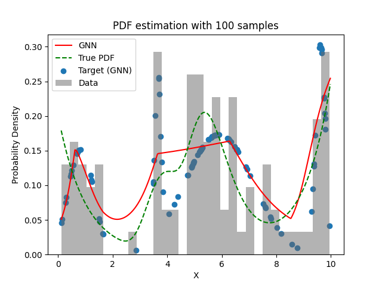
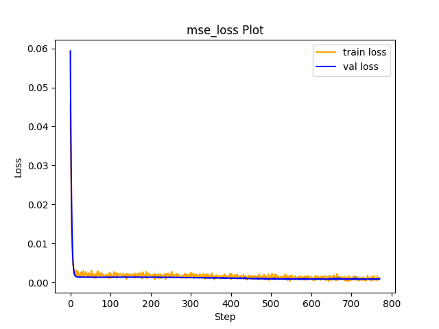

# Experiment Details Experiment  C4 S100
> from experiment with GNN
> on 2024-04-23 13-21
## Metrics:
                                                                                                      
| type   | r2            | mse          | max_error    | ise          | kl           | evs           |
|--------|---------------|--------------|--------------|--------------|--------------|---------------|
| Target | -0.2274413212 | 0.0035254449 | 0.1966252676 | 0.0035254449 | 0.1096064574 | -0.2211606587 |
| Model  | 0.583         | 0.0013       | 0.1281       | 0.0128       | 0.0551       | 0.6884        |
                                                                                                      
## Plot Prediction

## Loss Plot

## Dataset

PDF set as default <b>MULTIVARIATE_1254</b>

#### Dimension 1
                                      
| type        | rate | weight |      |
|-------------|------|--------|------|
| exponential | 1    | 0.2    |      |
| logistic    | 4    | 0.8    | 0.25 |
| logistic    | 5.5  | 0.7    | 0.3  |
| exponential | -1   | 0.25   | -10  |
                                      

                              
| KEY                | VALUE |
|--------------------|-------|
| dimension          | 1     |
| seed               | 8     |
| n_samples_training | 100   |
| n_samples_test     | 988   |
| n_samples_val      | 50    |
| notes              |       |
                              
## Target
- Using GNN Target

All Params used in the model for generate the target for the MLP 

                            
| KEY          | VALUE     |
|--------------|-----------|
| n_components | 4         |
| n_init       | 70        |
| max_iter     | 30        |
| init_params  | k-means++ |
| random_state | 27        |
                            

## Model
> using model GNN
#### Model Params:

All Params used in the model 

                                                                                 
| KEY             | VALUE                                                       |
|-----------------|-------------------------------------------------------------|
| dropout         | 0.0                                                         |
| hidden_layer    | [(50, ReLU()), (50, Tanh()), (22, Tanh()), (44, Sigmoid())] |
| last_activation | lambda                                                      |
                                                                                 

Model Architecture 

LitModularNN(
  (neural_netowrk_modular): NeuralNetworkModular(
    (dropout): Dropout(p=0.0, inplace=False)
    (output_layer): Linear(in_features=44, out_features=1, bias=True)
    (last_activation): AdaptiveSigmoid(
      (sigmoid): Sigmoid()
    )
    (layers): ModuleList(
      (0): Linear(in_features=1, out_features=50, bias=True)
      (1): Linear(in_features=50, out_features=50, bias=True)
      (2): Linear(in_features=50, out_features=22, bias=True)
      (3): Linear(in_features=22, out_features=44, bias=True)
      (4): AdaptiveSigmoid(
        (sigmoid): Sigmoid()
      )
    )
    (activation): ModuleList(
      (0): ReLU()
      (1-2): 2 x Tanh()
      (3): Sigmoid()
    )
  )
)

## Training

All Params used for the training 

                             
| KEY           | VALUE     |
|---------------|-----------|
| epochs        | 770       |
| batch_size    | 34        |
| loss_type     | mse_loss  |
| optimizer     | RMSprop   |
| learning_rate | 0.0007619 |
                             

