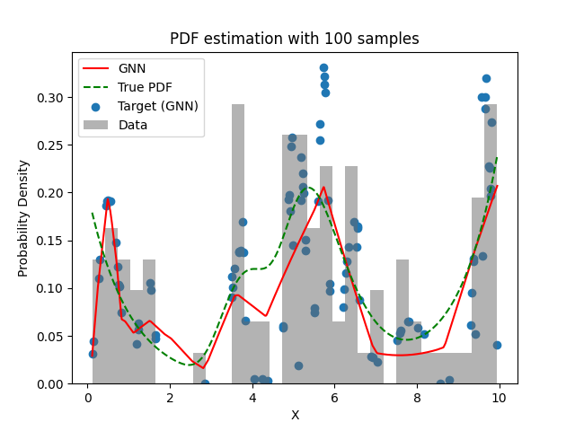
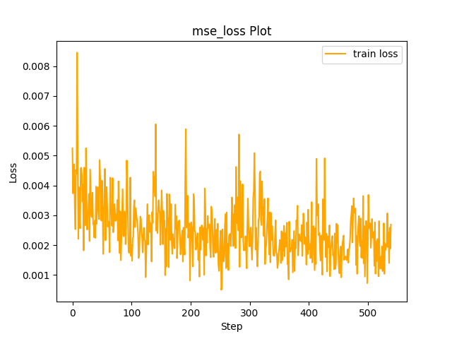

# Experiment Details Experiment  C10 S100
> from experiment with GNN
> on 2024-04-23 14-45
## Metrics:
                                                                                                      
| type   | r2            | mse          | max_error    | ise          | kl           | evs           |
|--------|---------------|--------------|--------------|--------------|--------------|---------------|
| Target | -0.6494202147 | 0.0047374485 | 0.1973826825 | 0.0047374485 | 0.2461665653 | -0.6491880032 |
| Model  | 0.7417        | 0.0008       | 0.15         | 0.0078       | 0.0401       | 0.7943        |
                                                                                                      
## Plot Prediction

## Loss Plot

## Dataset

PDF set as default <b>MULTIVARIATE_1254</b>

#### Dimension 1
                                      
| type        | rate | weight |      |
|-------------|------|--------|------|
| exponential | 1    | 0.2    |      |
| logistic    | 4    | 0.8    | 0.25 |
| logistic    | 5.5  | 0.7    | 0.3  |
| exponential | -1   | 0.25   | -10  |
                                      

                              
| KEY                | VALUE |
|--------------------|-------|
| dimension          | 1     |
| seed               | 75    |
| n_samples_training | 100   |
| n_samples_test     | 985   |
| n_samples_val      | 0     |
| notes              |       |
                              
## Target
- Using GNN Target

All Params used in the model for generate the target for the MLP 

                            
| KEY          | VALUE     |
|--------------|-----------|
| n_components | 10        |
| n_init       | 100       |
| max_iter     | 80        |
| init_params  | k-means++ |
| random_state | 96        |
                            

## Model
> using model GNN
#### Model Params:

All Params used in the model 

                                                                
| KEY             | VALUE                                      |
|-----------------|--------------------------------------------|
| dropout         | 0.0                                        |
| hidden_layer    | [(60, ReLU()), (30, ReLU()), (44, Tanh())] |
| last_activation | None                                       |
                                                                

Model Architecture 

LitModularNN(
  (neural_netowrk_modular): NeuralNetworkModular(
    (dropout): Dropout(p=0.0, inplace=False)
    (output_layer): Linear(in_features=44, out_features=1, bias=True)
    (layers): ModuleList(
      (0): Linear(in_features=1, out_features=60, bias=True)
      (1): Linear(in_features=60, out_features=30, bias=True)
      (2): Linear(in_features=30, out_features=44, bias=True)
    )
    (activation): ModuleList(
      (0-1): 2 x ReLU()
      (2): Tanh()
    )
  )
)

## Training

All Params used for the training 

                                         
| KEY           | VALUE                 |
|---------------|-----------------------|
| epochs        | 540                   |
| batch_size    | 40                    |
| loss_type     | mse_loss              |
| optimizer     | RMSprop               |
| learning_rate | 0.0009981718351141132 |
                                         

