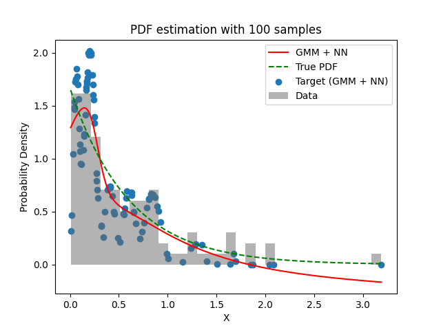
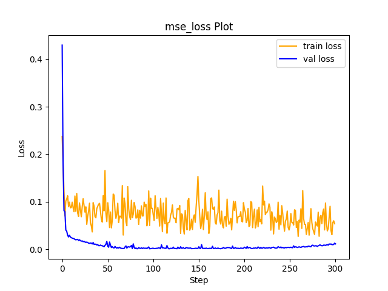

# Experiment Details Experiment  C10 S150
> from experiment with GMM + NN
> on 2024-04-03 18-07
## Metrics:
                                                                                              
| type   | r2           | mse          | max_error    | ise          | kl     | evs          |
|--------|--------------|--------------|--------------|--------------|--------|--------------|
| Target | 0.3368920515 | 0.1472283618 | 1.3128733578 | 0.1472283618 | 100000 | 0.3372618091 |
| Model  | 0.9159       | 0.0137       | 0.3537       | 0.0437       | 100000 | 0.9577       |
                                                                                              
## Plot Prediction

## Loss Plot

## Dataset

PDF attribute

#### Dimension 1
                               
| type        | rate | weight |
|-------------|------|--------|
| exponential | 0.6  | 1      |
                               

                              
| KEY                | VALUE |
|--------------------|-------|
| dimension          | 1     |
| seed               | 42    |
| n_samples_training | 100   |
| n_samples_test     | 319   |
| n_samples_val      | 50    |
| notes              |       |
                              
## Target
- Using GMM + NN Target

All Params used in the model for generate the target for the MLP 

                            
| KEY          | VALUE     |
|--------------|-----------|
| n_components | 10        |
| n_init       | 100       |
| max_iter     | 80        |
| init_params  | k-means++ |
| random_state | 42        |
                            

## Model
> using model GMM + NN
#### Model Params:

All Params used in the model 

                                                                
| KEY             | VALUE                                      |
|-----------------|--------------------------------------------|
| dropout         | 0.0                                        |
| hidden_layer    | [(64, Tanh()), (56, Tanh()), (38, Tanh())] |
| last_activation | None                                       |
                                                                

Model Architecture 

LitModularNN(
  (neural_netowrk_modular): NeuralNetworkModular(
    (dropout): Dropout(p=0.0, inplace=False)
    (output_layer): Linear(in_features=38, out_features=1, bias=True)
    (layers): ModuleList(
      (0): Linear(in_features=1, out_features=64, bias=True)
      (1): Linear(in_features=64, out_features=56, bias=True)
      (2): Linear(in_features=56, out_features=38, bias=True)
    )
    (activation): ModuleList(
      (0-2): 3 x Tanh()
    )
  )
)

## Training

All Params used for the training 

                               
| KEY           | VALUE       |
|---------------|-------------|
| epochs        | 300         |
| batch_size    | 26          |
| loss_type     | mse_loss    |
| optimizer     | Adam        |
| learning_rate | 0.000874345 |
                               

