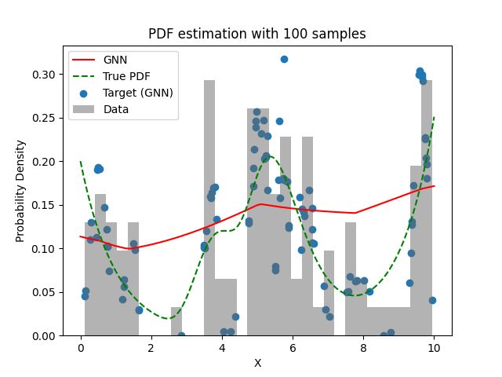
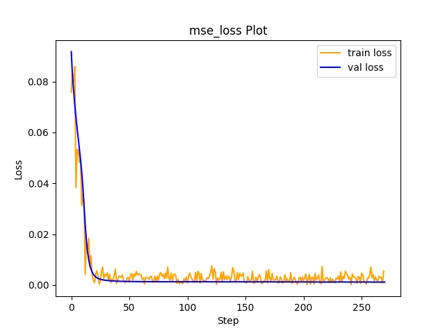

# Experiment Details Experiment  C8 S150
> from experiment with GNN
> on 2024-04-11 17-57
## Metrics:
                                                                                                    
| type   | r2            | mse          | max_error   | ise          | kl           | evs          |
|--------|---------------|--------------|-------------|--------------|--------------|--------------|
| Target | -0.1911328871 | 0.0034211602 | 0.197373183 | 0.0034211602 | 0.1917517097 | -0.183104842 |
| Model  | -0.0969       | 0.0035       | 0.0961      | 0.0352       | 0.1287       | 0.2498       |
                                                                                                    
## Plot Prediction

## Loss Plot

## Dataset

PDF set as default <b>MULTIVARIATE_1254</b>

#### Dimension 1
                                      
| type        | rate | weight |      |
|-------------|------|--------|------|
| exponential | 1    | 0.2    |      |
| logistic    | 4    | 0.8    | 0.25 |
| logistic    | 5.5  | 0.7    | 0.3  |
| exponential | -1   | 0.25   | -10  |
                                      

                              
| KEY                | VALUE |
|--------------------|-------|
| dimension          | 1     |
| seed               | 42    |
| n_samples_training | 100   |
| n_samples_test     | 1001  |
| n_samples_val      | 50    |
| notes              |       |
                              
## Target
- Using GNN Target

All Params used in the model for generate the target for the MLP 

                            
| KEY          | VALUE     |
|--------------|-----------|
| n_components | 8         |
| n_init       | 70        |
| max_iter     | 20        |
| init_params  | k-means++ |
| random_state | 3         |
                            

## Model
> using model GNN
#### Model Params:

All Params used in the model 

                                                                                            
| KEY             | VALUE                                                                  |
|-----------------|------------------------------------------------------------------------|
| dropout         | 0.0                                                                    |
| hidden_layer    | [(56, Tanh()), (64, ReLU()), (58, ReLU()), (20, ReLU()), (16, ReLU())] |
| last_activation | lambda                                                                 |
                                                                                            

Model Architecture 

LitModularNN(
  (neural_netowrk_modular): NeuralNetworkModular(
    (dropout): Dropout(p=0.0, inplace=False)
    (output_layer): Linear(in_features=16, out_features=1, bias=True)
    (last_activation): AdaptiveSigmoid(
      (sigmoid): Sigmoid()
    )
    (layers): ModuleList(
      (0): Linear(in_features=1, out_features=56, bias=True)
      (1): Linear(in_features=56, out_features=64, bias=True)
      (2): Linear(in_features=64, out_features=58, bias=True)
      (3): Linear(in_features=58, out_features=20, bias=True)
      (4): Linear(in_features=20, out_features=16, bias=True)
      (5): AdaptiveSigmoid(
        (sigmoid): Sigmoid()
      )
    )
    (activation): ModuleList(
      (0): Tanh()
      (1-4): 4 x ReLU()
    )
  )
)

## Training

All Params used for the training 

                                         
| KEY           | VALUE                 |
|---------------|-----------------------|
| epochs        | 270                   |
| batch_size    | 8                     |
| loss_type     | mse_loss              |
| optimizer     | RMSprop               |
| learning_rate | 5.244946293289557e-05 |
                                         

