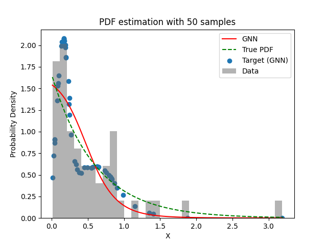
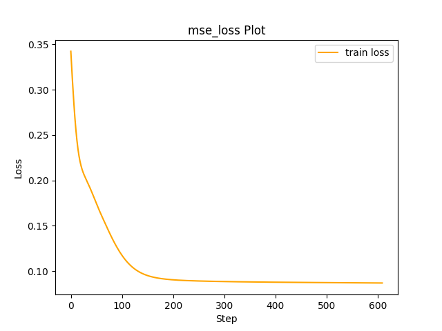

# Experiment Details Experiment  C24 S50
> from experiment with GNN
> on 2024-04-23 14-37
## Metrics:
                                                                                                    
| type   | r2           | mse          | max_error    | ise          | kl           | evs          |
|--------|--------------|--------------|--------------|--------------|--------------|--------------|
| Target | 0.0170229905 | 0.2042805674 | 1.1660865786 | 0.1021402837 | 0.0997116711 | 0.0289163717 |
| Model  | 0.9364       | 0.0102       | 0.1978       | 0.0324       | 0.1731       | 0.9461       |
                                                                                                    
## Plot Prediction

## Loss Plot

## Dataset

PDF set as default <b>EXPONENTIAL_06</b>

#### Dimension 1
                               
| type        | rate | weight |
|-------------|------|--------|
| exponential | 0.6  | 1      |
                               

                              
| KEY                | VALUE |
|--------------------|-------|
| dimension          | 1     |
| seed               | 73    |
| n_samples_training | 50    |
| n_samples_test     | 319   |
| n_samples_val      | 0     |
| notes              |       |
                              
## Target
- Using GNN Target

All Params used in the model for generate the target for the MLP 

                         
| KEY          | VALUE  |
|--------------|--------|
| n_components | 24     |
| n_init       | 40     |
| max_iter     | 10     |
| init_params  | random |
| random_state | 63     |
                         

## Model
> using model GNN
#### Model Params:

All Params used in the model 

                                    
| KEY             | VALUE          |
|-----------------|----------------|
| dropout         | 0.0            |
| hidden_layer    | [(58, Tanh())] |
| last_activation | lambda         |
                                    

Model Architecture 

LitModularNN(
  (neural_netowrk_modular): NeuralNetworkModular(
    (dropout): Dropout(p=0.0, inplace=False)
    (output_layer): Linear(in_features=58, out_features=1, bias=True)
    (last_activation): AdaptiveSigmoid(
      (sigmoid): Sigmoid()
    )
    (layers): ModuleList(
      (0): Linear(in_features=1, out_features=58, bias=True)
      (1): AdaptiveSigmoid(
        (sigmoid): Sigmoid()
      )
    )
    (activation): ModuleList(
      (0): Tanh()
    )
  )
)

## Training

All Params used for the training 

                                         
| KEY           | VALUE                 |
|---------------|-----------------------|
| epochs        | 610                   |
| batch_size    | 58                    |
| loss_type     | mse_loss              |
| optimizer     | RMSprop               |
| learning_rate | 0.0030987653108978165 |
                                         

