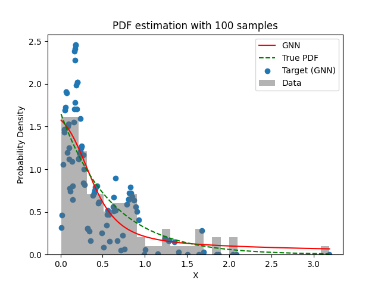
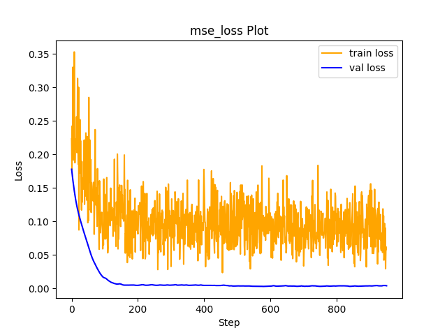

# Experiment Details Experiment  C13 S150
> from experiment with GNN
> on 2024-04-12 11-25
## Metrics:
                                                                                             
| type   | r2           | mse          | max_error   | ise          | kl     | evs          |
|--------|--------------|--------------|-------------|--------------|--------|--------------|
| Target | 0.0933123659 | 0.2013098099 | 1.313181931 | 0.2013098099 | 100000 | 0.0938583106 |
| Model  | 0.9674       | 0.0053       | 0.1532      | 0.0169       | 0.053  | 0.9675       |
                                                                                             
## Plot Prediction

## Loss Plot

## Dataset

PDF set as default <b>EXPONENTIAL_06</b>

#### Dimension 1
                               
| type        | rate | weight |
|-------------|------|--------|
| exponential | 0.6  | 1      |
                               

                              
| KEY                | VALUE |
|--------------------|-------|
| dimension          | 1     |
| seed               | 42    |
| n_samples_training | 100   |
| n_samples_test     | 319   |
| n_samples_val      | 50    |
| notes              |       |
                              
## Target
- Using GNN Target

All Params used in the model for generate the target for the MLP 

                         
| KEY          | VALUE  |
|--------------|--------|
| n_components | 13     |
| n_init       | 70     |
| max_iter     | 80     |
| init_params  | kmeans |
| random_state | 15     |
                         

## Model
> using model GNN
#### Model Params:

All Params used in the model 

                                    
| KEY             | VALUE          |
|-----------------|----------------|
| dropout         | 0.0            |
| hidden_layer    | [(14, Tanh())] |
| last_activation | lambda         |
                                    

Model Architecture 

LitModularNN(
  (neural_netowrk_modular): NeuralNetworkModular(
    (dropout): Dropout(p=0.0, inplace=False)
    (output_layer): Linear(in_features=14, out_features=1, bias=True)
    (last_activation): AdaptiveSigmoid(
      (sigmoid): Sigmoid()
    )
    (layers): ModuleList(
      (0): Linear(in_features=1, out_features=14, bias=True)
      (1): AdaptiveSigmoid(
        (sigmoid): Sigmoid()
      )
    )
    (activation): ModuleList(
      (0): Tanh()
    )
  )
)

## Training

All Params used for the training 

                             
| KEY           | VALUE     |
|---------------|-----------|
| epochs        | 950       |
| batch_size    | 76        |
| loss_type     | mse_loss  |
| optimizer     | RMSprop   |
| learning_rate | 0.0025185 |
                             

