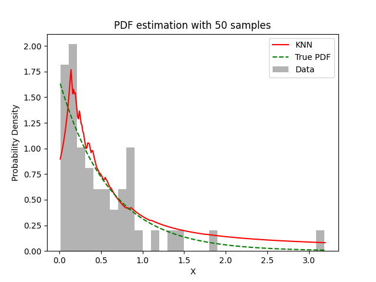

# Experiment Details Experiment S50
> from experiment with KNN
> on 2024-04-23 11-05
## Metrics:
                                                                   
| type  | r2     | mse    | max_error | ise      | kl    | evs    |
|-------|--------|--------|-----------|----------|-------|--------|
| Model | 0.9078 | 0.0147 | 0.7351    | 316.2619 | 0.702 | 0.9271 |
                                                                   
## Plot Prediction

## Dataset

PDF set as default <b>EXPONENTIAL_06</b>

#### Dimension 1
                               
| type        | rate | weight |
|-------------|------|--------|
| exponential | 0.6  | 1      |
                               

                              
| KEY                | VALUE |
|--------------------|-------|
| dimension          | 1     |
| seed               | 49    |
| n_samples_training | 50    |
| n_samples_test     | 319   |
| n_samples_val      | 0     |
| notes              |       |
                              
## Model
> using model KNN
#### Model Params:

All Params used in the model 

                           
| KEY | VALUE             |
|-----|-------------------|
| k1  | 3.291443562872368 |
| kn  | 23                |
                           

Model Architecture 

KNN_Model(k1=3.291443562872368, kn=23, training=array([1.40171379, 0.16787657, 0.87159631, 1.87457757, 0.62793651,
       0.65341418, 0.23213689, 0.09226395, 0.18910752, 0.2477912 ,
       0.13414582, 0.73625152, 0.25025202, 0.04624629, 0.41119227,
       0.75852411, 0.14275797, 0.38493404, 0.19314673, 0.17816833,
       0.83451839, 0.04381701, 0.81260279, 0.16802947, 0.09944154,
       0.01268385, 0.78903411, 0.33812286, 0.23865375, 0.07778016,
       0.82550931, 3.18592968, 0.9869195 , 0.35551452, 0.57396167,
       0.90477683, 0.19924129, 0.55489334, 0.49264296, 0.45180885,
       0.1732698 , 0.0854885 , 0.03280387, 0.269169  , 0.5609756 ,
       1.15097547, 0.19754532, 0.31861177, 0.04544322, 1.35112714]))

