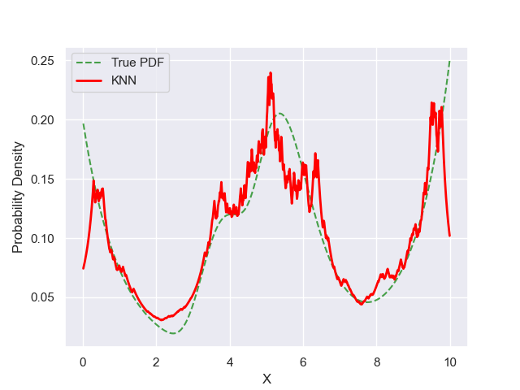

# Experiment Details KNN MULTIVARIATE_1254 S300
> from experiment with KNN
> on 2024-06-04 16-49
## Metrics:
                                                                   
| type  | r2     | mse    | max_error | ise     | kl     | evs    |
|-------|--------|--------|-----------|---------|--------|--------|
| Model | 0.7951 | 0.0007 | 0.1481    | 57.4511 | 0.1627 | 0.7962 |
                                                                   
## Plot Prediction

## Dataset

PDF set as default <b>MULTIVARIATE_1254</b>

#### Dimension 1
                                      
| type        | rate | weight |      |
|-------------|------|--------|------|
| exponential | 1    | 0.2    |      |
| logistic    | 4    | 0.8    | 0.25 |
| logistic    | 5.5  | 0.7    | 0.3  |
| exponential | -1   | 0.25   | -10  |
                                      

                              
| KEY                | VALUE |
|--------------------|-------|
| dimension          | 1     |
| seed               | 37    |
| n_samples_training | 300   |
| n_samples_test     | 999   |
| n_samples_val      | 0     |
| notes              |       |
                              
## Model
> using model KNN
#### Model Params:

All Params used in the model 

                            
| KEY | VALUE              |
|-----|--------------------|
| k1  | 1.5005508828032745 |
| kn  | 23                 |
                            

Model Architecture 

KNN_Model(k1=1.5005508828032745, kn=25, training=array([9.375019  , 4.89003   , 7.043401  , 4.748877  , 5.748054  ,
       5.605426  , 6.239142  , 5.282705  , 1.641122  , 3.493585  ,
       4.750192  , 8.015665  , 0.5006845 , 9.587764  , 0.8132093 ,
       9.651385  , 5.882876  , 6.88925   , 2.858302  , 5.293085  ,
       6.54212   , 0.2657254 , 1.531607  , 1.506608  , 0.4734116 ,
       3.83722   , 1.223035  , 0.5484621 , 9.784623  , 4.383124  ,
       6.552904  , 5.888731  , 9.298379  , 7.810104  , 6.600198  ,
       9.338509  , 8.173691  , 5.240142  , 4.883665  , 5.641452  ,
       5.511702  , 4.965811  , 5.190994  , 7.525979  , 9.414033  ,
       9.657895  , 4.988422  , 4.951302  , 6.273207  , 6.338143  ,
       7.775173  , 3.791577  , 3.496196  , 6.552608  , 0.3022147 ,
       8.570589  , 1.646756  , 5.63117   , 3.683106  , 4.252203  ,
       5.754482  , 5.763502  , 9.948655  , 3.714111  , 0.1416469 ,
       4.056597  , 3.679692  , 6.298438  , 9.571859  , 5.835233  ,
       5.729426  , 3.518163  , 0.1106241 , 1.238817  , 5.517597  ,
       7.60978   , 9.756414  , 0.684745  , 1.189607  , 8.774345  ,
       0.7314637 , 9.668651  , 5.21973   , 0.4543669 , 6.468749  ,
       3.763526  , 9.799669  , 3.564373  , 0.7663018 , 4.9125    ,
       9.371791  , 5.182179  , 6.928803  , 7.578432  , 5.23332   ,
       5.118826  , 9.754563  , 6.202972  , 9.7777    , 0.7636761 ,
       0.8401794 , 4.376027  , 4.129371  , 4.951649  , 9.175507  ,
       3.177935  , 8.693482  , 9.137634  , 5.587714  , 9.680427  ,
       5.12377   , 4.678642  , 8.702384  , 7.086371  , 2.994751  ,
       6.625451  , 4.600028  , 5.08955   , 1.344547  , 0.1187029 ,
       6.298539  , 0.1964849 , 4.567333  , 4.118461  , 3.899386  ,
       3.801121  , 3.269567  , 9.898566  , 9.608489  , 7.923205  ,
       4.413561  , 0.7258385 , 5.078392  , 4.748111  , 8.585232  ,
       3.71419   , 9.961235  , 5.829023  , 8.865982  , 0.2565272 ,
       9.974293  , 8.160622  , 0.7625968 , 3.699878  , 0.13391   ,
       9.024825  , 4.456761  , 4.501014  , 0.9769311 , 6.025025  ,
       4.371906  , 5.789281  , 4.510388  , 9.421297  , 6.156418  ,
       6.155267  , 7.81119   , 5.056887  , 9.987814  , 6.209549  ,
       3.372917  , 4.41234   , 5.006307  , 9.372733  , 5.059171  ,
       0.7000352 , 1.59945   , 8.851571  , 3.613627  , 0.05502021,
       4.427593  , 9.607844  , 3.673829  , 5.228292  , 3.856003  ,
       9.313694  , 4.020111  , 6.525383  , 6.250846  , 9.917333  ,
       6.579155  , 8.992554  , 9.700784  , 5.863385  , 8.717772  ,
       6.155552  , 9.680381  , 9.402754  , 0.01652273, 0.3595863 ,
       4.16437   , 5.830674  , 9.524585  , 6.093812  , 8.55049   ,
       4.843029  , 9.149315  , 7.072561  , 3.435779  , 4.680307  ,
       4.594853  , 6.020496  , 4.965273  , 0.7992301 , 6.344614  ,
       5.494807  , 5.720677  , 3.302892  , 5.825417  , 5.286229  ,
       9.270396  , 3.389498  , 0.02466357, 6.095269  , 6.93627   ,
       0.6579728 , 9.52765   , 8.656078  , 8.202571  , 8.636     ,
       5.107142  , 6.097165  , 0.2674682 , 6.4886    , 5.020301  ,
       3.994065  , 8.570448  , 2.115378  , 0.1755527 , 9.8153    ,
       9.435012  , 7.392043  , 6.533899  , 9.343755  , 4.844734  ,
       9.380539  , 9.578945  , 5.374003  , 4.120487  , 4.437573  ,
       4.330607  , 4.301145  , 9.968746  , 5.351219  , 4.691994  ,
       0.09608094, 6.483299  , 0.2736689 , 6.651809  , 3.636776  ,
       0.1188398 , 1.779952  , 9.544954  , 0.3190795 , 5.31763   ,
       8.379124  , 4.0346    , 5.83443   , 5.357567  , 0.2320342 ,
       7.10184   , 2.869015  , 5.222718  , 5.549523  , 9.042328  ,
       5.899665  , 4.708928  , 5.20298   , 5.290331  , 9.871499  ,
       8.425355  , 9.774344  , 9.698005  , 4.629885  , 3.889284  ,
       0.3882214 , 4.013373  , 9.749408  , 0.6664825 , 3.530914  ,
       4.912616  , 5.523612  , 0.1478877 , 4.373107  , 7.74358   ,
       8.513956  , 4.581385  , 9.068302  , 5.464789  , 6.574756  ,
       1.127118  , 6.237651  , 3.70302   , 4.810913  , 8.650779  ,
       6.772487  , 0.5770674 , 5.227701  , 7.855027  , 0.7726976 ]))

