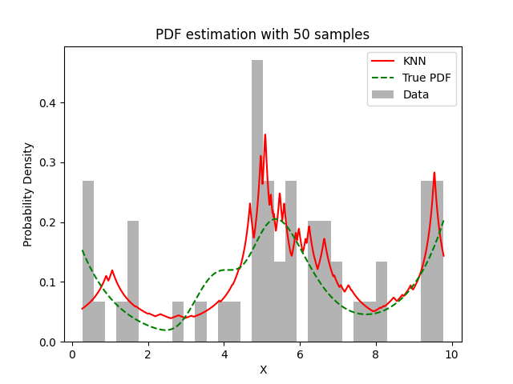

# Experiment Details Experiment S50
> from experiment with KNN
> on 2024-04-23 11-07
## Metrics:
                                                                   
| type  | r2     | mse    | max_error | ise     | kl     | evs    |
|-------|--------|--------|-----------|---------|--------|--------|
| Model | 0.4752 | 0.0015 | 0.1541    | 64.3591 | 0.1576 | 0.5261 |
                                                                   
## Plot Prediction

## Dataset

PDF set as default <b>MULTIVARIATE_1254</b>

#### Dimension 1
                                      
| type        | rate | weight |      |
|-------------|------|--------|------|
| exponential | 1    | 0.2    |      |
| logistic    | 4    | 0.8    | 0.25 |
| logistic    | 5.5  | 0.7    | 0.3  |
| exponential | -1   | 0.25   | -10  |
                                      

                              
| KEY                | VALUE |
|--------------------|-------|
| dimension          | 1     |
| seed               | 55    |
| n_samples_training | 50    |
| n_samples_test     | 953   |
| n_samples_val      | 0     |
| notes              |       |
                              
## Model
> using model KNN
#### Model Params:

All Params used in the model 

                           
| KEY | VALUE             |
|-----|-------------------|
| k1  | 7.255122108569863 |
| kn  | 23                |
                           

Model Architecture 

KNN_Model(k1=7.255122108569863, kn=7, training=array([9.375019 , 4.89003  , 7.043401 , 4.748877 , 5.748054 , 5.605426 ,
       6.239142 , 5.282705 , 1.641122 , 3.493585 , 4.750192 , 8.015665 ,
       0.5006845, 9.587764 , 0.8132093, 9.651385 , 5.882876 , 6.88925  ,
       2.858302 , 5.293085 , 6.54212  , 0.2657254, 1.531607 , 1.506608 ,
       0.4734116, 3.83722  , 1.223035 , 0.5484621, 9.784623 , 4.383124 ,
       6.552904 , 5.888731 , 9.298379 , 7.810104 , 6.600198 , 9.338509 ,
       8.173691 , 5.240142 , 4.883665 , 5.641452 , 5.511702 , 4.965811 ,
       5.190994 , 7.525979 , 9.414033 , 9.657895 , 4.988422 , 4.951302 ,
       6.273207 , 6.338143 ]))

