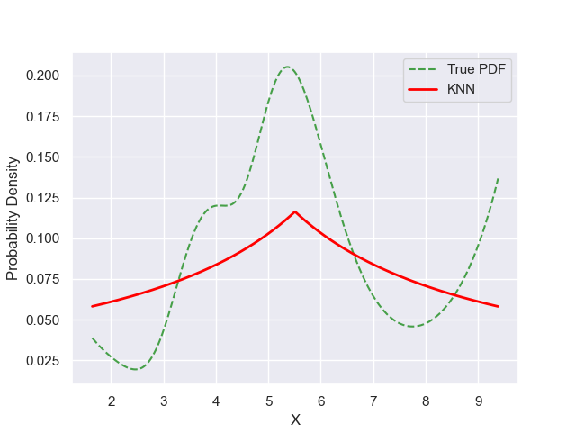

# Experiment Details Experiment S10
> from experiment with KNN
> on 2024-05-23 17-15
## Metrics:
                                                                  
| type  | r2     | mse    | max_error | ise     | kl     | evs   |
|-------|--------|--------|-----------|---------|--------|-------|
| Model | 0.3616 | 0.0019 | 0.0941    | 20.1995 | 0.1706 | 0.416 |
                                                                  
## Plot Prediction

## Dataset

PDF set as default <b>MULTIVARIATE_1254</b>

#### Dimension 1
                                      
| type        | rate | weight |      |
|-------------|------|--------|------|
| exponential | 1    | 0.2    |      |
| logistic    | 4    | 0.8    | 0.25 |
| logistic    | 5.5  | 0.7    | 0.3  |
| exponential | -1   | 0.25   | -10  |
                                      

                              
| KEY                | VALUE |
|--------------------|-------|
| dimension          | 1     |
| seed               | 37    |
| n_samples_training | 10    |
| n_samples_test     | 775   |
| n_samples_val      | 0     |
| notes              |       |
                              
## Model
> using model KNN
#### Model Params:

All Params used in the model 

                            
| KEY | VALUE              |
|-----|--------------------|
| k1  | 2.9567713114668117 |
| kn  | 23                 |
                            

Model Architecture 

KNN_Model(k1=2.9567713114668117, kn=9, training=array([9.375019, 4.89003 , 7.043401, 4.748877, 5.748054, 5.605426,
       6.239142, 5.282705, 1.641122, 3.493585]))

