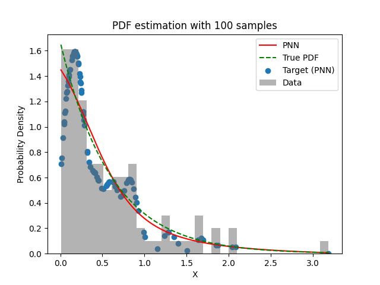
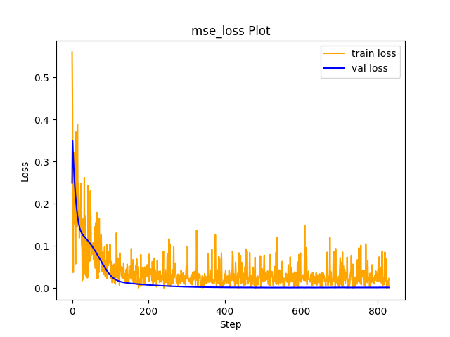

# Experiment Details Experiment  H0.05856210430161586 S150
> from experiment with PNN
> on 2024-04-12 10-56
## Metrics:
                                                                                              
| type   | r2           | mse          | max_error    | ise          | kl     | evs          |
|--------|--------------|--------------|--------------|--------------|--------|--------------|
| Target | 0.7099030259 | 0.0644095767 | 0.9240336063 | 0.0644095767 | 100000 | 0.7114500796 |
| Model  | 0.9935       | 0.0011       | 0.199        | 0.0034       | 0.0026 | 0.994        |
                                                                                              
## Plot Prediction

## Loss Plot

## Dataset

PDF set as default <b>EXPONENTIAL_06</b>

#### Dimension 1
                               
| type        | rate | weight |
|-------------|------|--------|
| exponential | 0.6  | 1      |
                               

                              
| KEY                | VALUE |
|--------------------|-------|
| dimension          | 1     |
| seed               | 61    |
| n_samples_training | 100   |
| n_samples_test     | 319   |
| n_samples_val      | 50    |
| notes              |       |
                              
## Target
- Using PNN Target

All Params used in the model for generate the target for the MLP 

                             
| KEY | VALUE               |
|-----|---------------------|
| h   | 0.05856210430161586 |
                             

## Model
> using model PNN
#### Model Params:

All Params used in the model 

                                                               
| KEY             | VALUE                                     |
|-----------------|-------------------------------------------|
| dropout         | 0.0                                       |
| hidden_layer    | [(18, Tanh()), (4, Tanh()), (20, Tanh())] |
| last_activation | None                                      |
                                                               

Model Architecture 

LitModularNN(
  (neural_netowrk_modular): NeuralNetworkModular(
    (dropout): Dropout(p=0.0, inplace=False)
    (output_layer): Linear(in_features=20, out_features=1, bias=True)
    (layers): ModuleList(
      (0): Linear(in_features=1, out_features=18, bias=True)
      (1): Linear(in_features=18, out_features=4, bias=True)
      (2): Linear(in_features=4, out_features=20, bias=True)
    )
    (activation): ModuleList(
      (0-2): 3 x Tanh()
    )
  )
)

## Training

All Params used for the training 

                            
| KEY           | VALUE    |
|---------------|----------|
| epochs        | 830      |
| batch_size    | 8        |
| loss_type     | mse_loss |
| optimizer     | Adam     |
| learning_rate | 0.00012  |
                            

