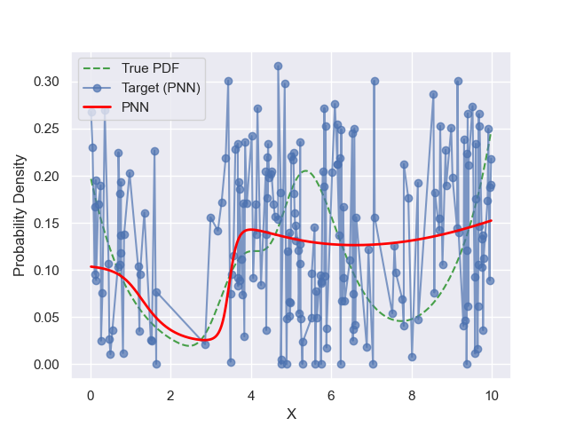
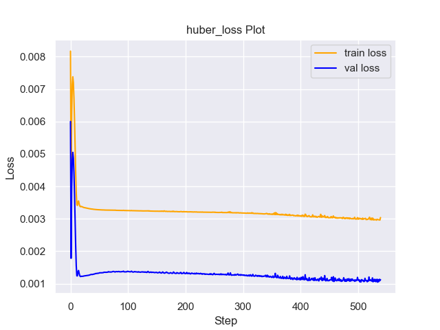
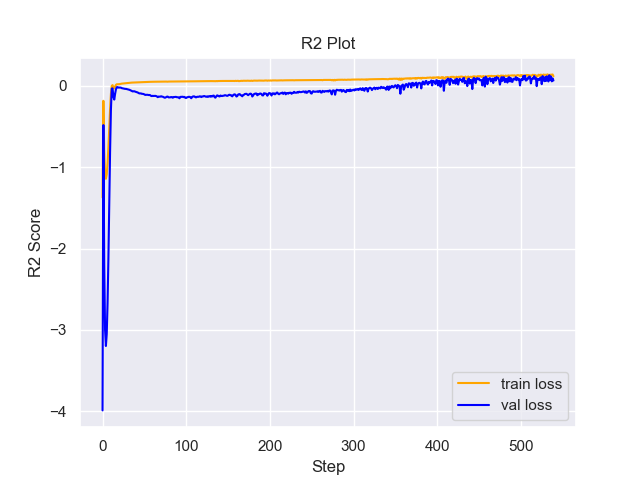

# Experiment Details Experiment  H0.026604557869874756 S250
> from experiment with PNN
> on 2024-05-23 19-21
## Metrics:
                                                                                                     
| type   | r2            | mse          | max_error   | ise          | kl           | evs           |
|--------|---------------|--------------|-------------|--------------|--------------|---------------|
| Target | -1.1867932628 | 0.0057187923 | 0.188865627 | 0.0114375846 | 0.3513543959 | -1.1784740706 |
| Model  | 0.3368        | 0.0021       | 0.0956      | 0.2092       | 0.0911       | 0.3584        |
                                                                                                     
## Plot Prediction

## Loss Plot

## Training Metric Plot

## Dataset

PDF set as default <b>MULTIVARIATE_1254</b>

#### Dimension 1
                                      
| type        | rate | weight |      |
|-------------|------|--------|------|
| exponential | 1    | 0.2    |      |
| logistic    | 4    | 0.8    | 0.25 |
| logistic    | 5.5  | 0.7    | 0.3  |
| exponential | -1   | 0.25   | -10  |
                                      

                              
| KEY                | VALUE |
|--------------------|-------|
| dimension          | 1     |
| seed               | 31    |
| n_samples_training | 200   |
| n_samples_test     | 9973  |
| n_samples_val      | 50    |
| notes              |       |
                              
## Target
- Using PNN Target

All Params used in the model for generate the target for the MLP 

                              
| KEY | VALUE                |
|-----|----------------------|
| h   | 0.026604557869874756 |
                              

## Model
> using model PNN
#### Model Params:

All Params used in the model 

                                                                                    
| KEY             | VALUE                                                          |
|-----------------|----------------------------------------------------------------|
| dropout         | 0.0                                                            |
| hidden_layer    | [[28, Tanh()], (20, Sigmoid()), (34, Sigmoid()), (26, Tanh())] |
| last_activation | lambda                                                         |
                                                                                    

Model Architecture 

NeuralNetworkModular(
  (dropout): Dropout(p=0.0, inplace=False)
  (output_layer): Linear(in_features=26, out_features=1, bias=True)
  (last_activation): AdaptiveSigmoid(
    (sigmoid): Sigmoid()
  )
  (layers): ModuleList(
    (0): Linear(in_features=1, out_features=28, bias=True)
    (1): Linear(in_features=28, out_features=20, bias=True)
    (2): Linear(in_features=20, out_features=34, bias=True)
    (3): Linear(in_features=34, out_features=26, bias=True)
    (4): AdaptiveSigmoid(
      (sigmoid): Sigmoid()
    )
  )
  (activation): ModuleList(
    (0): Tanh()
    (1-2): 2 x Sigmoid()
    (3): Tanh()
  )
)

## Training

All Params used for the training 

                                        
| KEY           | VALUE                |
|---------------|----------------------|
| epochs        | 540                  |
| batch_size    | 52                   |
| loss_type     | huber_loss           |
| optimizer     | Adam                 |
| learning_rate | 0.003454947958915411 |
                                        

