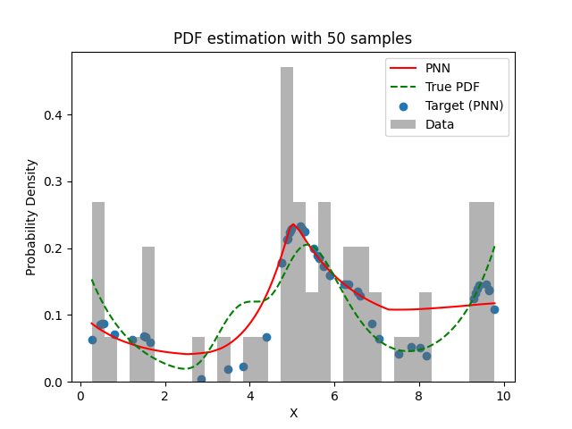
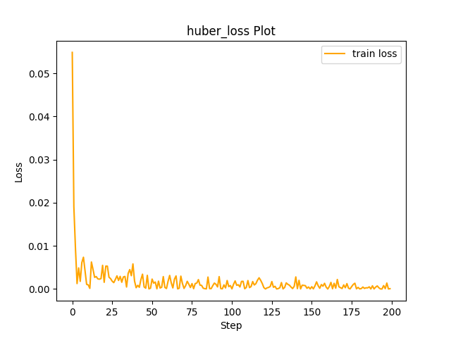

# Experiment Details Experiment  H0.32837350446657937 S50
> from experiment with PNN
> on 2024-04-23 14-15
## Metrics:
                                                                                                  
| type   | r2           | mse          | max_error    | ise          | kl           | evs        |
|--------|--------------|--------------|--------------|--------------|--------------|------------|
| Target | 0.5503268826 | 0.0013037325 | 0.0949638505 | 0.0006518662 | 0.0642570382 | 0.55111116 |
| Model  | 0.5513       | 0.0013       | 0.0854       | 0.012        | 0.0669       | 0.5875     |
                                                                                                  
## Plot Prediction

## Loss Plot

## Dataset

PDF set as default <b>MULTIVARIATE_1254</b>

#### Dimension 1
                                      
| type        | rate | weight |      |
|-------------|------|--------|------|
| exponential | 1    | 0.2    |      |
| logistic    | 4    | 0.8    | 0.25 |
| logistic    | 5.5  | 0.7    | 0.3  |
| exponential | -1   | 0.25   | -10  |
                                      

                              
| KEY                | VALUE |
|--------------------|-------|
| dimension          | 1     |
| seed               | 23    |
| n_samples_training | 50    |
| n_samples_test     | 953   |
| n_samples_val      | 0     |
| notes              |       |
                              
## Target
- Using PNN Target

All Params used in the model for generate the target for the MLP 

                             
| KEY | VALUE               |
|-----|---------------------|
| h   | 0.32837350446657937 |
                             

## Model
> using model PNN
#### Model Params:

All Params used in the model 

                                                                                 
| KEY             | VALUE                                                       |
|-----------------|-------------------------------------------------------------|
| dropout         | 0.0                                                         |
| hidden_layer    | [(26, ReLU()), (24, Tanh()), (64, ReLU()), (58, Sigmoid())] |
| last_activation | lambda                                                      |
                                                                                 

Model Architecture 

LitModularNN(
  (neural_netowrk_modular): NeuralNetworkModular(
    (dropout): Dropout(p=0.0, inplace=False)
    (output_layer): Linear(in_features=58, out_features=1, bias=True)
    (last_activation): AdaptiveSigmoid(
      (sigmoid): Sigmoid()
    )
    (layers): ModuleList(
      (0): Linear(in_features=1, out_features=26, bias=True)
      (1): Linear(in_features=26, out_features=24, bias=True)
      (2): Linear(in_features=24, out_features=64, bias=True)
      (3): Linear(in_features=64, out_features=58, bias=True)
      (4): AdaptiveSigmoid(
        (sigmoid): Sigmoid()
      )
    )
    (activation): ModuleList(
      (0): ReLU()
      (1): Tanh()
      (2): ReLU()
      (3): Sigmoid()
    )
  )
)

## Training

All Params used for the training 

                                          
| KEY           | VALUE                  |
|---------------|------------------------|
| epochs        | 200                    |
| batch_size    | 2                      |
| loss_type     | huber_loss             |
| optimizer     | Adam                   |
| learning_rate | 0.00032614616773403313 |
                                          

