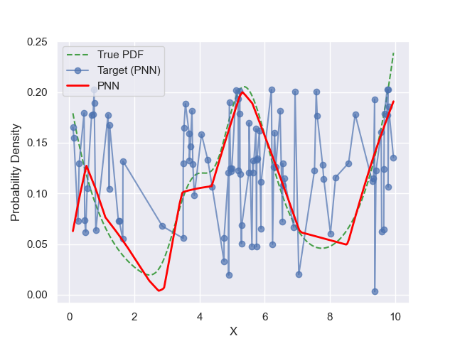
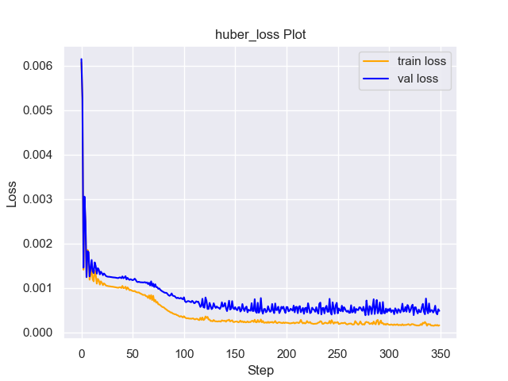
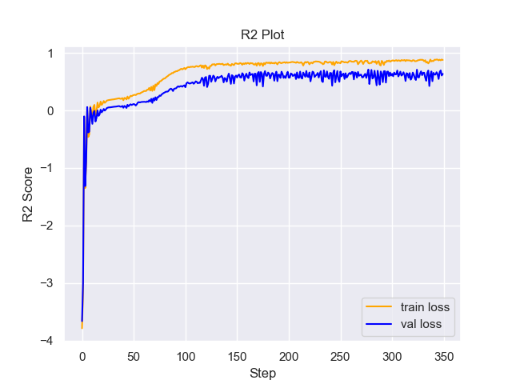

# Experiment Details Experiment  H0.2631334377419931 S150
> from experiment with PNN
> on 2024-05-23 16-56
## Metrics:
                                                                                                 
| type   | r2           | mse         | max_error    | ise         | kl          | evs          |
|--------|--------------|-------------|--------------|-------------|-------------|--------------|
| Target | 0.6930986739 | 0.000881479 | 0.1338841597 | 0.000881479 | 0.038386178 | 0.7045151255 |
| Model  | 0.9047       | 0.0003      | 0.1163       | 0.0286      | 0.0228      | 0.9073       |
                                                                                                 
## Plot Prediction

## Loss Plot

## Training Metric Plot

## Dataset

PDF set as default <b>MULTIVARIATE_1254</b>

#### Dimension 1
                                      
| type        | rate | weight |      |
|-------------|------|--------|------|
| exponential | 1    | 0.2    |      |
| logistic    | 4    | 0.8    | 0.25 |
| logistic    | 5.5  | 0.7    | 0.3  |
| exponential | -1   | 0.25   | -10  |
                                      

                              
| KEY                | VALUE |
|--------------------|-------|
| dimension          | 1     |
| seed               | 98    |
| n_samples_training | 100   |
| n_samples_test     | 9840  |
| n_samples_val      | 50    |
| notes              |       |
                              
## Target
- Using PNN Target

All Params used in the model for generate the target for the MLP 

                            
| KEY | VALUE              |
|-----|--------------------|
| h   | 0.2631334377419931 |
                            

## Model
> using model PNN
#### Model Params:

All Params used in the model 

                                                                                               
| KEY             | VALUE                                                                     |
|-----------------|---------------------------------------------------------------------------|
| dropout         | 0.0                                                                       |
| hidden_layer    | [(34, ReLU()), (30, Tanh()), (22, ReLU()), (52, ReLU()), (24, Sigmoid())] |
| last_activation | None                                                                      |
                                                                                               

Model Architecture 

NeuralNetworkModular(
  (dropout): Dropout(p=0.0, inplace=False)
  (output_layer): Linear(in_features=24, out_features=1, bias=True)
  (layers): ModuleList(
    (0): Linear(in_features=1, out_features=34, bias=True)
    (1): Linear(in_features=34, out_features=30, bias=True)
    (2): Linear(in_features=30, out_features=22, bias=True)
    (3): Linear(in_features=22, out_features=52, bias=True)
    (4): Linear(in_features=52, out_features=24, bias=True)
  )
  (activation): ModuleList(
    (0): ReLU()
    (1): Tanh()
    (2-3): 2 x ReLU()
    (4): Sigmoid()
  )
)

## Training

All Params used for the training 

                                         
| KEY           | VALUE                 |
|---------------|-----------------------|
| learning_rate | 0.0024196704886789663 |
| epochs        | 350                   |
| loss_type     | huber_loss            |
| optimizer     | Adam                  |
| batch_size    | 68                    |
                                         

