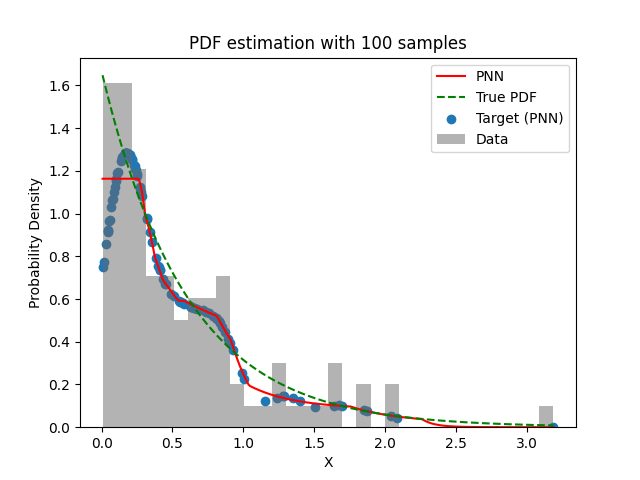
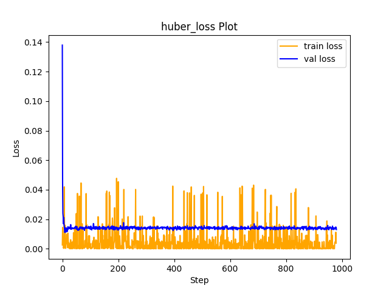

# Experiment Details Experiment  H0.11685252311419939 S150
> from experiment with PNN
> on 2024-04-04 01-27
## Metrics:
                                                                                                    
| type   | r2           | mse          | max_error    | ise          | kl           | evs          |
|--------|--------------|--------------|--------------|--------------|--------------|--------------|
| Target | 0.7708435628 | 0.0508790868 | 0.8823867681 | 0.0508790868 | 0.0284288719 | 0.8018004984 |
| Model  | 0.9572       | 0.007        | 0.4847       | 0.0223       | 0.047        | 0.9638       |
                                                                                                    
## Plot Prediction

## Loss Plot

## Dataset

PDF attribute

#### Dimension 1
                               
| type        | rate | weight |
|-------------|------|--------|
| exponential | 0.6  | 1      |
                               

                              
| KEY                | VALUE |
|--------------------|-------|
| dimension          | 1     |
| seed               | 42    |
| n_samples_training | 100   |
| n_samples_test     | 319   |
| n_samples_val      | 50    |
| notes              |       |
                              
## Target
- Using PNN Target

All Params used in the model for generate the target for the MLP 

                             
| KEY | VALUE               |
|-----|---------------------|
| h   | 0.11685252311419939 |
                             

## Model
> using model PNN
#### Model Params:

All Params used in the model 

                                                                
| KEY             | VALUE                                      |
|-----------------|--------------------------------------------|
| dropout         | 0.0                                        |
| hidden_layer    | [(22, Tanh()), (24, ReLU()), (60, ReLU())] |
| last_activation | lambda                                     |
                                                                

Model Architecture 

LitModularNN(
  (neural_netowrk_modular): NeuralNetworkModular(
    (dropout): Dropout(p=0.0, inplace=False)
    (output_layer): Linear(in_features=60, out_features=1, bias=True)
    (last_activation): AdaptiveSigmoid(
      (sigmoid): Sigmoid()
    )
    (layers): ModuleList(
      (0): Linear(in_features=1, out_features=22, bias=True)
      (1): Linear(in_features=22, out_features=24, bias=True)
      (2): Linear(in_features=24, out_features=60, bias=True)
      (3): AdaptiveSigmoid(
        (sigmoid): Sigmoid()
      )
    )
    (activation): ModuleList(
      (0): Tanh()
      (1-2): 2 x ReLU()
    )
  )
)

## Training

All Params used for the training 

                                 
| KEY           | VALUE         |
|---------------|---------------|
| epochs        | 980           |
| batch_size    | 2             |
| loss_type     | huber_loss    |
| optimizer     | RMSprop       |
| learning_rate | 0.00660307851 |
                                 

