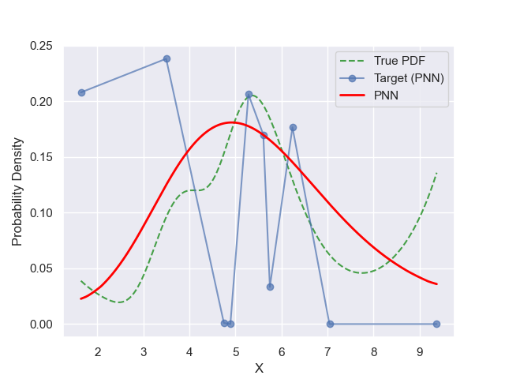
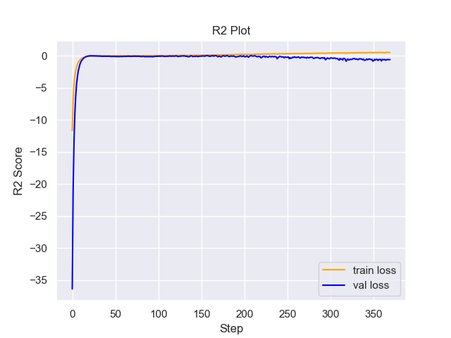

# Experiment Details Experiment  H0.24853179838613948 S60
> from experiment with PNN
> on 2024-05-23 16-39
## Metrics:
                                                                                                     
| type   | r2            | mse          | max_error    | ise          | kl           | evs          |
|--------|---------------|--------------|--------------|--------------|--------------|--------------|
| Target | -0.6301858859 | 0.0046763354 | 0.1358952409 | 0.0004676335 | 5.8995045451 | -0.231846817 |
| Model  | 0.5778        | 0.0012       | 0.1          | 0.096        | 0.0766       | 0.6396       |
                                                                                                     
## Plot Prediction

## Loss Plot

## Training Metric Plot

## Dataset

PDF set as default <b>MULTIVARIATE_1254</b>

#### Dimension 1
                                      
| type        | rate | weight |      |
|-------------|------|--------|------|
| exponential | 1    | 0.2    |      |
| logistic    | 4    | 0.8    | 0.25 |
| logistic    | 5.5  | 0.7    | 0.3  |
| exponential | -1   | 0.25   | -10  |
                                      

                              
| KEY                | VALUE |
|--------------------|-------|
| dimension          | 1     |
| seed               | 64    |
| n_samples_training | 10    |
| n_samples_test     | 7735  |
| n_samples_val      | 50    |
| notes              |       |
                              
## Target
- Using PNN Target

All Params used in the model for generate the target for the MLP 

                             
| KEY | VALUE               |
|-----|---------------------|
| h   | 0.24853179838613948 |
                             

## Model
> using model PNN
#### Model Params:

All Params used in the model 

                                                                             
| KEY             | VALUE                                                   |
|-----------------|---------------------------------------------------------|
| dropout         | 0.0                                                     |
| hidden_layer    | [(52, Tanh()), (6, Tanh()), (58, Tanh()), (38, ReLU())] |
| last_activation | lambda                                                  |
                                                                             

Model Architecture 

NeuralNetworkModular(
  (dropout): Dropout(p=0.0, inplace=False)
  (output_layer): Linear(in_features=38, out_features=1, bias=True)
  (last_activation): AdaptiveSigmoid(
    (sigmoid): Sigmoid()
  )
  (layers): ModuleList(
    (0): Linear(in_features=1, out_features=52, bias=True)
    (1): Linear(in_features=52, out_features=6, bias=True)
    (2): Linear(in_features=6, out_features=58, bias=True)
    (3): Linear(in_features=58, out_features=38, bias=True)
    (4): AdaptiveSigmoid(
      (sigmoid): Sigmoid()
    )
  )
  (activation): ModuleList(
    (0-2): 3 x Tanh()
    (3): ReLU()
  )
)

## Training

All Params used for the training 

                                          
| KEY           | VALUE                  |
|---------------|------------------------|
| learning_rate | 0.00043285400651533746 |
| epochs        | 370                    |
| loss_type     | huber_loss             |
| optimizer     | RMSprop                |
| batch_size    | 6                      |
                                          

