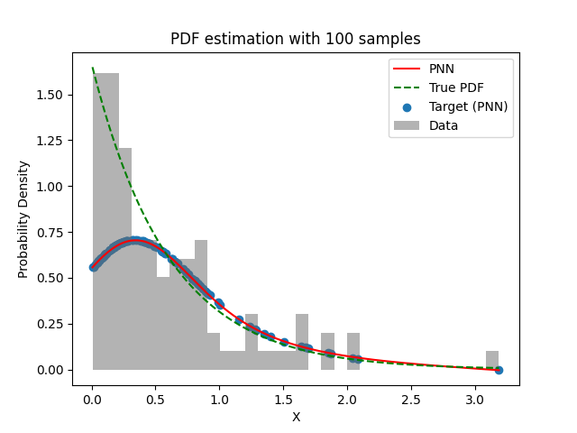
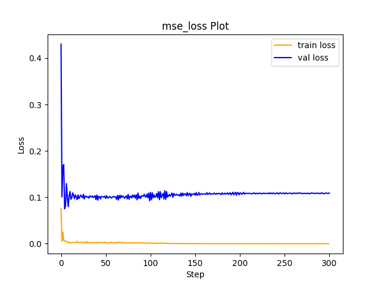

# Experiment Details Experiment  H0.3795755152130492 S150
> from experiment with PNN
> on 2024-04-03 18-17
## Metrics:
                                                                                                   
| type   | r2           | mse          | max_error   | ise          | kl           | evs          |
|--------|--------------|--------------|-------------|--------------|--------------|--------------|
| Target | 0.0336755483 | 0.2145508379 | 1.074900234 | 0.2145508379 | 0.0673385281 | 0.4395711259 |
| Model  | 0.7003       | 0.0488       | 1.0912      | 0.1558       | 100000       | 0.7226       |
                                                                                                   
## Plot Prediction

## Loss Plot

## Dataset

PDF attribute

#### Dimension 1
                               
| type        | rate | weight |
|-------------|------|--------|
| exponential | 0.6  | 1      |
                               

                              
| KEY                | VALUE |
|--------------------|-------|
| dimension          | 1     |
| seed               | 42    |
| n_samples_training | 100   |
| n_samples_test     | 319   |
| n_samples_val      | 50    |
| notes              |       |
                              
## Target
- Using PNN Target

All Params used in the model for generate the target for the MLP 

                            
| KEY | VALUE              |
|-----|--------------------|
| h   | 0.3795755152130492 |
                            

## Model
> using model PNN
#### Model Params:

All Params used in the model 

                                                                
| KEY             | VALUE                                      |
|-----------------|--------------------------------------------|
| dropout         | 0.0                                        |
| hidden_layer    | [(64, Tanh()), (56, Tanh()), (38, Tanh())] |
| last_activation | None                                       |
                                                                

Model Architecture 

LitModularNN(
  (neural_netowrk_modular): NeuralNetworkModular(
    (dropout): Dropout(p=0.0, inplace=False)
    (output_layer): Linear(in_features=38, out_features=1, bias=True)
    (layers): ModuleList(
      (0): Linear(in_features=1, out_features=64, bias=True)
      (1): Linear(in_features=64, out_features=56, bias=True)
      (2): Linear(in_features=56, out_features=38, bias=True)
    )
    (activation): ModuleList(
      (0-2): 3 x Tanh()
    )
  )
)

## Training

All Params used for the training 

                               
| KEY           | VALUE       |
|---------------|-------------|
| epochs        | 300         |
| batch_size    | 26          |
| loss_type     | mse_loss    |
| optimizer     | Adam        |
| learning_rate | 0.000874345 |
                               

