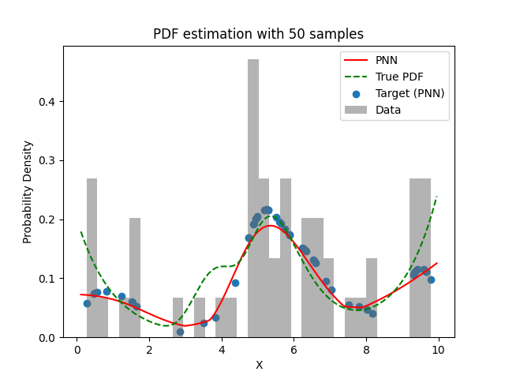
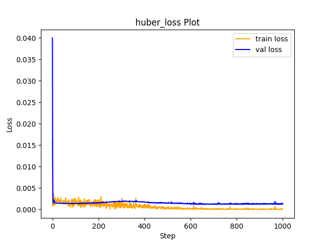

# Experiment Details Experiment  H0.4489913561811363 S50
> from experiment with PNN
> on 2024-04-23 13-33
## Metrics:
                                                                                                  
| type   | r2           | mse         | max_error    | ise         | kl           | evs          |
|--------|--------------|-------------|--------------|-------------|--------------|--------------|
| Target | 0.5551413398 | 0.001289774 | 0.1054331455 | 0.000644887 | 0.0560670258 | 0.5729628644 |
| Model  | 0.6206       | 0.0012      | 0.1136       | 0.0114      | 0.068        | 0.6914       |
                                                                                                  
## Plot Prediction

## Loss Plot

## Dataset

PDF set as default <b>MULTIVARIATE_1254</b>

#### Dimension 1
                                      
| type        | rate | weight |      |
|-------------|------|--------|------|
| exponential | 1    | 0.2    |      |
| logistic    | 4    | 0.8    | 0.25 |
| logistic    | 5.5  | 0.7    | 0.3  |
| exponential | -1   | 0.25   | -10  |
                                      

                              
| KEY                | VALUE |
|--------------------|-------|
| dimension          | 1     |
| seed               | 27    |
| n_samples_training | 50    |
| n_samples_test     | 985   |
| n_samples_val      | 50    |
| notes              |       |
                              
## Target
- Using PNN Target

All Params used in the model for generate the target for the MLP 

                            
| KEY | VALUE              |
|-----|--------------------|
| h   | 0.4489913561811363 |
                            

## Model
> using model PNN
#### Model Params:

All Params used in the model 

                                                                                                  
| KEY             | VALUE                                                                        |
|-----------------|------------------------------------------------------------------------------|
| dropout         | 0.0                                                                          |
| hidden_layer    | [(26, Sigmoid()), (26, Tanh()), (24, Sigmoid()), (50, Tanh()), (34, ReLU())] |
| last_activation | lambda                                                                       |
                                                                                                  

Model Architecture 

LitModularNN(
  (neural_netowrk_modular): NeuralNetworkModular(
    (dropout): Dropout(p=0.0, inplace=False)
    (output_layer): Linear(in_features=34, out_features=1, bias=True)
    (last_activation): AdaptiveSigmoid(
      (sigmoid): Sigmoid()
    )
    (layers): ModuleList(
      (0): Linear(in_features=1, out_features=26, bias=True)
      (1): Linear(in_features=26, out_features=26, bias=True)
      (2): Linear(in_features=26, out_features=24, bias=True)
      (3): Linear(in_features=24, out_features=50, bias=True)
      (4): Linear(in_features=50, out_features=34, bias=True)
      (5): AdaptiveSigmoid(
        (sigmoid): Sigmoid()
      )
    )
    (activation): ModuleList(
      (0): Sigmoid()
      (1): Tanh()
      (2): Sigmoid()
      (3): Tanh()
      (4): ReLU()
    )
  )
)

## Training

All Params used for the training 

                                        
| KEY           | VALUE                |
|---------------|----------------------|
| epochs        | 1000                 |
| batch_size    | 10                   |
| loss_type     | huber_loss           |
| optimizer     | RMSprop              |
| learning_rate | 0.000625561910265068 |
                                        

