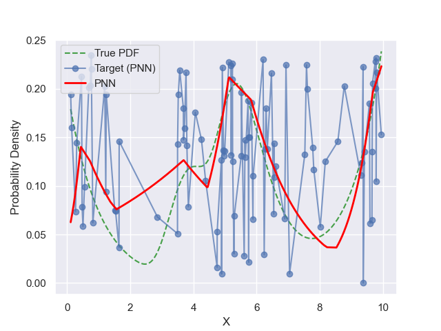
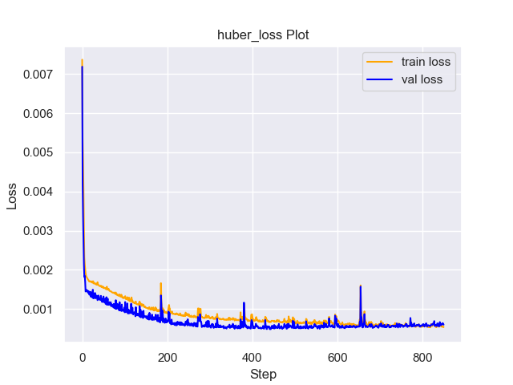
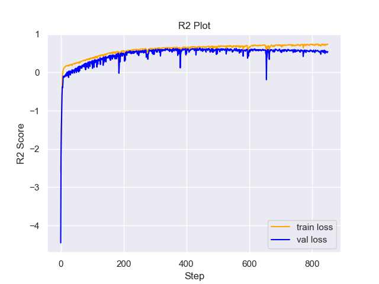

# Experiment Details Experiment  H0.13146068251965842 S150
> from experiment with PNN
> on 2024-05-23 16-50
## Metrics:
                                                                                                    
| type   | r2           | mse          | max_error    | ise          | kl           | evs          |
|--------|--------------|--------------|--------------|--------------|--------------|--------------|
| Target | 0.3706839302 | 0.0018075154 | 0.1648034664 | 0.0018075154 | 0.1037430573 | 0.3814572262 |
| Model  | 0.6323       | 0.0011       | 0.1165       | 0.1102       | 0.0677       | 0.6911       |
                                                                                                    
## Plot Prediction

## Loss Plot

## Training Metric Plot

## Dataset

PDF set as default <b>MULTIVARIATE_1254</b>

#### Dimension 1
                                      
| type        | rate | weight |      |
|-------------|------|--------|------|
| exponential | 1    | 0.2    |      |
| logistic    | 4    | 0.8    | 0.25 |
| logistic    | 5.5  | 0.7    | 0.3  |
| exponential | -1   | 0.25   | -10  |
                                      

                              
| KEY                | VALUE |
|--------------------|-------|
| dimension          | 1     |
| seed               | 12    |
| n_samples_training | 100   |
| n_samples_test     | 9840  |
| n_samples_val      | 50    |
| notes              |       |
                              
## Target
- Using PNN Target

All Params used in the model for generate the target for the MLP 

                             
| KEY | VALUE               |
|-----|---------------------|
| h   | 0.13146068251965842 |
                             

## Model
> using model PNN
#### Model Params:

All Params used in the model 

                                                  
| KEY             | VALUE                        |
|-----------------|------------------------------|
| dropout         | 0.0                          |
| hidden_layer    | [(14, ReLU()), (44, ReLU())] |
| last_activation | lambda                       |
                                                  

Model Architecture 

NeuralNetworkModular(
  (dropout): Dropout(p=0.0, inplace=False)
  (output_layer): Linear(in_features=44, out_features=1, bias=True)
  (last_activation): AdaptiveSigmoid(
    (sigmoid): Sigmoid()
  )
  (layers): ModuleList(
    (0): Linear(in_features=1, out_features=14, bias=True)
    (1): Linear(in_features=14, out_features=44, bias=True)
    (2): AdaptiveSigmoid(
      (sigmoid): Sigmoid()
    )
  )
  (activation): ModuleList(
    (0-1): 2 x ReLU()
  )
)

## Training

All Params used for the training 

                              
| KEY           | VALUE      |
|---------------|------------|
| learning_rate | 0.00278    |
| epochs        | 850        |
| loss_type     | huber_loss |
| optimizer     | Adam       |
| batch_size    | 18         |
                              

