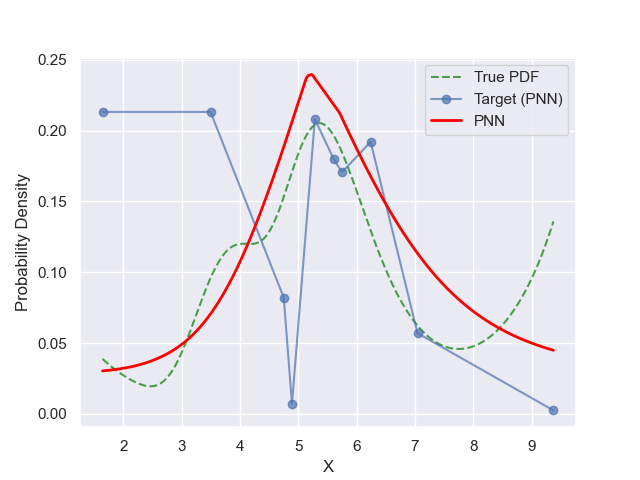
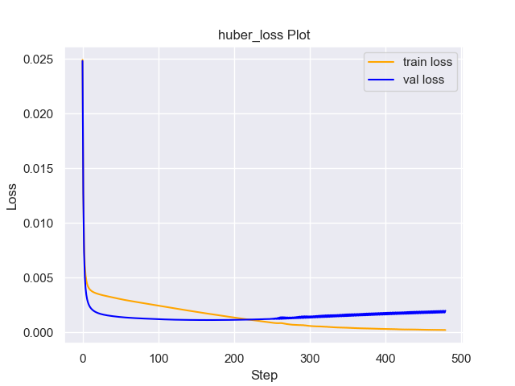
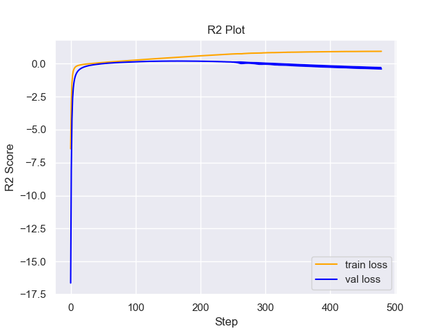

# Experiment Details Experiment  H0.943425509758125 S60
> from experiment with PNN
> on 2024-05-23 16-41
## Metrics:
                                                                                                   
| type   | r2           | mse          | max_error   | ise          | kl           | evs          |
|--------|--------------|--------------|-------------|--------------|--------------|--------------|
| Target | 0.1463257595 | 0.0024488417 | 0.133441783 | 0.0002448842 | 0.3424304474 | 0.1536732509 |
| Model  | 0.6396       | 0.0011       | 0.091       | 0.0819       | 0.0545       | 0.6982       |
                                                                                                   
## Plot Prediction

## Loss Plot

## Training Metric Plot

## Dataset

PDF set as default <b>MULTIVARIATE_1254</b>

#### Dimension 1
                                      
| type        | rate | weight |      |
|-------------|------|--------|------|
| exponential | 1    | 0.2    |      |
| logistic    | 4    | 0.8    | 0.25 |
| logistic    | 5.5  | 0.7    | 0.3  |
| exponential | -1   | 0.25   | -10  |
                                      

                              
| KEY                | VALUE |
|--------------------|-------|
| dimension          | 1     |
| seed               | 60    |
| n_samples_training | 10    |
| n_samples_test     | 7735  |
| n_samples_val      | 50    |
| notes              |       |
                              
## Target
- Using PNN Target

All Params used in the model for generate the target for the MLP 

                           
| KEY | VALUE             |
|-----|-------------------|
| h   | 0.943425509758125 |
                           

## Model
> using model PNN
#### Model Params:

All Params used in the model 

                                                                
| KEY             | VALUE                                      |
|-----------------|--------------------------------------------|
| dropout         | 0.0                                        |
| hidden_layer    | [(42, ReLU()), (48, Tanh()), (14, Tanh())] |
| last_activation | lambda                                     |
                                                                

Model Architecture 

NeuralNetworkModular(
  (dropout): Dropout(p=0.0, inplace=False)
  (output_layer): Linear(in_features=14, out_features=1, bias=True)
  (last_activation): AdaptiveSigmoid(
    (sigmoid): Sigmoid()
  )
  (layers): ModuleList(
    (0): Linear(in_features=1, out_features=42, bias=True)
    (1): Linear(in_features=42, out_features=48, bias=True)
    (2): Linear(in_features=48, out_features=14, bias=True)
    (3): AdaptiveSigmoid(
      (sigmoid): Sigmoid()
    )
  )
  (activation): ModuleList(
    (0): ReLU()
    (1-2): 2 x Tanh()
  )
)

## Training

All Params used for the training 

                                         
| KEY           | VALUE                 |
|---------------|-----------------------|
| learning_rate | 0.0005046691303549016 |
| epochs        | 480                   |
| loss_type     | huber_loss            |
| optimizer     | RMSprop               |
| batch_size    | 60                    |
                                         

