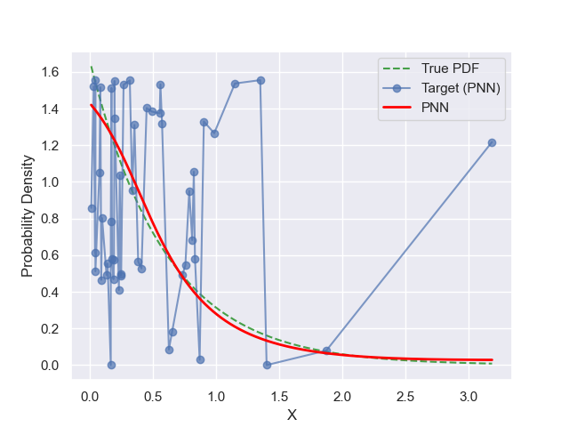
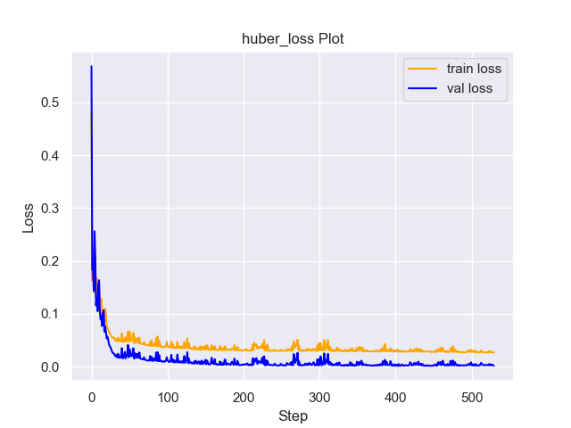
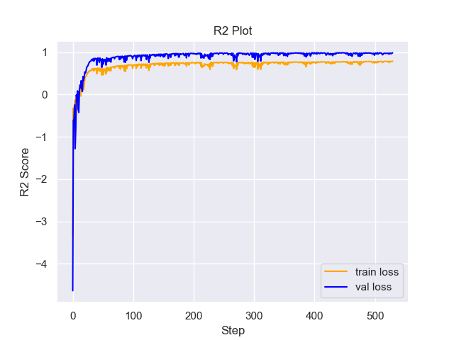

# Experiment Details Experiment  H0.08920871939579947 S100
> from experiment with PNN
> on 2024-05-23 16-43
## Metrics:
                                                                                                    
| type   | r2           | mse          | max_error    | ise          | kl           | evs          |
|--------|--------------|--------------|--------------|--------------|--------------|--------------|
| Target | 0.6608006995 | 0.0704918069 | 0.8297995134 | 0.0352459035 | 0.0843061936 | 0.6625193287 |
| Model  | 0.9911       | 0.0014       | 0.2115       | 0.0444       | 0.0076       | 0.9911       |
                                                                                                    
## Plot Prediction

## Loss Plot

## Training Metric Plot

## Dataset

PDF set as default <b>EXPONENTIAL_06</b>

#### Dimension 1
                               
| type        | rate | weight |
|-------------|------|--------|
| exponential | 0.6  | 1      |
                               

                              
| KEY                | VALUE |
|--------------------|-------|
| dimension          | 1     |
| seed               | 63    |
| n_samples_training | 50    |
| n_samples_test     | 3175  |
| n_samples_val      | 50    |
| notes              |       |
                              
## Target
- Using PNN Target

All Params used in the model for generate the target for the MLP 

                             
| KEY | VALUE               |
|-----|---------------------|
| h   | 0.08920871939579947 |
                             

## Model
> using model PNN
#### Model Params:

All Params used in the model 

                                                     
| KEY             | VALUE                           |
|-----------------|---------------------------------|
| dropout         | 0.0                             |
| hidden_layer    | [(52, Sigmoid()), (50, Tanh())] |
| last_activation | None                            |
                                                     

Model Architecture 

NeuralNetworkModular(
  (dropout): Dropout(p=0.0, inplace=False)
  (output_layer): Linear(in_features=50, out_features=1, bias=True)
  (layers): ModuleList(
    (0): Linear(in_features=1, out_features=52, bias=True)
    (1): Linear(in_features=52, out_features=50, bias=True)
  )
  (activation): ModuleList(
    (0): Sigmoid()
    (1): Tanh()
  )
)

## Training

All Params used for the training 

                              
| KEY           | VALUE      |
|---------------|------------|
| learning_rate | 0.0076     |
| epochs        | 530        |
| loss_type     | huber_loss |
| optimizer     | Adam       |
| batch_size    | 42         |
                              

