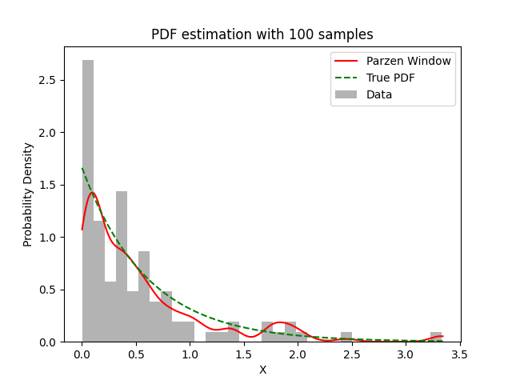

# Experiment Details Experiment  H0.11685252311419939 S150
> from experiment with Parzen Window
> on 2024-04-04 01-36
## Metrics:
                                                                   
| type  | r2     | mse    | max_error | ise      | kl     | evs   |
|-------|--------|--------|-----------|----------|--------|-------|
| Model | 0.9622 | 0.0061 | 0.5887    | 340.2557 | 0.7446 | 0.967 |
                                                                   
## Plot Prediction

## Dataset

PDF attribute

#### Dimension 1
                               
| type        | rate | weight |
|-------------|------|--------|
| exponential | 0.6  | 1      |
                               

                              
| KEY                | VALUE |
|--------------------|-------|
| dimension          | 1     |
| seed               | 60    |
| n_samples_training | 100   |
| n_samples_test     | 335   |
| n_samples_val      | 50    |
| notes              |       |
                              
## Target
## Model
> using model Parzen Window
#### Model Params:

All Params used in the model 

                            
| KEY | VALUE              |
|-----|--------------------|
| h   | 0.1000015563586018 |
                            

Model Architecture 

ParzenWindow_Model(h=0.1000015563586018, training=array([1.30148953e-02, 1.15374750e+00, 1.91807440e+00, 7.32924999e-01,
       3.78304010e-01, 4.41031262e-01, 5.09581419e-01, 1.28441908e-01,
       3.34548609e-02, 1.95962884e-03, 4.45490994e-01, 3.33179772e-01,
       1.01530508e-01, 2.43199842e-01, 4.40847295e-02, 2.92984681e-03,
       4.88895174e-02, 2.56930267e-01, 2.58482261e-01, 3.40453874e-01,
       1.07983339e-01, 3.67948061e-01, 3.50034492e-01, 7.94931712e-02,
       2.23841276e-01, 5.32728505e-01, 9.51941897e-01, 5.33557086e-01,
       3.39527423e-01, 3.33350024e+00, 8.79545191e-01, 3.69781153e-01,
       8.11639234e-02, 9.31286450e-02, 2.58506626e-02, 6.95680007e-02,
       1.71325972e+00, 9.09118319e-01, 7.78971557e-01, 8.19182392e-01,
       1.41123886e+00, 5.30832063e-01, 7.97651823e-03, 4.91557239e-01,
       1.32352259e-02, 9.08857229e-02, 1.76177958e-01, 4.28242105e-01,
       1.68987780e-01, 9.48566564e-02, 1.96776840e-01, 2.06782101e-02,
       3.30798073e-01, 5.53864826e-01, 4.11646700e-02, 1.30210207e-01,
       2.44777367e+00, 6.72923555e-01, 8.99051187e-02, 2.67700760e-02,
       6.27213998e-02, 1.01044333e+00, 1.54815159e-01, 1.39262495e+00,
       5.58988873e-01, 1.30539785e-01, 4.08382882e-01, 1.81507750e+00,
       3.15601206e-02, 7.47240263e-01, 4.12828492e-01, 5.78974733e-01,
       5.93230426e-01, 4.06598278e-01, 1.81781600e-01, 3.85279924e-02,
       6.31687873e-01, 3.36548074e-01, 3.53299099e-01, 1.33059004e+00,
       3.74223212e-01, 5.52039174e-01, 2.18818285e-02, 6.77817099e-01,
       6.57531814e-01, 7.98334749e-01, 1.04913069e-01, 2.46237640e-01,
       2.88940326e-01, 3.32806256e-01, 1.87680119e-01, 1.92494579e+00,
       1.98860024e+00, 1.70462433e-01, 8.22879000e-02, 9.87740939e-02,
       1.54425989e-01, 1.76324440e+00, 8.02021837e-02, 6.22571330e-01,
       1.05867296e-01, 3.74534950e-01, 1.68700987e-01, 3.31582120e+00,
       1.33396662e-01, 2.16143173e-02, 8.26195629e-01, 1.46943492e-02,
       1.96321479e+00, 4.44490105e-01, 1.30966175e+00, 1.40886801e+00,
       6.26645307e-01, 5.74246306e-02, 1.14340768e+00, 8.14455956e-02,
       2.42358480e-01, 6.21401377e-01, 9.67858398e-01, 5.22781198e-01,
       1.82722048e+00, 1.32953505e-01, 9.81473008e-01, 1.79982934e+00,
       3.72406308e-01, 2.08281361e+00, 6.67812119e-02, 3.63978128e-01,
       1.74346256e+00, 8.54082285e-02, 8.29814393e-01, 4.76757471e-01,
       5.03212401e-01, 1.98316724e-01, 6.13468274e-01, 3.45196337e-02,
       8.11130430e-02, 8.00843104e-02, 1.09128035e+00, 4.46160448e-01,
       2.03627052e-01, 1.05738381e+00, 4.30272339e-02, 1.00500149e+00,
       1.14170344e-01, 3.26523357e-01, 7.61368381e-02, 1.11208400e-02,
       7.59839685e-01, 2.78524635e-01]))

