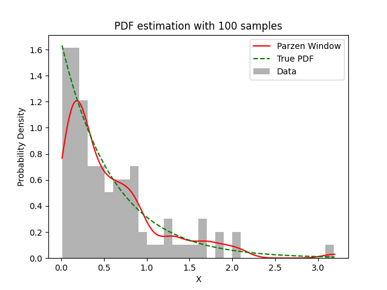

# Experiment Details Experiment S100
> from experiment with Parzen Window
> on 2024-04-12 00-24
## Metrics:
                                                                  
| type  | r2    | mse    | max_error | ise      | kl    | evs    |
|-------|-------|--------|-----------|----------|-------|--------|
| Model | 0.918 | 0.0131 | 0.8652    | 288.4629 | 0.702 | 0.9209 |
                                                                  
## Plot Prediction

## Dataset

PDF set as default <b>EXPONENTIAL_06</b>

#### Dimension 1
                               
| type        | rate | weight |
|-------------|------|--------|
| exponential | 0.6  | 1      |
                               

                              
| KEY                | VALUE |
|--------------------|-------|
| dimension          | 1     |
| seed               | 42    |
| n_samples_training | 100   |
| n_samples_test     | 319   |
| n_samples_val      | 0     |
| notes              |       |
                              
## Model
> using model Parzen Window
#### Model Params:

All Params used in the model 

                             
| KEY | VALUE               |
|-----|---------------------|
| h   | 0.13769091718282794 |
                             

Model Architecture 

ParzenWindow_Model(h=0.13769091718282794, training=array([1.40171379, 0.16787657, 0.87159631, 1.87457757, 0.62793651,
       0.65341418, 0.23213689, 0.09226395, 0.18910752, 0.2477912 ,
       0.13414582, 0.73625152, 0.25025202, 0.04624629, 0.41119227,
       0.75852411, 0.14275797, 0.38493404, 0.19314673, 0.17816833,
       0.83451839, 0.04381701, 0.81260279, 0.16802947, 0.09944154,
       0.01268385, 0.78903411, 0.33812286, 0.23865375, 0.07778016,
       0.82550931, 3.18592968, 0.9869195 , 0.35551452, 0.57396167,
       0.90477683, 0.19924129, 0.55489334, 0.49264296, 0.45180885,
       0.1732698 , 0.0854885 , 0.03280387, 0.269169  , 0.5609756 ,
       1.15097547, 0.19754532, 0.31861177, 0.04544322, 1.35112714,
       1.84944674, 0.67073526, 0.43615841, 0.22813133, 1.28695043,
       0.1127394 , 0.58049963, 0.41068976, 0.92503214, 0.10256996,
       0.272687  , 0.23965543, 0.54905109, 0.17658007, 1.63758627,
       0.89284367, 1.00584052, 0.05587931, 0.40415771, 0.14621937,
       0.17174579, 0.27784533, 0.31684234, 0.28338056, 0.01723291,
       1.50578903, 2.04245358, 1.67078857, 0.40119496, 0.07615496,
       0.80551719, 0.1727813 , 0.44991063, 0.21499224, 0.21251113,
       1.28012532, 0.80365516, 0.11162106, 0.85047208, 0.71241097,
       0.65517357, 1.69408143, 0.05444696, 0.50771615, 0.62668403,
       0.62952443, 0.06908168, 2.08562376, 0.15485452, 1.24041262]))

