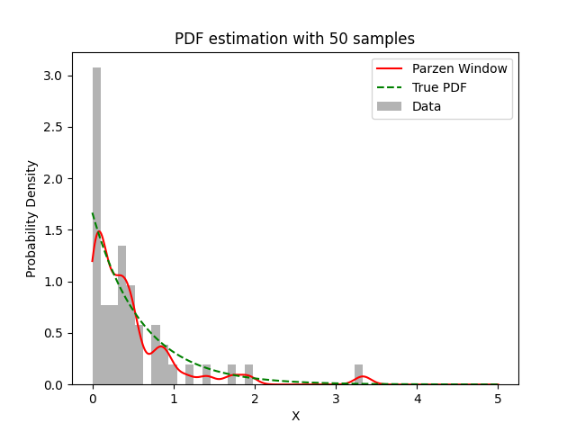

# Experiment Details Experiment S50
> from experiment with Parzen Window
> on 2024-04-05 16-58
## Metrics:
                                                                    
| type  | r2     | mse    | max_error | ise      | kl     | evs    |
|-------|--------|--------|-----------|----------|--------|--------|
| Model | 0.9567 | 0.0056 | 0.4693    | 645.2581 | 1.1245 | 0.9607 |
                                                                    
## Plot Prediction

## Dataset

PDF attribute

#### Dimension 1
                               
| type        | rate | weight |
|-------------|------|--------|
| exponential | 0.6  | 1      |
                               

                              
| KEY                | VALUE |
|--------------------|-------|
| dimension          | 1     |
| seed               | 60    |
| n_samples_training | 50    |
| n_samples_test     | 501   |
| n_samples_val      | 0     |
| notes              |       |
                              
## Model
> using model Parzen Window
#### Model Params:

All Params used in the model 

                            
| KEY | VALUE              |
|-----|--------------------|
| h   | 0.1018868018526368 |
                            

Model Architecture 

ParzenWindow_Model(h=0.1018868018526368, training=array([1.30148953e-02, 1.15374750e+00, 1.91807440e+00, 7.32924999e-01,
       3.78304010e-01, 4.41031262e-01, 5.09581419e-01, 1.28441908e-01,
       3.34548609e-02, 1.95962884e-03, 4.45490994e-01, 3.33179772e-01,
       1.01530508e-01, 2.43199842e-01, 4.40847295e-02, 2.92984681e-03,
       4.88895174e-02, 2.56930267e-01, 2.58482261e-01, 3.40453874e-01,
       1.07983339e-01, 3.67948061e-01, 3.50034492e-01, 7.94931712e-02,
       2.23841276e-01, 5.32728505e-01, 9.51941897e-01, 5.33557086e-01,
       3.39527423e-01, 3.33350024e+00, 8.79545191e-01, 3.69781153e-01,
       8.11639234e-02, 9.31286450e-02, 2.58506626e-02, 6.95680007e-02,
       1.71325972e+00, 9.09118319e-01, 7.78971557e-01, 8.19182392e-01,
       1.41123886e+00, 5.30832063e-01, 7.97651823e-03, 4.91557239e-01,
       1.32352259e-02, 9.08857229e-02, 1.76177958e-01, 4.28242105e-01,
       1.68987780e-01, 9.48566564e-02]))

