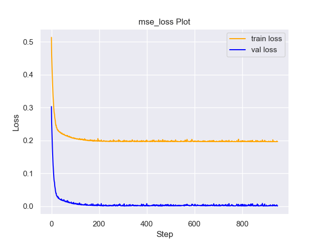
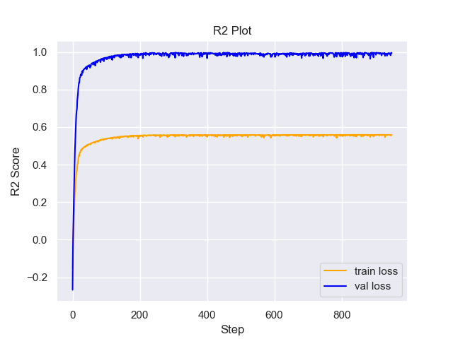

# Experiment Details Experiment  C13 S150
> from experiment with GNN
> on 2024-05-23 16-23
## Metrics:
                                                                                                    
| type   | r2           | mse          | max_error    | ise          | kl           | evs          |
|--------|--------------|--------------|--------------|--------------|--------------|--------------|
| Target | 0.0933123692 | 0.2013098092 | 1.3131819433 | 0.2013098092 | 0.3267044237 | 0.0938583142 |
| Model  | 0.9953       | 0.0007       | 0.0522       | 0.0233       | 0.0095       | 0.9954       |
                                                                                                    
## Plot Prediction

## Loss Plot

## Training Metric Plot

## Dataset

PDF set as default <b>EXPONENTIAL_06</b>

#### Dimension 1
                               
| type        | rate | weight |
|-------------|------|--------|
| exponential | 0.6  | 1      |
                               

                              
| KEY                | VALUE |
|--------------------|-------|
| dimension          | 1     |
| seed               | 54    |
| n_samples_training | 100   |
| n_samples_test     | 3175  |
| n_samples_val      | 50    |
| notes              |       |
                              
## Target
- Using GNN Target

All Params used in the model for generate the target for the MLP 

                         
| KEY          | VALUE  |
|--------------|--------|
| n_init       | 70     |
| max_iter     | 80     |
| n_components | 13     |
| random_state | 15     |
| init_params  | kmeans |
                         

## Model
> using model GNN
#### Model Params:

All Params used in the model 

                                    
| KEY             | VALUE          |
|-----------------|----------------|
| dropout         | 0.0            |
| hidden_layer    | [(14, Tanh())] |
| last_activation | None           |
                                    

Model Architecture 

NeuralNetworkModular(
  (dropout): Dropout(p=0.0, inplace=False)
  (output_layer): Linear(in_features=14, out_features=1, bias=True)
  (layers): ModuleList(
    (0): Linear(in_features=1, out_features=14, bias=True)
  )
  (activation): ModuleList(
    (0): Tanh()
  )
)

## Training

All Params used for the training 

                                        
| KEY           | VALUE                |
|---------------|----------------------|
| learning_rate | 0.002518531606034997 |
| epochs        | 950                  |
| loss_type     | mse_loss             |
| optimizer     | RMSprop              |
| batch_size    | 76                   |
                                        

