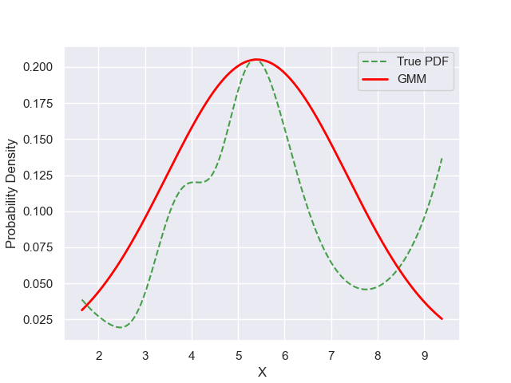

# Experiment Details Experiment S10
> from experiment with GMM
> on 2024-05-23 17-17
## Metrics:
                                                                   
| type  | r2     | mse    | max_error | ise     | kl     | evs    |
|-------|--------|--------|-----------|---------|--------|--------|
| Model | 0.1837 | 0.0024 | 0.1113    | 43.9243 | 0.1706 | 0.4851 |
                                                                   
## Plot Prediction

## Dataset

PDF set as default <b>MULTIVARIATE_1254</b>

#### Dimension 1
                                      
| type        | rate | weight |      |
|-------------|------|--------|------|
| exponential | 1    | 0.2    |      |
| logistic    | 4    | 0.8    | 0.25 |
| logistic    | 5.5  | 0.7    | 0.3  |
| exponential | -1   | 0.25   | -10  |
                                      

                              
| KEY                | VALUE |
|--------------------|-------|
| dimension          | 1     |
| seed               | 37    |
| n_samples_training | 10    |
| n_samples_test     | 775   |
| n_samples_val      | 0     |
| notes              |       |
                              
## Model
> using model GMM
#### Model Params:

All Params used in the model 

                         
| KEY          | VALUE  |
|--------------|--------|
| random_state | 95     |
| init_params  | kmeans |
| n_components | 1      |
| n_init       | 60     |
| max_iter     | 100    |
                         

Model Architecture 

GaussianMixture(n_init=60, random_state=95)

