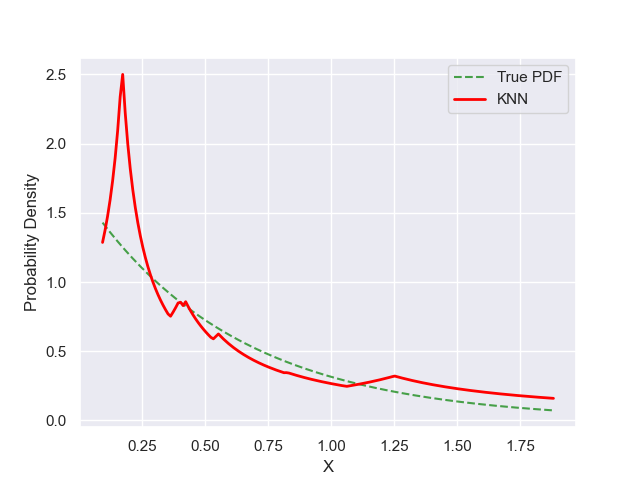

# Experiment Details Experiment S10
> from experiment with KNN
> on 2024-05-23 17-14
## Metrics:
                                                                   
| type  | r2     | mse   | max_error | ise      | kl     | evs    |
|-------|--------|-------|-----------|----------|--------|--------|
| Model | 0.6933 | 0.042 | 1.2493    | 115.6446 | 0.3069 | 0.7145 |
                                                                   
## Plot Prediction

## Dataset

PDF set as default <b>EXPONENTIAL_06</b>

#### Dimension 1
                               
| type        | rate | weight |
|-------------|------|--------|
| exponential | 0.6  | 1      |
                               

                              
| KEY                | VALUE |
|--------------------|-------|
| dimension          | 1     |
| seed               | 37    |
| n_samples_training | 10    |
| n_samples_test     | 180   |
| n_samples_val      | 0     |
| notes              |       |
                              
## Model
> using model KNN
#### Model Params:

All Params used in the model 

                           
| KEY | VALUE             |
|-----|-------------------|
| k1  | 4.368735084592013 |
| kn  | 4               |
                           

Model Architecture 

KNN_Model(k1=4.368735084592013, kn=4, training=array([1.40171379, 0.16787657, 0.87159631, 1.87457757, 0.62793651,
       0.65341418, 0.23213689, 0.09226395, 0.18910752, 0.2477912 ]))

