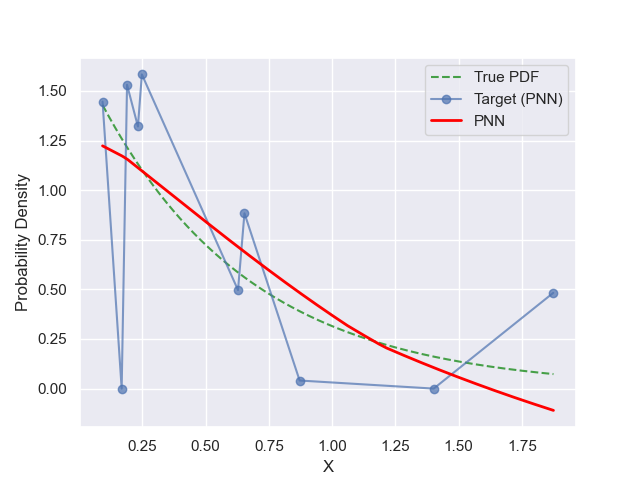
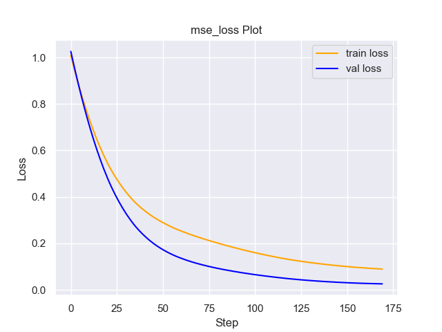
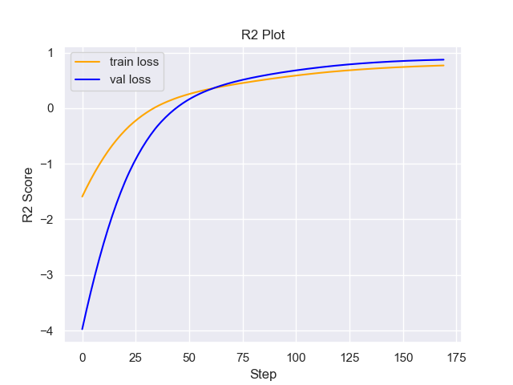

# Experiment Details Experiment  H0.09085668630067516 S60
> from experiment with PNN
> on 2024-05-23 16-37
## Metrics:
                                                                                                    
| type   | r2           | mse          | max_error   | ise          | kl            | evs          |
|--------|--------------|--------------|-------------|--------------|---------------|--------------|
| Target | 0.6252560124 | 0.0820382649 | 0.545701049 | 0.0082038265 | 0.4340147359  | 0.6259810603 |
| Model  | 0.9291       | 0.0096       | 0.2059      | 0.1705       | 10000000000.0 | 0.9291       |
                                                                                                    
## Plot Prediction

## Loss Plot

## Training Metric Plot

## Dataset

PDF set as default <b>EXPONENTIAL_06</b>

#### Dimension 1
                               
| type        | rate | weight |
|-------------|------|--------|
| exponential | 0.6  | 1      |
                               

                              
| KEY                | VALUE |
|--------------------|-------|
| dimension          | 1     |
| seed               | 11    |
| n_samples_training | 10    |
| n_samples_test     | 1784  |
| n_samples_val      | 50    |
| notes              |       |
                              
## Target
- Using PNN Target

All Params used in the model for generate the target for the MLP 

                             
| KEY | VALUE               |
|-----|---------------------|
| h   | 0.09085668630067516 |
                             

## Model
> using model PNN
#### Model Params:

All Params used in the model 

                                                  
| KEY             | VALUE                        |
|-----------------|------------------------------|
| dropout         | 0.0                          |
| hidden_layer    | [(12, Tanh()), (52, ReLU())] |
| last_activation | None                         |
                                                  

Model Architecture 

NeuralNetworkModular(
  (dropout): Dropout(p=0.0, inplace=False)
  (output_layer): Linear(in_features=52, out_features=1, bias=True)
  (layers): ModuleList(
    (0): Linear(in_features=1, out_features=12, bias=True)
    (1): Linear(in_features=12, out_features=52, bias=True)
  )
  (activation): ModuleList(
    (0): Tanh()
    (1): ReLU()
  )
)

## Training

All Params used for the training 

                            
| KEY           | VALUE    |
|---------------|----------|
| learning_rate | 0.00053  |
| epochs        | 170      |
| loss_type     | mse_loss |
| optimizer     | Adam     |
| batch_size    | 56       |
                            

