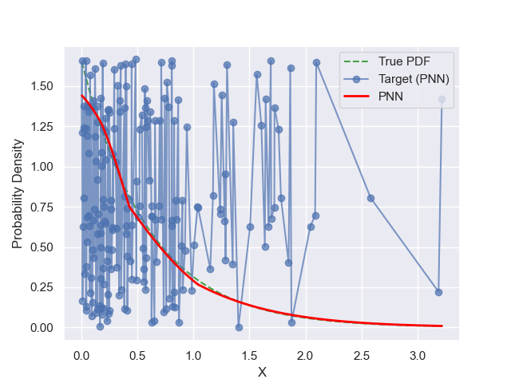
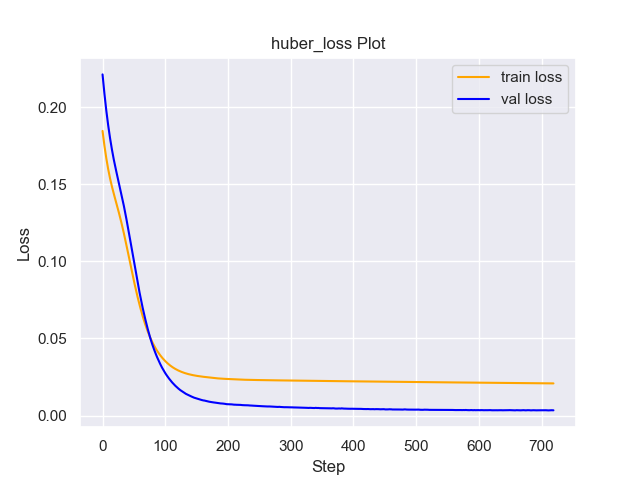
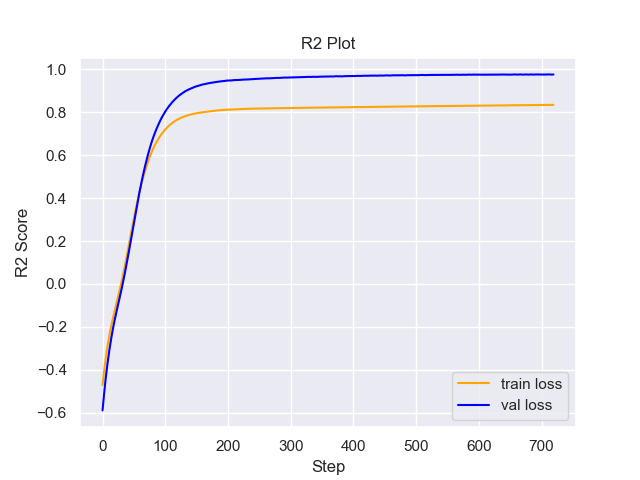

# Experiment Details Experiment  H0.026604557869874756 S250
> from experiment with PNN
> on 2024-05-23 16-58
## Metrics:
                                                                                                   
| type   | r2           | mse          | max_error   | ise          | kl           | evs          |
|--------|--------------|--------------|-------------|--------------|--------------|--------------|
| Target | 0.7539108124 | 0.0566612661 | 0.963219617 | 0.1133225322 | 0.0650394501 | 0.7556284844 |
| Model  | 0.9949       | 0.0008       | 0.208       | 0.0261       | 0.0014       | 0.9952       |
                                                                                                   
## Plot Prediction

## Loss Plot

## Training Metric Plot

## Dataset

PDF set as default <b>EXPONENTIAL_06</b>

#### Dimension 1
                               
| type        | rate | weight |
|-------------|------|--------|
| exponential | 0.6  | 1      |
                               

                              
| KEY                | VALUE |
|--------------------|-------|
| dimension          | 1     |
| seed               | 81    |
| n_samples_training | 200   |
| n_samples_test     | 3210  |
| n_samples_val      | 50    |
| notes              |       |
                              
## Target
- Using PNN Target

All Params used in the model for generate the target for the MLP 

                              
| KEY | VALUE                |
|-----|----------------------|
| h   | 0.026604557869874756 |
                              

## Model
> using model PNN
#### Model Params:

All Params used in the model 

                                    
| KEY             | VALUE          |
|-----------------|----------------|
| dropout         | 0.0            |
| hidden_layer    | [(16, ReLU())] |
| last_activation | lambda         |
                                    

Model Architecture 

NeuralNetworkModular(
  (dropout): Dropout(p=0.0, inplace=False)
  (output_layer): Linear(in_features=16, out_features=1, bias=True)
  (last_activation): AdaptiveSigmoid(
    (sigmoid): Sigmoid()
  )
  (layers): ModuleList(
    (0): Linear(in_features=1, out_features=16, bias=True)
    (1): AdaptiveSigmoid(
      (sigmoid): Sigmoid()
    )
  )
  (activation): ModuleList(
    (0): ReLU()
  )
)

## Training

All Params used for the training 

                                         
| KEY           | VALUE                 |
|---------------|-----------------------|
| learning_rate | 0.0017160951525772392 |
| epochs        | 720                   |
| loss_type     | huber_loss            |
| optimizer     | Adam                  |
| batch_size    | 68                    |
                                         

