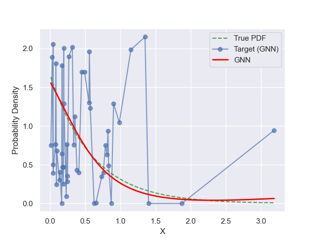
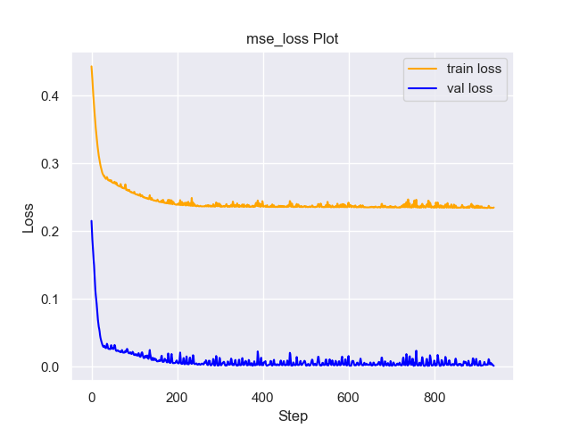
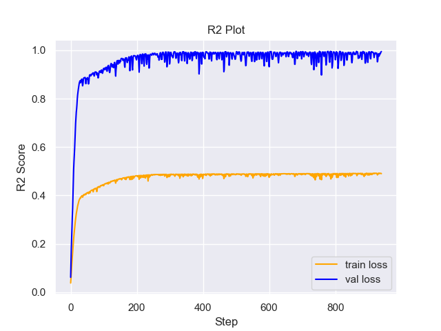

# Experiment Details Experiment  C8 S100
> from experiment with GNN
> on 2024-05-23 16-13
## Metrics:
                                                                                                     
| type   | r2           | mse          | max_error    | ise          | kl           | evs           |
|--------|--------------|--------------|--------------|--------------|--------------|---------------|
| Target | -0.171745494 | 0.2435101045 | 1.3465800785 | 0.1217550523 | 0.5980160547 | -0.1675084567 |
| Model  | 0.9924       | 0.0012       | 0.076        | 0.038        | 0.0212       | 0.9926        |
                                                                                                     
## Plot Prediction

## Loss Plot

## Training Metric Plot

## Dataset

PDF set as default <b>EXPONENTIAL_06</b>

#### Dimension 1
                               
| type        | rate | weight |
|-------------|------|--------|
| exponential | 0.6  | 1      |
                               

                              
| KEY                | VALUE |
|--------------------|-------|
| dimension          | 1     |
| seed               | 2     |
| n_samples_training | 50    |
| n_samples_test     | 3175  |
| n_samples_val      | 50    |
| notes              |       |
                              
## Target
- Using GNN Target

All Params used in the model for generate the target for the MLP 

                            
| KEY          | VALUE     |
|--------------|-----------|
| n_init       | 30        |
| max_iter     | 30        |
| n_components | 8         |
| random_state | 73        |
| init_params  | k-means++ |
                            

## Model
> using model GNN
#### Model Params:

All Params used in the model 

                                       
| KEY             | VALUE             |
|-----------------|-------------------|
| dropout         | 0.0               |
| hidden_layer    | [(26, Sigmoid())] |
| last_activation | None              |
                                       

Model Architecture 

NeuralNetworkModular(
  (dropout): Dropout(p=0.0, inplace=False)
  (output_layer): Linear(in_features=26, out_features=1, bias=True)
  (layers): ModuleList(
    (0): Linear(in_features=1, out_features=26, bias=True)
  )
  (activation): ModuleList(
    (0): Sigmoid()
  )
)

## Training

All Params used for the training 

                            
| KEY           | VALUE    |
|---------------|----------|
| learning_rate | 0.00924  |
| epochs        | 940      |
| loss_type     | mse_loss |
| optimizer     | Adam     |
| batch_size    | 34       |
                            

