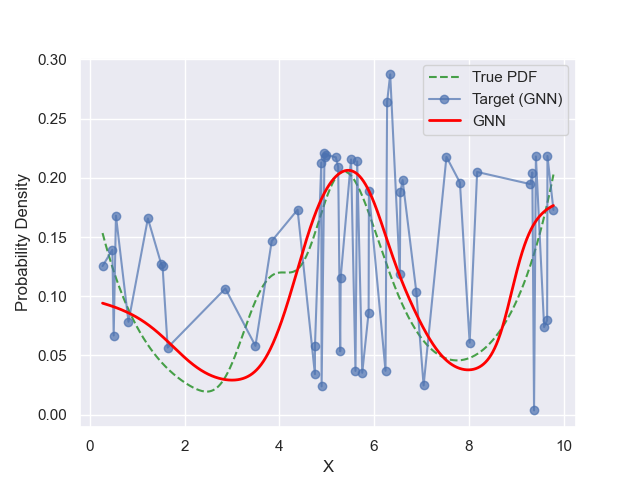
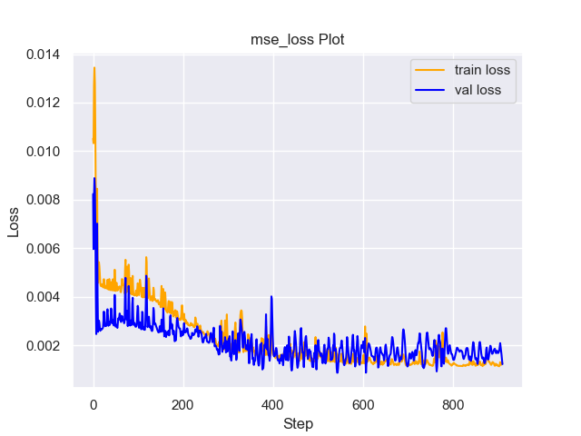
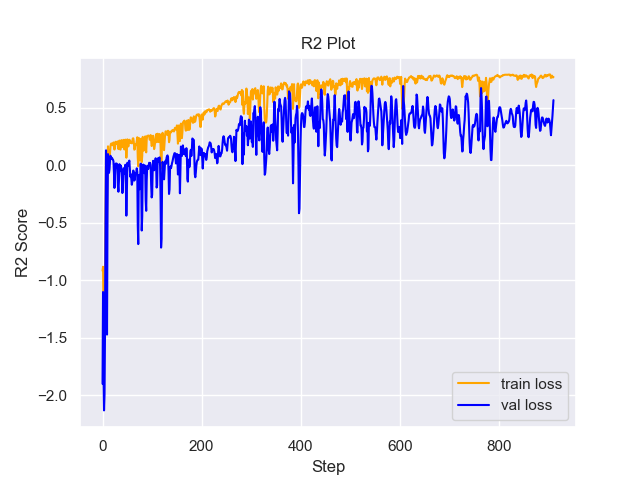

# Experiment Details Experiment  C4 S100
> from experiment with GNN
> on 2024-05-23 16-15
## Metrics:
                                                                                                    
| type   | r2           | mse          | max_error    | ise          | kl           | evs          |
|--------|--------------|--------------|--------------|--------------|--------------|--------------|
| Target | 0.2295806764 | 0.0022336685 | 0.1657670332 | 0.0011168343 | 0.0872765541 | 0.2563999183 |
| Model  | 0.8035       | 0.0006       | 0.0642       | 0.0524       | 0.0427       | 0.8035       |
                                                                                                    
## Plot Prediction

## Loss Plot

## Training Metric Plot

## Dataset

PDF set as default <b>MULTIVARIATE_1254</b>

#### Dimension 1
                                      
| type        | rate | weight |      |
|-------------|------|--------|------|
| exponential | 1    | 0.2    |      |
| logistic    | 4    | 0.8    | 0.25 |
| logistic    | 5.5  | 0.7    | 0.3  |
| exponential | -1   | 0.25   | -10  |
                                      

                              
| KEY                | VALUE |
|--------------------|-------|
| dimension          | 1     |
| seed               | 47    |
| n_samples_training | 50    |
| n_samples_test     | 9520  |
| n_samples_val      | 50    |
| notes              |       |
                              
## Target
- Using GNN Target

All Params used in the model for generate the target for the MLP 

                            
| KEY          | VALUE     |
|--------------|-----------|
| n_init       | 47        |
| max_iter     | 70        |
| n_components | 4         |
| random_state | 14        |
| init_params  | k-means++ |
                            

## Model
> using model GNN
#### Model Params:

All Params used in the model 

                                                                
| KEY             | VALUE                                      |
|-----------------|--------------------------------------------|
| dropout         | 0.0                                        |
| hidden_layer    | [(24, Tanh()), (26, Tanh()), (48, Tanh())] |
| last_activation | lambda                                     |
                                                                

Model Architecture 

NeuralNetworkModular(
  (dropout): Dropout(p=0.0, inplace=False)
  (output_layer): Linear(in_features=48, out_features=1, bias=True)
  (last_activation): AdaptiveSigmoid(
    (sigmoid): Sigmoid()
  )
  (layers): ModuleList(
    (0): Linear(in_features=1, out_features=24, bias=True)
    (1): Linear(in_features=24, out_features=26, bias=True)
    (2): Linear(in_features=26, out_features=48, bias=True)
    (3): AdaptiveSigmoid(
      (sigmoid): Sigmoid()
    )
  )
  (activation): ModuleList(
    (0-2): 3 x Tanh()
  )
)

## Training

All Params used for the training 

                            
| KEY           | VALUE    |
|---------------|----------|
| learning_rate | 0.00537  |
| epochs        | 910      |
| loss_type     | mse_loss |
| optimizer     | Adam     |
| batch_size    | 44       |
                            

