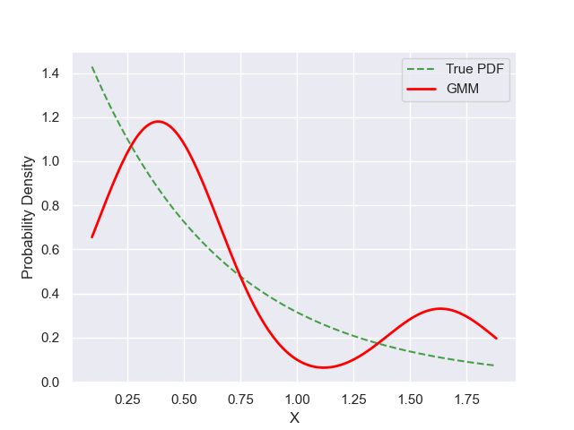

# Experiment Details Experiment S10
> from experiment with GMM
> on 2024-05-23 17-12
## Metrics:
                                                                   
| type  | r2     | mse    | max_error | ise     | kl     | evs    |
|-------|--------|--------|-----------|---------|--------|--------|
| Model | 0.6079 | 0.0537 | 0.7735    | 91.1557 | 0.3069 | 0.6116 |
                                                                   
## Plot Prediction

## Dataset

PDF set as default <b>EXPONENTIAL_06</b>

#### Dimension 1
                               
| type        | rate | weight |
|-------------|------|--------|
| exponential | 0.6  | 1      |
                               

                              
| KEY                | VALUE |
|--------------------|-------|
| dimension          | 1     |
| seed               | 37    |
| n_samples_training | 10    |
| n_samples_test     | 180   |
| n_samples_val      | 0     |
| notes              |       |
                              
## Model
> using model GMM
#### Model Params:

All Params used in the model 

                         
| KEY          | VALUE  |
|--------------|--------|
| n_components | 2      |
| n_init       | 70     |
| max_iter     | 20     |
| init_params  | kmeans |
| random_state | 56     |
                         

Model Architecture 

GaussianMixture(max_iter=20, n_components=2, n_init=70, random_state=56)

