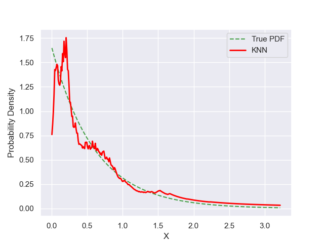

# Experiment Details Experiment S200
> from experiment with KNN
> on 2024-05-23 18-05
## Metrics:
                                                                    
| type  | r2     | mse    | max_error | ise      | kl     | evs    |
|-------|--------|--------|-----------|----------|--------|--------|
| Model | 0.9206 | 0.0129 | 0.8886    | 326.5495 | 0.7101 | 0.9211 |
                                                                    
## Plot Prediction

## Dataset

PDF set as default <b>EXPONENTIAL_06</b>

#### Dimension 1
                               
| type        | rate | weight |
|-------------|------|--------|
| exponential | 0.6  | 1      |
                               

                              
| KEY                | VALUE |
|--------------------|-------|
| dimension          | 1     |
| seed               | 37    |
| n_samples_training | 200   |
| n_samples_test     | 322   |
| n_samples_val      | 0     |
| notes              |       |
                              
## Model
> using model KNN
#### Model Params:

All Params used in the model 

                            
| KEY | VALUE              |
|-----|--------------------|
| k1  | 1.8571060564834343 |
| kn  | 23                 |
                            

Model Architecture 

KNN_Model(k1=1.8571060564834343, kn=26, training=array([1.40171379, 0.16787657, 0.87159631, 1.87457757, 0.62793651,
       0.65341418, 0.23213689, 0.09226395, 0.18910752, 0.2477912 ,
       0.13414582, 0.73625152, 0.25025202, 0.04624629, 0.41119227,
       0.75852411, 0.14275797, 0.38493404, 0.19314673, 0.17816833,
       0.83451839, 0.04381701, 0.81260279, 0.16802947, 0.09944154,
       0.01268385, 0.78903411, 0.33812286, 0.23865375, 0.07778016,
       0.82550931, 3.18592968, 0.9869195 , 0.35551452, 0.57396167,
       0.90477683, 0.19924129, 0.55489334, 0.49264296, 0.45180885,
       0.1732698 , 0.0854885 , 0.03280387, 0.269169  , 0.5609756 ,
       1.15097547, 0.19754532, 0.31861177, 0.04544322, 1.35112714,
       1.84944674, 0.67073526, 0.43615841, 0.22813133, 1.28695043,
       0.1127394 , 0.58049963, 0.41068976, 0.92503214, 0.10256996,
       0.272687  , 0.23965543, 0.54905109, 0.17658007, 1.63758627,
       0.89284367, 1.00584052, 0.05587931, 0.40415771, 0.14621937,
       0.17174579, 0.27784533, 0.31684234, 0.28338056, 0.01723291,
       1.50578903, 2.04245358, 1.67078857, 0.40119496, 0.07615496,
       0.80551719, 0.1727813 , 0.44991063, 0.21499224, 0.21251113,
       1.28012532, 0.80365516, 0.11162106, 0.85047208, 0.71241097,
       0.65517357, 1.69408143, 0.05444696, 0.50771615, 0.62668403,
       0.62952443, 0.06908168, 2.08562376, 0.15485452, 1.24041262,
       0.11862305, 0.26281411, 1.24047725, 0.41054555, 1.72200324,
       1.04146794, 1.03801203, 0.19966139, 0.62633809, 0.51964759,
       0.69244646, 0.83924858, 0.90296391, 0.26319789, 0.42636865,
       0.19555684, 1.78143473, 2.5816633 , 0.02231099, 0.38723289,
       1.17550637, 0.49456704, 0.60628191, 0.14597551, 1.28453019,
       0.18120639, 0.30798206, 0.13242868, 0.21654846, 0.28266222,
       0.06803352, 0.1813082 , 0.12043234, 0.05414623, 0.00669074,
       0.21315284, 0.52136789, 1.75988818, 0.04522514, 0.29779998,
       0.19579593, 0.02489826, 0.94193289, 0.58221478, 1.60686527,
       0.14704926, 1.35562014, 0.82903572, 0.65810775, 0.69939157,
       0.59349762, 0.21453862, 0.54135254, 0.25084969, 0.06745479,
       0.615637  , 0.34435747, 0.23871551, 0.24374557, 0.38406691,
       1.72395353, 0.57236883, 0.08878207, 0.78161672, 0.14202917,
       0.02302774, 0.05785657, 0.05194751, 0.10864516, 0.34685177,
       0.58763352, 0.86521795, 1.64436162, 3.21531928, 0.17690357,
       0.74582992, 1.25250403, 0.56732805, 0.40330543, 0.32633194,
       1.18312092, 0.76445847, 0.08031622, 1.56505835, 0.29529642,
       0.12356696, 1.86423089, 0.35330836, 0.8064956 , 1.30037532,
       0.39734549, 0.45049364, 0.19269138, 2.09580386, 0.71352825,
       0.00764272, 0.8087623 , 1.69043695, 0.04235265, 0.48535865]))

