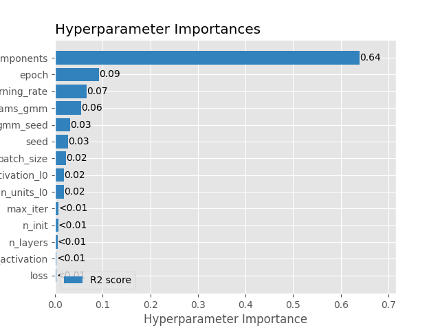
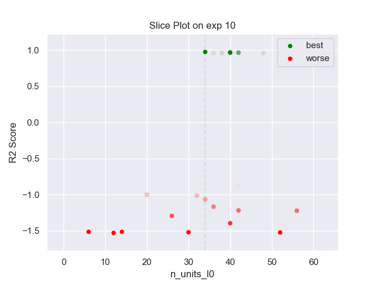
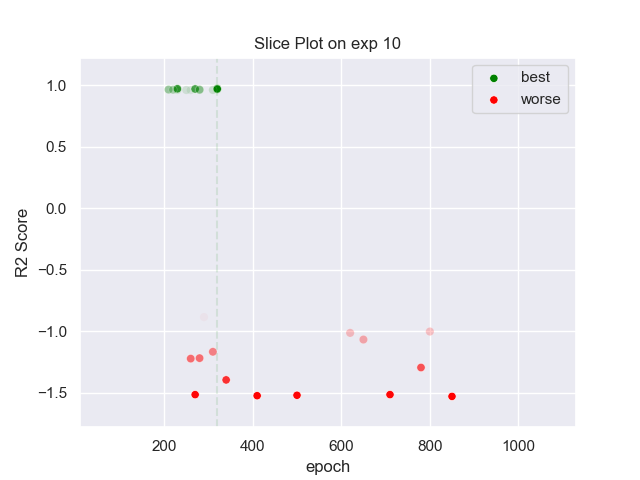
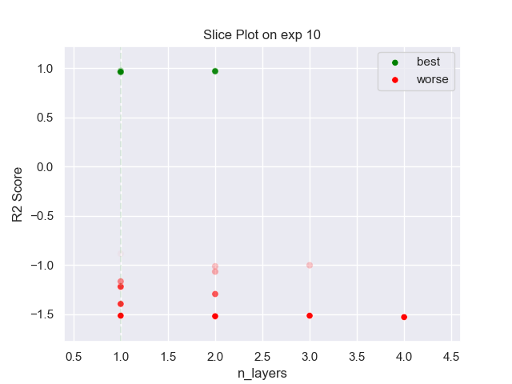
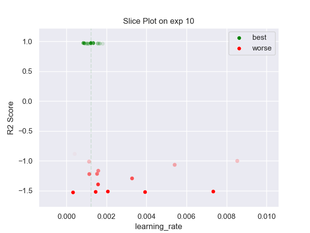
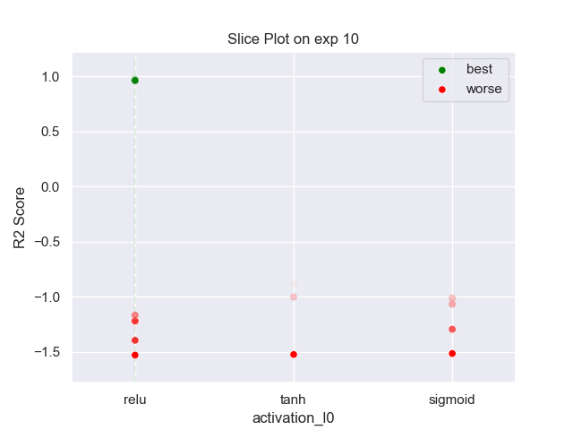
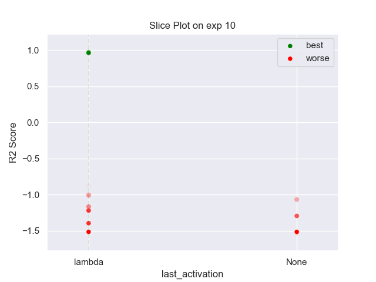
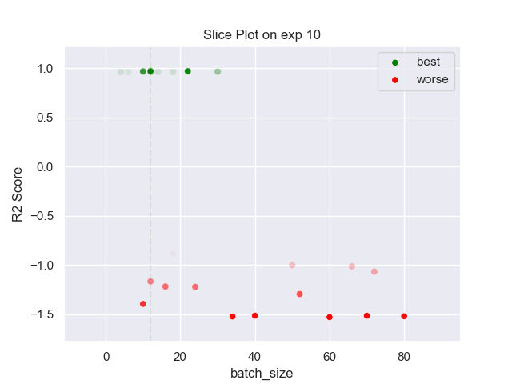
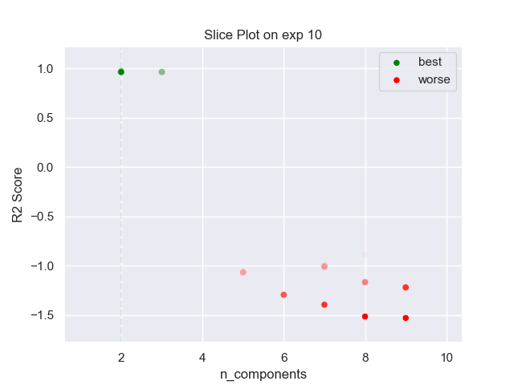

## MLP GMM 10 exp

### TOP 3
- R2 score: **0.97240629**
	 - **seed** : *51*
	 - **n_init** : *40*
	 - **max_iter** : *100*
	 - **n_components** : *2*
	 - **gmm_seed** : *59*
	 - **init_params_gmm** : *k-means++*
	 - **n_layers** : *1*
	 - **n_units_l0** : *34*
	 - **activation_l0** : *relu*
	 - **last_activation** : *lambda*
	 - **learning_rate** : *0.0012300000000000002*
	 - **epoch** : *320*
	 - **loss** : *huber_loss*
	 - **batch_size** : *12*

- R2 score: **0.97013315**
	 - **seed** : *52*
	 - **n_init** : *40*
	 - **max_iter** : *20*
	 - **n_components** : *2*
	 - **gmm_seed** : *39*
	 - **init_params_gmm** : *k-means++*
	 - **n_layers** : *2*
	 - **n_units_l0** : *40*
	 - **activation_l0** : *relu*
	 - **n_units_l1** : *12*
	 - **activation_l1** : *sigmoid*
	 - **last_activation** : *lambda*
	 - **learning_rate** : *0.0008500000000000001*
	 - **epoch** : *320*
	 - **loss** : *huber_loss*
	 - **batch_size** : *22*

- R2 score: **0.96929205**
	 - **seed** : *4*
	 - **n_init** : *40*
	 - **max_iter** : *100*
	 - **n_components** : *2*
	 - **gmm_seed** : *39*
	 - **init_params_gmm** : *k-means++*
	 - **n_layers** : *1*
	 - **n_units_l0** : *40*
	 - **activation_l0** : *relu*
	 - **last_activation** : *lambda*
	 - **learning_rate** : *0.00134*
	 - **epoch** : *230*
	 - **loss** : *huber_loss*
	 - **batch_size** : *12*

### WORST 3
- R2 score: **-1.52989955**
	 - **seed** : *51*
	 - **n_init** : *40*
	 - **max_iter** : *100*
	 - **n_components** : *2*
	 - **gmm_seed** : *59*
	 - **init_params_gmm** : *k-means++*
	 - **n_layers** : *1*
	 - **n_units_l0** : *34*
	 - **activation_l0** : *relu*
	 - **last_activation** : *lambda*
	 - **learning_rate** : *0.0012300000000000002*
	 - **epoch** : *320*
	 - **loss** : *huber_loss*
	 - **batch_size** : *12*

- R2 score: **-1.52421973**
	 - **seed** : *52*
	 - **n_init** : *40*
	 - **max_iter** : *20*
	 - **n_components** : *2*
	 - **gmm_seed** : *39*
	 - **init_params_gmm** : *k-means++*
	 - **n_layers** : *2*
	 - **n_units_l0** : *40*
	 - **activation_l0** : *relu*
	 - **n_units_l1** : *12*
	 - **activation_l1** : *sigmoid*
	 - **last_activation** : *lambda*
	 - **learning_rate** : *0.0008500000000000001*
	 - **epoch** : *320*
	 - **loss** : *huber_loss*
	 - **batch_size** : *22*

- R2 score: **-1.52065745**
	 - **seed** : *4*
	 - **n_init** : *40*
	 - **max_iter** : *100*
	 - **n_components** : *2*
	 - **gmm_seed** : *39*
	 - **init_params_gmm** : *k-means++*
	 - **n_layers** : *1*
	 - **n_units_l0** : *40*
	 - **activation_l0** : *relu*
	 - **last_activation** : *lambda*
	 - **learning_rate** : *0.00134*
	 - **epoch** : *230*
	 - **loss** : *huber_loss*
	 - **batch_size** : *12*

