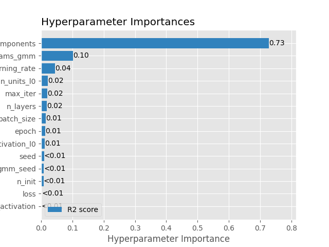
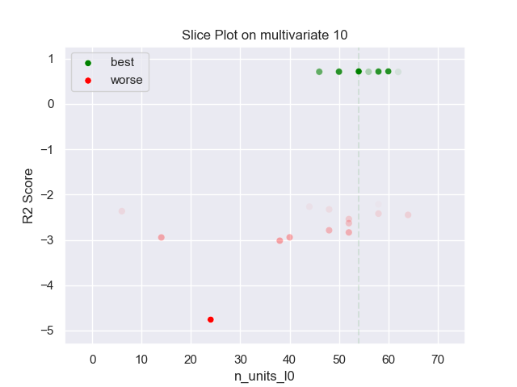
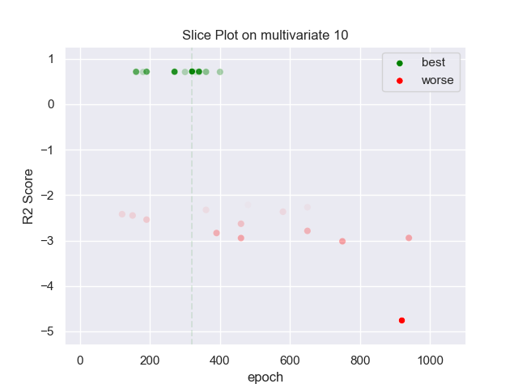
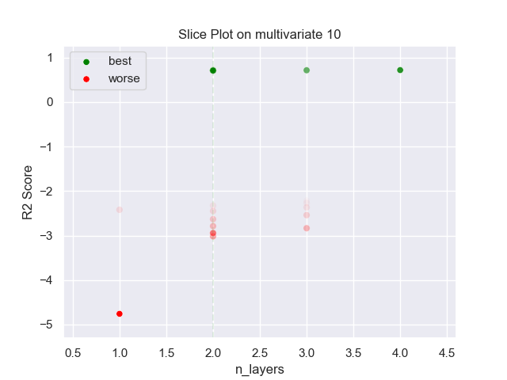
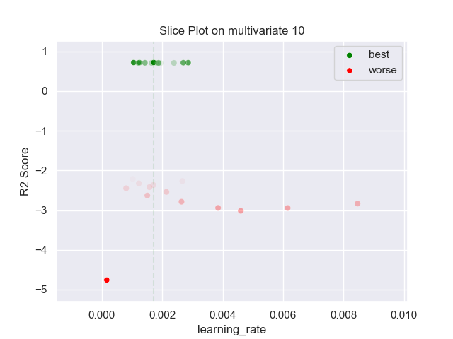
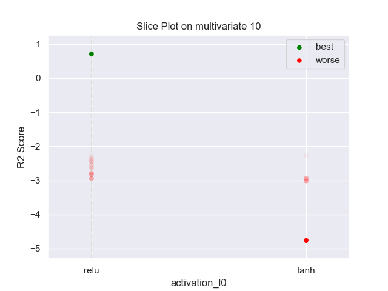
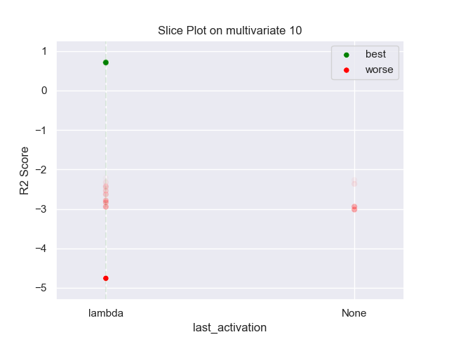
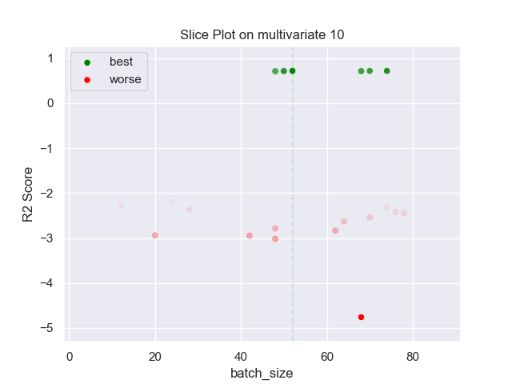
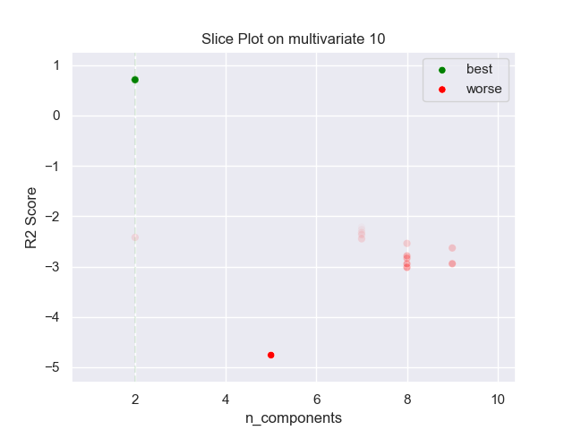

## MLP GMM 10 multivariate

### TOP 3
- R2 score: **0.72235172**
	 - **seed** : *42*
	 - **n_init** : *70*
	 - **max_iter** : *10*
	 - **n_components** : *2*
	 - **gmm_seed** : *37*
	 - **init_params_gmm** : *k-means++*
	 - **n_layers** : *2*
	 - **n_units_l0** : *54*
	 - **activation_l0** : *relu*
	 - **n_units_l1** : *30*
	 - **activation_l1** : *tanh*
	 - **last_activation** : *lambda*
	 - **learning_rate** : *0.0017200000000000002*
	 - **epoch** : *320*
	 - **loss** : *mse_loss*
	 - **batch_size** : *52*

- R2 score: **0.72005721**
	 - **seed** : *45*
	 - **n_init** : *90*
	 - **max_iter** : *60*
	 - **n_components** : *2*
	 - **gmm_seed** : *53*
	 - **init_params_gmm** : *kmeans*
	 - **n_layers** : *4*
	 - **n_units_l0** : *60*
	 - **activation_l0** : *relu*
	 - **n_units_l1** : *32*
	 - **activation_l1** : *tanh*
	 - **n_units_l2** : *10*
	 - **activation_l2** : *tanh*
	 - **n_units_l3** : *46*
	 - **activation_l3** : *tanh*
	 - **last_activation** : *lambda*
	 - **learning_rate** : *0.0010600000000000002*
	 - **epoch** : *340*
	 - **loss** : *mse_loss*
	 - **batch_size** : *74*

- R2 score: **0.71840077**
	 - **seed** : *46*
	 - **n_init** : *70*
	 - **max_iter** : *10*
	 - **n_components** : *2*
	 - **gmm_seed** : *50*
	 - **init_params_gmm** : *k-means++*
	 - **n_layers** : *2*
	 - **n_units_l0** : *58*
	 - **activation_l0** : *relu*
	 - **n_units_l1** : *26*
	 - **activation_l1** : *tanh*
	 - **last_activation** : *lambda*
	 - **learning_rate** : *0.00125*
	 - **epoch** : *270*
	 - **loss** : *mse_loss*
	 - **batch_size** : *70*

### WORST 3
- R2 score: **-4.76029849**
	 - **seed** : *42*
	 - **n_init** : *70*
	 - **max_iter** : *10*
	 - **n_components** : *2*
	 - **gmm_seed** : *37*
	 - **init_params_gmm** : *k-means++*
	 - **n_layers** : *2*
	 - **n_units_l0** : *54*
	 - **activation_l0** : *relu*
	 - **n_units_l1** : *30*
	 - **activation_l1** : *tanh*
	 - **last_activation** : *lambda*
	 - **learning_rate** : *0.0017200000000000002*
	 - **epoch** : *320*
	 - **loss** : *mse_loss*
	 - **batch_size** : *52*

- R2 score: **-3.01763135**
	 - **seed** : *45*
	 - **n_init** : *90*
	 - **max_iter** : *60*
	 - **n_components** : *2*
	 - **gmm_seed** : *53*
	 - **init_params_gmm** : *kmeans*
	 - **n_layers** : *4*
	 - **n_units_l0** : *60*
	 - **activation_l0** : *relu*
	 - **n_units_l1** : *32*
	 - **activation_l1** : *tanh*
	 - **n_units_l2** : *10*
	 - **activation_l2** : *tanh*
	 - **n_units_l3** : *46*
	 - **activation_l3** : *tanh*
	 - **last_activation** : *lambda*
	 - **learning_rate** : *0.0010600000000000002*
	 - **epoch** : *340*
	 - **loss** : *mse_loss*
	 - **batch_size** : *74*

- R2 score: **-2.94629605**
	 - **seed** : *46*
	 - **n_init** : *70*
	 - **max_iter** : *10*
	 - **n_components** : *2*
	 - **gmm_seed** : *50*
	 - **init_params_gmm** : *k-means++*
	 - **n_layers** : *2*
	 - **n_units_l0** : *58*
	 - **activation_l0** : *relu*
	 - **n_units_l1** : *26*
	 - **activation_l1** : *tanh*
	 - **last_activation** : *lambda*
	 - **learning_rate** : *0.00125*
	 - **epoch** : *270*
	 - **loss** : *mse_loss*
	 - **batch_size** : *70*

