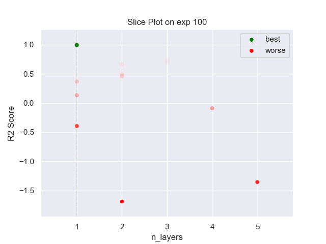
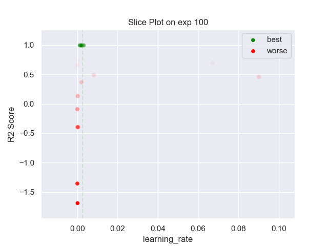

## MLP GMM 100 exp

### TOP 3
- R2 score: **0.99542077**
	 - **seed** : *54*
	 - **n_init** : *70*
	 - **max_iter** : *80*
	 - **n_components** : *13*
	 - **gmm_seed** : *15*
	 - **init_params_gmm** : *kmeans*
	 - **n_layers** : *1*
	 - **n_units_l0** : *14*
	 - **activation_l0** : *tanh*
	 - **last_activation** : *None*
	 - **learning_rate** : *0.002518531606034997*
	 - **epoch** : *950*
	 - **optimizer** : *RMSprop*
	 - **loss** : *mse_loss*
	 - **batch_size** : *76*

- R2 score: **0.99515872**
	 - **seed** : *50*
	 - **n_init** : *70*
	 - **max_iter** : *80*
	 - **n_components** : *9*
	 - **gmm_seed** : *35*
	 - **init_params_gmm** : *kmeans*
	 - **n_layers** : *1*
	 - **n_units_l0** : *12*
	 - **activation_l0** : *tanh*
	 - **last_activation** : *None*
	 - **learning_rate** : *0.0012451809531000015*
	 - **epoch** : *970*
	 - **optimizer** : *RMSprop*
	 - **loss** : *mse_loss*
	 - **batch_size** : *72*

- R2 score: **0.99397113**
	 - **seed** : *44*
	 - **n_init** : *80*
	 - **max_iter** : *70*
	 - **n_components** : *12*
	 - **gmm_seed** : *39*
	 - **init_params_gmm** : *kmeans*
	 - **n_layers** : *1*
	 - **n_units_l0** : *14*
	 - **activation_l0** : *tanh*
	 - **last_activation** : *None*
	 - **learning_rate** : *0.0032386305366728*
	 - **epoch** : *980*
	 - **optimizer** : *RMSprop*
	 - **loss** : *mse_loss*
	 - **batch_size** : *78*

### WORST 3
- R2 score: **-1.68997498**
	 - **seed** : *54*
	 - **n_init** : *70*
	 - **max_iter** : *80*
	 - **n_components** : *13*
	 - **gmm_seed** : *15*
	 - **init_params_gmm** : *kmeans*
	 - **n_layers** : *1*
	 - **n_units_l0** : *14*
	 - **activation_l0** : *tanh*
	 - **last_activation** : *None*
	 - **learning_rate** : *0.002518531606034997*
	 - **epoch** : *950*
	 - **optimizer** : *RMSprop*
	 - **loss** : *mse_loss*
	 - **batch_size** : *76*

- R2 score: **-1.3563107**
	 - **seed** : *50*
	 - **n_init** : *70*
	 - **max_iter** : *80*
	 - **n_components** : *9*
	 - **gmm_seed** : *35*
	 - **init_params_gmm** : *kmeans*
	 - **n_layers** : *1*
	 - **n_units_l0** : *12*
	 - **activation_l0** : *tanh*
	 - **last_activation** : *None*
	 - **learning_rate** : *0.0012451809531000015*
	 - **epoch** : *970*
	 - **optimizer** : *RMSprop*
	 - **loss** : *mse_loss*
	 - **batch_size** : *72*

- R2 score: **-0.3959734**
	 - **seed** : *44*
	 - **n_init** : *80*
	 - **max_iter** : *70*
	 - **n_components** : *12*
	 - **gmm_seed** : *39*
	 - **init_params_gmm** : *kmeans*
	 - **n_layers** : *1*
	 - **n_units_l0** : *14*
	 - **activation_l0** : *tanh*
	 - **last_activation** : *None*
	 - **learning_rate** : *0.0032386305366728*
	 - **epoch** : *980*
	 - **optimizer** : *RMSprop*
	 - **loss** : *mse_loss*
	 - **batch_size** : *78*

