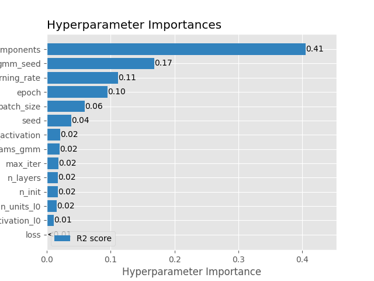
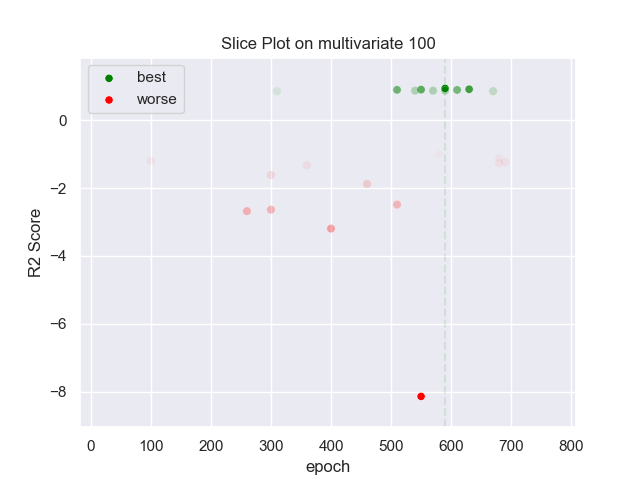

## MLP GMM 100 multivariate

### TOP 3
- R2 score: **0.94151184**
	 - **seed** : *53*
	 - **n_init** : *90*
	 - **max_iter** : *10*
	 - **n_components** : *8*
	 - **gmm_seed** : *91*
	 - **init_params_gmm** : *kmeans*
	 - **n_layers** : *2*
	 - **n_units_l0** : *34*
	 - **activation_l0** : *sigmoid*
	 - **n_units_l1** : *22*
	 - **activation_l1** : *tanh*
	 - **last_activation** : *lambda*
	 - **learning_rate** : *0.00747*
	 - **epoch** : *590*
	 - **loss** : *huber_loss*
	 - **batch_size** : *6*

- R2 score: **0.91679047**
	 - **seed** : *60*
	 - **n_init** : *100*
	 - **max_iter** : *10*
	 - **n_components** : *11*
	 - **gmm_seed** : *8*
	 - **init_params_gmm** : *kmeans*
	 - **n_layers** : *2*
	 - **n_units_l0** : *56*
	 - **activation_l0** : *sigmoid*
	 - **n_units_l1** : *32*
	 - **activation_l1** : *tanh*
	 - **last_activation** : *lambda*
	 - **learning_rate** : *0.00893*
	 - **epoch** : *630*
	 - **loss** : *huber_loss*
	 - **batch_size** : *14*

- R2 score: **0.90610548**
	 - **seed** : *55*
	 - **n_init** : *100*
	 - **max_iter** : *10*
	 - **n_components** : *6*
	 - **gmm_seed** : *11*
	 - **init_params_gmm** : *kmeans*
	 - **n_layers** : *2*
	 - **n_units_l0** : *56*
	 - **activation_l0** : *sigmoid*
	 - **n_units_l1** : *22*
	 - **activation_l1** : *tanh*
	 - **last_activation** : *lambda*
	 - **learning_rate** : *0.00908*
	 - **epoch** : *550*
	 - **loss** : *huber_loss*
	 - **batch_size** : *6*

### WORST 3
- R2 score: **-8.14258958**
	 - **seed** : *53*
	 - **n_init** : *90*
	 - **max_iter** : *10*
	 - **n_components** : *8*
	 - **gmm_seed** : *91*
	 - **init_params_gmm** : *kmeans*
	 - **n_layers** : *2*
	 - **n_units_l0** : *34*
	 - **activation_l0** : *sigmoid*
	 - **n_units_l1** : *22*
	 - **activation_l1** : *tanh*
	 - **last_activation** : *lambda*
	 - **learning_rate** : *0.00747*
	 - **epoch** : *590*
	 - **loss** : *huber_loss*
	 - **batch_size** : *6*

- R2 score: **-3.1932546**
	 - **seed** : *60*
	 - **n_init** : *100*
	 - **max_iter** : *10*
	 - **n_components** : *11*
	 - **gmm_seed** : *8*
	 - **init_params_gmm** : *kmeans*
	 - **n_layers** : *2*
	 - **n_units_l0** : *56*
	 - **activation_l0** : *sigmoid*
	 - **n_units_l1** : *32*
	 - **activation_l1** : *tanh*
	 - **last_activation** : *lambda*
	 - **learning_rate** : *0.00893*
	 - **epoch** : *630*
	 - **loss** : *huber_loss*
	 - **batch_size** : *14*

- R2 score: **-2.67845615**
	 - **seed** : *55*
	 - **n_init** : *100*
	 - **max_iter** : *10*
	 - **n_components** : *6*
	 - **gmm_seed** : *11*
	 - **init_params_gmm** : *kmeans*
	 - **n_layers** : *2*
	 - **n_units_l0** : *56*
	 - **activation_l0** : *sigmoid*
	 - **n_units_l1** : *22*
	 - **activation_l1** : *tanh*
	 - **last_activation** : *lambda*
	 - **learning_rate** : *0.00908*
	 - **epoch** : *550*
	 - **loss** : *huber_loss*
	 - **batch_size** : *6*

