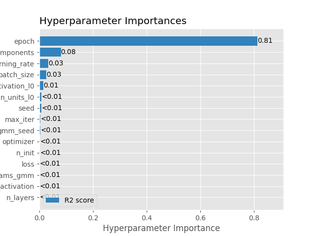
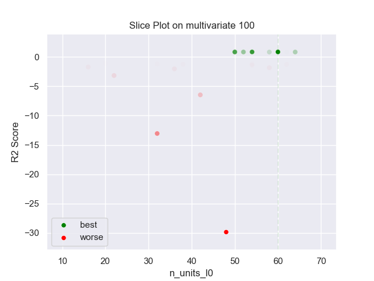
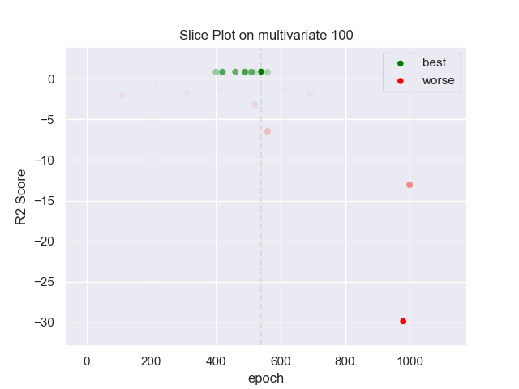
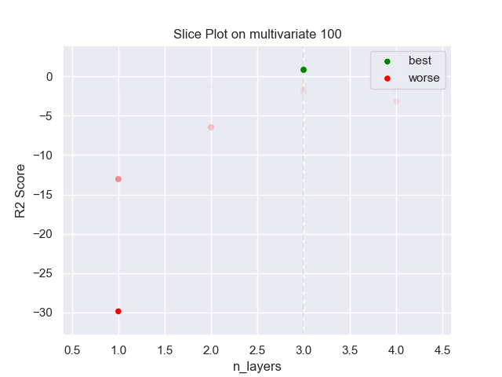
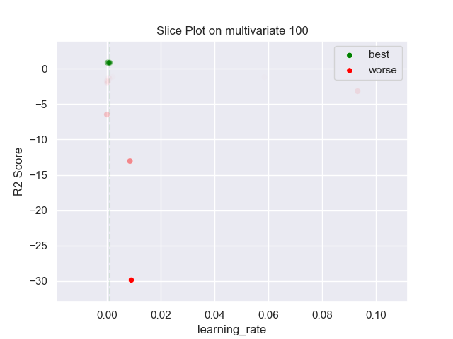
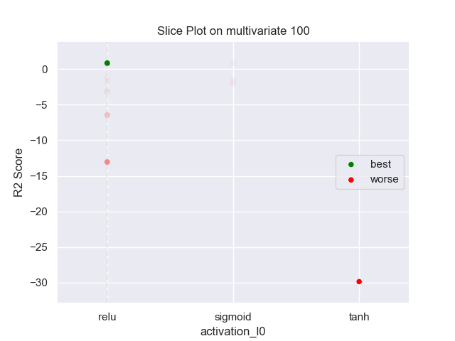
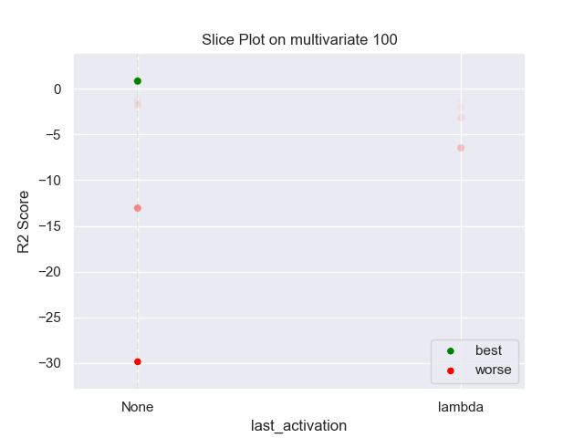
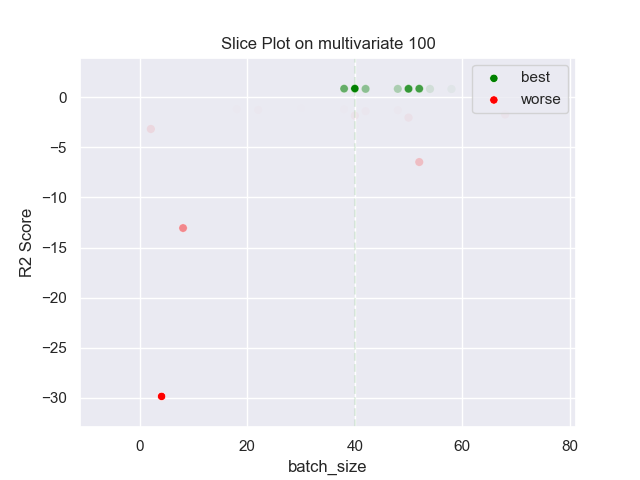
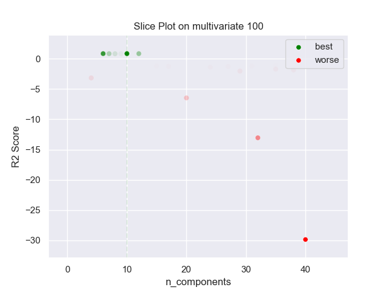

## MLP GMM 100 multivariate

### TOP 3
- R2 score: **0.89178926**
	 - **seed** : *75*
	 - **n_init** : *100*
	 - **max_iter** : *80*
	 - **n_components** : *10*
	 - **gmm_seed** : *96*
	 - **init_params_gmm** : *k-means++*
	 - **n_layers** : *3*
	 - **n_units_l0** : *60*
	 - **activation_l0** : *relu*
	 - **n_units_l1** : *30*
	 - **activation_l1** : *relu*
	 - **n_units_l2** : *44*
	 - **activation_l2** : *tanh*
	 - **last_activation** : *None*
	 - **learning_rate** : *0.0009981718351141132*
	 - **epoch** : *540*
	 - **optimizer** : *RMSprop*
	 - **loss** : *mse_loss*
	 - **batch_size** : *40*

- R2 score: **0.87038104**
	 - **seed** : *69*
	 - **n_init** : *100*
	 - **max_iter** : *70*
	 - **n_components** : *10*
	 - **gmm_seed** : *86*
	 - **init_params_gmm** : *k-means++*
	 - **n_layers** : *3*
	 - **n_units_l0** : *54*
	 - **activation_l0** : *relu*
	 - **n_units_l1** : *26*
	 - **activation_l1** : *relu*
	 - **n_units_l2** : *44*
	 - **activation_l2** : *tanh*
	 - **last_activation** : *None*
	 - **learning_rate** : *0.0002703192766690984*
	 - **epoch** : *490*
	 - **optimizer** : *Adam*
	 - **loss** : *huber_loss*
	 - **batch_size** : *52*

- R2 score: **0.86488257**
	 - **seed** : *86*
	 - **n_init** : *100*
	 - **max_iter** : *50*
	 - **n_components** : *6*
	 - **gmm_seed** : *78*
	 - **init_params_gmm** : *k-means++*
	 - **n_layers** : *3*
	 - **n_units_l0** : *60*
	 - **activation_l0** : *relu*
	 - **n_units_l1** : *30*
	 - **activation_l1** : *relu*
	 - **n_units_l2** : *44*
	 - **activation_l2** : *tanh*
	 - **last_activation** : *None*
	 - **learning_rate** : *0.0008140896367081241*
	 - **epoch** : *460*
	 - **optimizer** : *Adam*
	 - **loss** : *mse_loss*
	 - **batch_size** : *38*

### WORST 3
- R2 score: **-29.86491979**
	 - **seed** : *75*
	 - **n_init** : *100*
	 - **max_iter** : *80*
	 - **n_components** : *10*
	 - **gmm_seed** : *96*
	 - **init_params_gmm** : *k-means++*
	 - **n_layers** : *3*
	 - **n_units_l0** : *60*
	 - **activation_l0** : *relu*
	 - **n_units_l1** : *30*
	 - **activation_l1** : *relu*
	 - **n_units_l2** : *44*
	 - **activation_l2** : *tanh*
	 - **last_activation** : *None*
	 - **learning_rate** : *0.0009981718351141132*
	 - **epoch** : *540*
	 - **optimizer** : *RMSprop*
	 - **loss** : *mse_loss*
	 - **batch_size** : *40*

- R2 score: **-13.05341671**
	 - **seed** : *69*
	 - **n_init** : *100*
	 - **max_iter** : *70*
	 - **n_components** : *10*
	 - **gmm_seed** : *86*
	 - **init_params_gmm** : *k-means++*
	 - **n_layers** : *3*
	 - **n_units_l0** : *54*
	 - **activation_l0** : *relu*
	 - **n_units_l1** : *26*
	 - **activation_l1** : *relu*
	 - **n_units_l2** : *44*
	 - **activation_l2** : *tanh*
	 - **last_activation** : *None*
	 - **learning_rate** : *0.0002703192766690984*
	 - **epoch** : *490*
	 - **optimizer** : *Adam*
	 - **loss** : *huber_loss*
	 - **batch_size** : *52*

- R2 score: **-6.46178368**
	 - **seed** : *86*
	 - **n_init** : *100*
	 - **max_iter** : *50*
	 - **n_components** : *6*
	 - **gmm_seed** : *78*
	 - **init_params_gmm** : *k-means++*
	 - **n_layers** : *3*
	 - **n_units_l0** : *60*
	 - **activation_l0** : *relu*
	 - **n_units_l1** : *30*
	 - **activation_l1** : *relu*
	 - **n_units_l2** : *44*
	 - **activation_l2** : *tanh*
	 - **last_activation** : *None*
	 - **learning_rate** : *0.0008140896367081241*
	 - **epoch** : *460*
	 - **optimizer** : *Adam*
	 - **loss** : *mse_loss*
	 - **batch_size** : *38*

