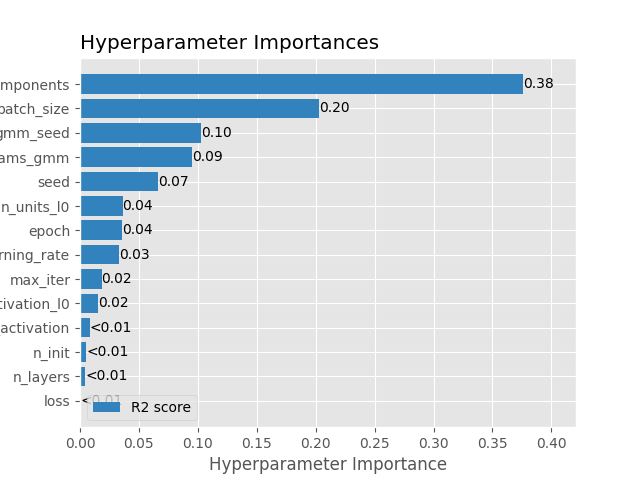
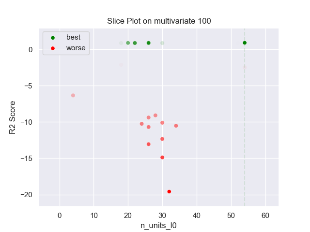
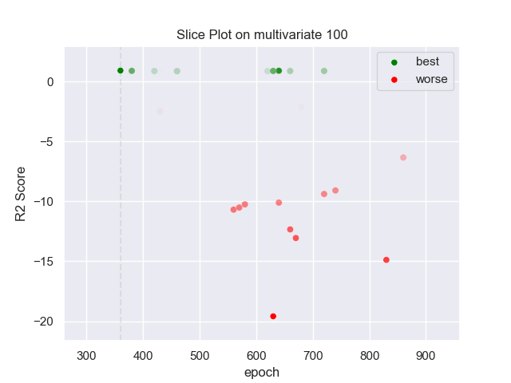
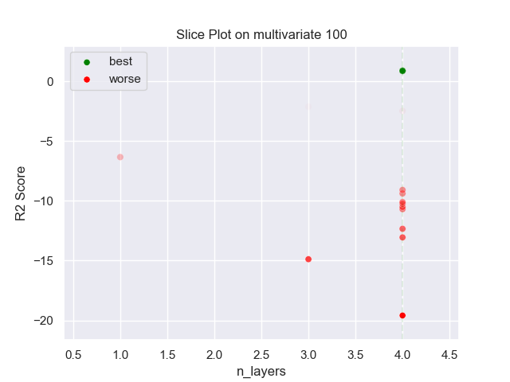
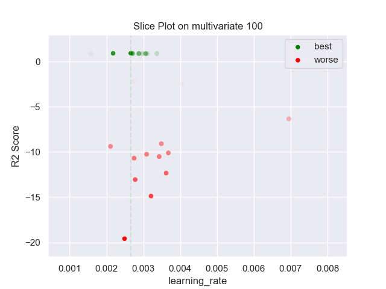
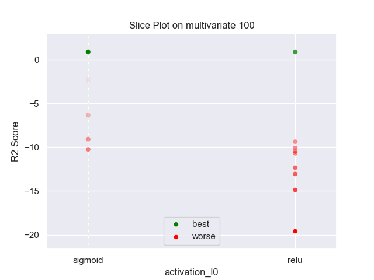
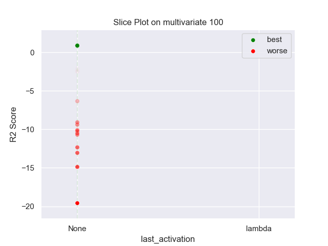
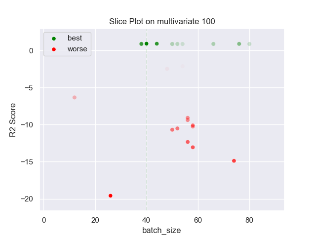
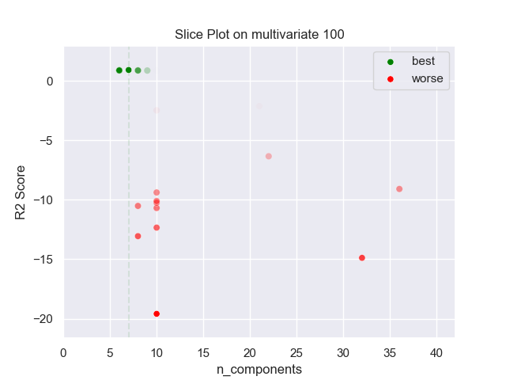

## MLP GMM 100 multivariate

### TOP 3
- R2 score: **0.90491187**
	 - **seed** : *98*
	 - **n_init** : *10*
	 - **max_iter** : *30*
	 - **n_components** : *7*
	 - **gmm_seed** : *62*
	 - **init_params_gmm** : *k-means++*
	 - **n_layers** : *4*
	 - **n_units_l0** : *54*
	 - **activation_l0** : *sigmoid*
	 - **n_units_l1** : *26*
	 - **activation_l1** : *tanh*
	 - **n_units_l2** : *24*
	 - **activation_l2** : *tanh*
	 - **n_units_l3** : *54*
	 - **activation_l3** : *relu*
	 - **last_activation** : *None*
	 - **learning_rate** : *0.00266*
	 - **epoch** : *360*
	 - **loss** : *mse_loss*
	 - **batch_size** : *40*

- R2 score: **0.89503319**
	 - **seed** : *100*
	 - **n_init** : *30*
	 - **max_iter** : *40*
	 - **n_components** : *6*
	 - **gmm_seed** : *28*
	 - **init_params_gmm** : *k-means++*
	 - **n_layers** : *4*
	 - **n_units_l0** : *26*
	 - **activation_l0** : *sigmoid*
	 - **n_units_l1** : *28*
	 - **activation_l1** : *tanh*
	 - **n_units_l2** : *40*
	 - **activation_l2** : *tanh*
	 - **n_units_l3** : *48*
	 - **activation_l3** : *relu*
	 - **last_activation** : *None*
	 - **learning_rate** : *0.00218*
	 - **epoch** : *640*
	 - **loss** : *mse_loss*
	 - **batch_size** : *44*

- R2 score: **0.88083197**
	 - **seed** : *98*
	 - **n_init** : *20*
	 - **max_iter** : *30*
	 - **n_components** : *6*
	 - **gmm_seed** : *77*
	 - **init_params_gmm** : *k-means++*
	 - **n_layers** : *4*
	 - **n_units_l0** : *20*
	 - **activation_l0** : *sigmoid*
	 - **n_units_l1** : *26*
	 - **activation_l1** : *tanh*
	 - **n_units_l2** : *22*
	 - **activation_l2** : *tanh*
	 - **n_units_l3** : *64*
	 - **activation_l3** : *relu*
	 - **last_activation** : *None*
	 - **learning_rate** : *0.0027*
	 - **epoch** : *380*
	 - **loss** : *mse_loss*
	 - **batch_size** : *38*

### WORST 3
- R2 score: **-19.58370645**
	 - **seed** : *98*
	 - **n_init** : *10*
	 - **max_iter** : *30*
	 - **n_components** : *7*
	 - **gmm_seed** : *62*
	 - **init_params_gmm** : *k-means++*
	 - **n_layers** : *4*
	 - **n_units_l0** : *54*
	 - **activation_l0** : *sigmoid*
	 - **n_units_l1** : *26*
	 - **activation_l1** : *tanh*
	 - **n_units_l2** : *24*
	 - **activation_l2** : *tanh*
	 - **n_units_l3** : *54*
	 - **activation_l3** : *relu*
	 - **last_activation** : *None*
	 - **learning_rate** : *0.00266*
	 - **epoch** : *360*
	 - **loss** : *mse_loss*
	 - **batch_size** : *40*

- R2 score: **-14.88073881**
	 - **seed** : *100*
	 - **n_init** : *30*
	 - **max_iter** : *40*
	 - **n_components** : *6*
	 - **gmm_seed** : *28*
	 - **init_params_gmm** : *k-means++*
	 - **n_layers** : *4*
	 - **n_units_l0** : *26*
	 - **activation_l0** : *sigmoid*
	 - **n_units_l1** : *28*
	 - **activation_l1** : *tanh*
	 - **n_units_l2** : *40*
	 - **activation_l2** : *tanh*
	 - **n_units_l3** : *48*
	 - **activation_l3** : *relu*
	 - **last_activation** : *None*
	 - **learning_rate** : *0.00218*
	 - **epoch** : *640*
	 - **loss** : *mse_loss*
	 - **batch_size** : *44*

- R2 score: **-13.05703604**
	 - **seed** : *98*
	 - **n_init** : *20*
	 - **max_iter** : *30*
	 - **n_components** : *6*
	 - **gmm_seed** : *77*
	 - **init_params_gmm** : *k-means++*
	 - **n_layers** : *4*
	 - **n_units_l0** : *20*
	 - **activation_l0** : *sigmoid*
	 - **n_units_l1** : *26*
	 - **activation_l1** : *tanh*
	 - **n_units_l2** : *22*
	 - **activation_l2** : *tanh*
	 - **n_units_l3** : *64*
	 - **activation_l3** : *relu*
	 - **last_activation** : *None*
	 - **learning_rate** : *0.0027*
	 - **epoch** : *380*
	 - **loss** : *mse_loss*
	 - **batch_size** : *38*

