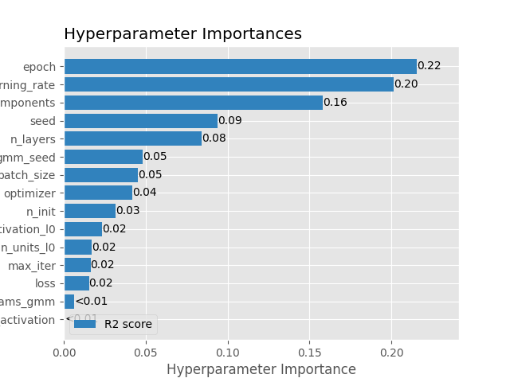
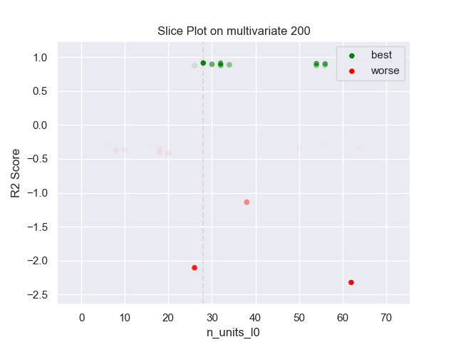
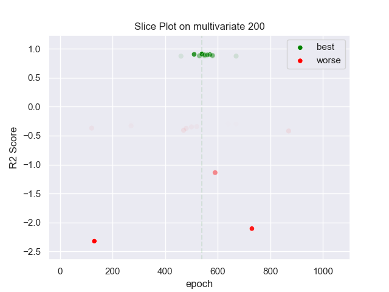
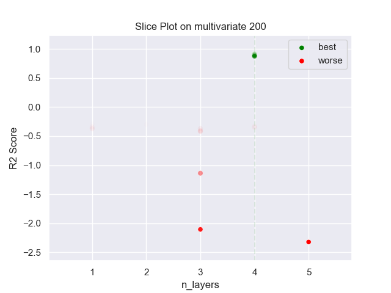
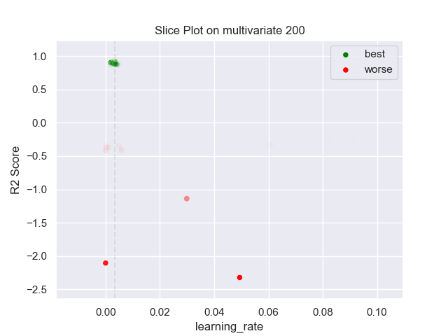
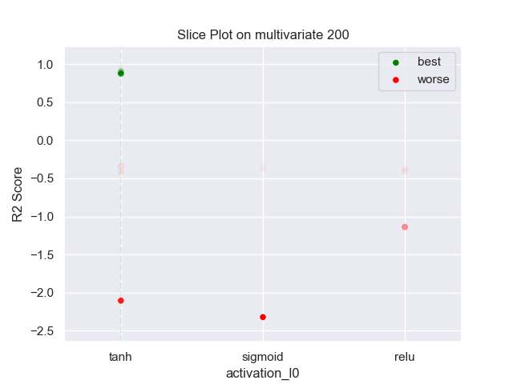
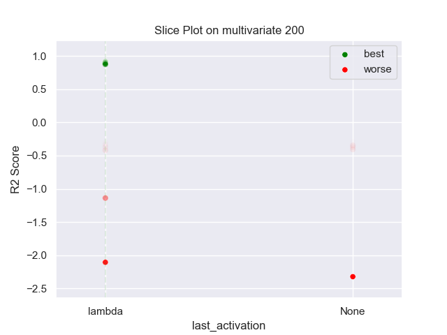
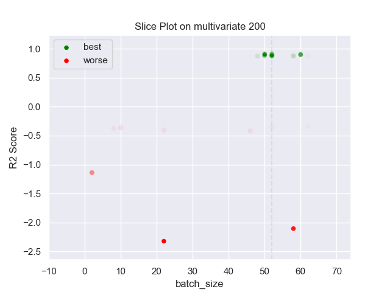
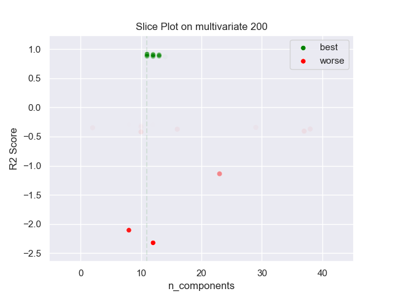

## MLP GMM 200 multivariate

### TOP 3
- R2 score: **0.91327032**
	 - **seed** : *31*
	 - **n_init** : *20*
	 - **max_iter** : *100*
	 - **n_components** : *11*
	 - **gmm_seed** : *37*
	 - **init_params_gmm** : *k-means++*
	 - **n_layers** : *4*
	 - **n_units_l0** : *28*
	 - **activation_l0** : *tanh*
	 - **n_units_l1** : *20*
	 - **activation_l1** : *sigmoid*
	 - **n_units_l2** : *34*
	 - **activation_l2** : *sigmoid*
	 - **n_units_l3** : *26*
	 - **activation_l3** : *tanh*
	 - **last_activation** : *lambda*
	 - **learning_rate** : *0.003454947958915411*
	 - **epoch** : *540*
	 - **optimizer** : *Adam*
	 - **loss** : *huber_loss*
	 - **batch_size** : *52*

- R2 score: **0.90986568**
	 - **seed** : *42*
	 - **n_init** : *10*
	 - **max_iter** : *80*
	 - **n_components** : *12*
	 - **gmm_seed** : *56*
	 - **init_params_gmm** : *k-means++*
	 - **n_layers** : *4*
	 - **n_units_l0** : *32*
	 - **activation_l0** : *tanh*
	 - **n_units_l1** : *18*
	 - **activation_l1** : *sigmoid*
	 - **n_units_l2** : *36*
	 - **activation_l2** : *sigmoid*
	 - **n_units_l3** : *14*
	 - **activation_l3** : *tanh*
	 - **last_activation** : *lambda*
	 - **learning_rate** : *0.002640146742608952*
	 - **epoch** : *540*
	 - **optimizer** : *Adam*
	 - **loss** : *huber_loss*
	 - **batch_size** : *50*

- R2 score: **0.90366254**
	 - **seed** : *25*
	 - **n_init** : *30*
	 - **max_iter** : *80*
	 - **n_components** : *12*
	 - **gmm_seed** : *32*
	 - **init_params_gmm** : *k-means++*
	 - **n_layers** : *4*
	 - **n_units_l0** : *54*
	 - **activation_l0** : *tanh*
	 - **n_units_l1** : *22*
	 - **activation_l1** : *sigmoid*
	 - **n_units_l2** : *40*
	 - **activation_l2** : *sigmoid*
	 - **n_units_l3** : *30*
	 - **activation_l3** : *tanh*
	 - **last_activation** : *lambda*
	 - **learning_rate** : *0.001952324510714249*
	 - **epoch** : *510*
	 - **optimizer** : *Adam*
	 - **loss** : *huber_loss*
	 - **batch_size** : *52*

### WORST 3
- R2 score: **-2.32271669**
	 - **seed** : *31*
	 - **n_init** : *20*
	 - **max_iter** : *100*
	 - **n_components** : *11*
	 - **gmm_seed** : *37*
	 - **init_params_gmm** : *k-means++*
	 - **n_layers** : *4*
	 - **n_units_l0** : *28*
	 - **activation_l0** : *tanh*
	 - **n_units_l1** : *20*
	 - **activation_l1** : *sigmoid*
	 - **n_units_l2** : *34*
	 - **activation_l2** : *sigmoid*
	 - **n_units_l3** : *26*
	 - **activation_l3** : *tanh*
	 - **last_activation** : *lambda*
	 - **learning_rate** : *0.003454947958915411*
	 - **epoch** : *540*
	 - **optimizer** : *Adam*
	 - **loss** : *huber_loss*
	 - **batch_size** : *52*

- R2 score: **-2.10625894**
	 - **seed** : *42*
	 - **n_init** : *10*
	 - **max_iter** : *80*
	 - **n_components** : *12*
	 - **gmm_seed** : *56*
	 - **init_params_gmm** : *k-means++*
	 - **n_layers** : *4*
	 - **n_units_l0** : *32*
	 - **activation_l0** : *tanh*
	 - **n_units_l1** : *18*
	 - **activation_l1** : *sigmoid*
	 - **n_units_l2** : *36*
	 - **activation_l2** : *sigmoid*
	 - **n_units_l3** : *14*
	 - **activation_l3** : *tanh*
	 - **last_activation** : *lambda*
	 - **learning_rate** : *0.002640146742608952*
	 - **epoch** : *540*
	 - **optimizer** : *Adam*
	 - **loss** : *huber_loss*
	 - **batch_size** : *50*

- R2 score: **-1.13914786**
	 - **seed** : *25*
	 - **n_init** : *30*
	 - **max_iter** : *80*
	 - **n_components** : *12*
	 - **gmm_seed** : *32*
	 - **init_params_gmm** : *k-means++*
	 - **n_layers** : *4*
	 - **n_units_l0** : *54*
	 - **activation_l0** : *tanh*
	 - **n_units_l1** : *22*
	 - **activation_l1** : *sigmoid*
	 - **n_units_l2** : *40*
	 - **activation_l2** : *sigmoid*
	 - **n_units_l3** : *30*
	 - **activation_l3** : *tanh*
	 - **last_activation** : *lambda*
	 - **learning_rate** : *0.001952324510714249*
	 - **epoch** : *510*
	 - **optimizer** : *Adam*
	 - **loss** : *huber_loss*
	 - **batch_size** : *52*

